% Untersuchungen über die radioaktiven Substanzen
% Marie Curie
% 1904

## Einleitung.

Die vorliegende Arbeit bezweckt, eine Übersicht über die
Untersuchungen an radioaktiven Substanzen zu geben, die ich
seit mehr als vier Jahren ausführe. Der Ausgangspunkt war
eine Untersuchung der von Herrn *Becquerel* entdeckten
Uranstrahlen. Die Resultate, zu welchen diese Arbeit mich führte,
schienen eine so interessante Perspektive zu eröffnen, daß Herr
*Curie*,
unter Aufgabe seiner eigenen Arbeiten, sich mit mir vereinigte
und wir gemeinsam auf das Ziel hinarbeiteten, die
neuen radioaktiven Substanzen zu extrahiren und näher zu erforschen.

Von Anfang unserer Untersuchungen an hielten wir uns für
verpflichtet, Proben der von uns entdeckten und hergestellten
Substanzen an einige Physiker zu verleihen, vor allen Dingen an
Herrn *Becquerel*,
den Entdecker der Uranstrahlen. So haben
wir selbst die Untersuchungen andrer über die radioaktiven Substanzen
erleichtert. Bald nach unsren ersten Veröffentlichungen
befaßte sich auch Herr *Giesel*
in Deutschland mit der Herstellung
dieser Substanzen und verlieh ebenfalls Proben davon an mehrere
deutsche Physiker. Später wurden die Substanzen in Deutschland
und Frankreich in den Handel gebracht und die immer mehr
zunehmende Wichtigkeit des Gegenstandes wurde die Veranlassung
zu einer wissenschaftlichen Bewegung, so daß zahlreiche Arbeiten
über die radioaktiven Körper erschienen sind und noch fortwährend
erscheinen, vor allem im Ausland. Die verschiedenen
französischen und ausländischen Arbeiten führen natürlich zum
Teil zu gleichen Resultaten, wie bei jedem neuen und in Bildung
begriffenen Wissenszweig. Das Aussehen der Frage ändert sich
sozusagen von Tag zu Tag.

Vom chemischen Standpunkt aus ist jedoch ein Punkt definitiv
gesichert: **Die Existenz eines neuen stark radioaktiven
  Elements, des Radiums.** Die Herstellung des reinen
Radiumchlorids und die Bestimmung des Atomgewichts des
Radiums bilden den wichtigsten Teil meiner persönlichen Mitarbeit.
Diese Arbeit fügt nicht nur den bisher bekannten einfachen Körpern
mit Sicherheit einen neuen von sehr merkwürdigen Eigenschaften
hinzu, sondern enthält auch die Darlegung und Rechtfertigung
einer neuen Methode chemischer Untersuchungen. Diese auf der
Radioaktivität, als einer dem Atom anhaftenden Eigenschaft, beruhende
Methode ist es, die uns, Herrn *Curie*
und mir, die Entdeckung des Radiums ermöglichte.

Während vom chemischen Standpunkte aus die ursprünglich
gestellte Frage als gelöst betrachtet werden kann, ist die Untersuchung
der physikalischen Eigenschaften der radioaktiven Substanzen
in voller Entwicklung begriffen. Gewisse wichtige Punkte
stehen zwar bereits fest, aber eine große Anzahl von Schlüssen ist
noch provisorischer Natur. Dies ist durchaus erklärlich, wenn man
die Komplicirtheit der mit der Radioaktivität zusammenhängenden
Phänomene und die Unterschiede zwischen den verschiedenen
radioaktiven Substanzen bedenkt. Die Untersuchungen verschiedener
Physiker, die sich mit diesen Substanzen beschäftigen,
begegnen und durchkreuzen sich fortwährend. Wenn ich auch
versuchen werde, mich auf das eigentliche Ziel meiner Arbeit zu
beschränken und vor allem meine eigenen Untersuchungen darzulegen,
so muß ich doch gleichzeitig die Resultate andrer
Arbeiten mitteilen, deren Kenntniß unerläßlich ist.

Außerdem hatte ich den Wunsch, diese Arbeit zu einer Übersicht
des gegenwärtigen Standes der Frage zu gestalten.

Die Ausführung dieser Untersuchungen geschah in dem Laboratorium
der ȃcole de physique et de chimie industrielles de la
ville de Paris«, mit Erlaubniß von Herrn *Schützenberger*,
dem leider verstorbenen Direktor dieser Schule, und von Herrn
*Lauth*,
dem gegenwärtigen Direktor. Für die wohlwollende Gastfreundschaft,
die ich an dieser Anstalt genossen habe, spreche ich hierdurch
meinen besten Dank aus.

## Historische Übersicht.

Die Entdeckung der Erscheinung der Radioaktivität steht in
engem Zusammenhang mit den an die Entdeckung der Röntgenstrahlen
sich anschließenden Untersuchungen über die photographischen
Wirkungen der phosphorescirenden und fluorescirenden
Substanzen.

Die ersten Röntgenröhren besaßen keine metallische Antikathode;
die Quelle der Röntgenstrahlen befand sich auf der von
den Kathodenstrahlen getroffenen Glaswand; gleichzeitig geriet
diese Glaswand in den Zustand lebhafter Fluorescenz. Man
konnte sich damals fragen, ob die Emission der Röntgenstrahlen
nicht eine notwendige Begleiterscheinung der Fluorescenz wäre,
unabhängig von der Ursache der letzteren. Diese Idee ist zuerst
von Herrn H. *Poincaré*[@ph1896rg]
ausgesprochen worden. Kurze Zeit
darauf kündigte Herr *Henry*[@hc1896cr]
an, daß er mit phosphorescirendem Zinksulfid
photographische Wirkungen durch schwarzes
Papier hindurch erhalten habe. Herr
*Niewenglowski*[@ngh1896cr]
erhielt dieselbe Erscheinung mit belichtetem
Calciumsulfid. Endlich erhielt Herr
*Troost*[@t1896cr]
kräftige photographische Wirkungen mit
künstlich hergestellter, phosphorescirender, hexagonaler Blende
und zwar durch schwarzes Papier und dicken Carton hindurch.

Die soeben citirten Experimente konnten trotz zahlreicher
darauf gerichteter Bemühungen nicht wiederholt werden. Man
kann also durchaus noch nicht als ausgemacht ansehen, daß das
Zinksulfid und Calciumsulfid die Eigenschaft haben, unter der
Einwirkung des Lichts unsichtbare Strahlen auszusenden, die
schwarzes Papier durchdringen und auf die photographische Platte
wirken.

Herr *Becquerel*[@bh1896cr1; @bh1896cr2; @bh1896cr3; @bh1896cr4; 
@bh1896cr5; @bh1896cr6]
machte ähnliche Versuche mit Uransalzen,
von denen einige fluorescirend sind. Er erhielt starke photographische
Wirkungen mit Urankaliumsulfat durch schwarzes Papier
hindurch.

*Becquerel* glaubte zuerst, daß das fluorescirende Salz sich
ähnlich verhalte wie das Zink- und Calciumsulfid in den Versuchen
von *Henry*, *Niewenglowski* und
*Troost*. Aber die weiteren
Versuche zeigten, daß das beobachtete Phänomen mit der Fluorescenz
nichts zu tun hatte. Das Salz braucht durchaus nicht belichtet
zu sein; ferner wirken das Uran und alle seine Verbindungen,
ob fluorescirend oder nicht, in gleicher Weise, und das metallische
Uran am allerstärksten.
*Becquerel* fand sodann, daß die Uranverbindungen,
auch wenn man sie in vollkommener Dunkelheit
aufbewahrt, jahrelang fortfahren, auf die photographische Platte
durch schwarzes Papier hindurch zu wirken. Er nahm an, daß
das Uran und seine Verbindungen besondere Strahlen aussenden:
Die **Uranstrahlen**.
Er stellte fest, daß diese Strahlen durch
dünne Metallschirme hindurchgehen und elektrisirte Körper entladen.
Er machte ferner Versuche, aus denen er schloß, daß die
Uranstrahlen reflektirt, gebrochen und polarisirt werden können.

Die Arbeiten anderer Physiker
(*Elster* und *Geitel*, Lord
*Kelvin*, *Schmidt*,
*Rutherford*,
*Beattie* und
*Smoluchowski*)
haben die Resultate *Becquerel*s
bestätigt und erweitert, abgesehen von der
Reflexion, der Brechung und Polarisation der
Uranstrahlen, die sich in dieser Beziehung wie die Röntgenstrahlen
verhalten; eine Tatsache, die zuerst von
*Rutherford* und später
von *Becquerel* selbst erkannt wurde.

# Erstes Kapitel. Radioaktivität des Uraniums und Thoriums. Radioaktive Mineralien.

## a) Becquerelstrahlen.
Die von Herrn *Becquerel*
entdeckten **Uranstrahlen**
wirken auf gegen Licht geschützte photographische Platten; sie
können alle festen, flüssigen und gasförmigen Körper durchdringen,
vorausgesetzt, daß ihre Dicke genügend gering ist;
die durchstrahlten Gase machen sie zu schwachen Leitern der
Elektrizität[@bh1896cr1; @bh1896cr2; @bh1896cr3; @bh1896cr4; @bh1896cr5; @bh1896cr6].

Diese Eigenschaften der Uranverbindungen entspringen keiner
bekannten erregenden Ursache. Die Strahlung scheint selbsttätig
zu sein, ihre Intensität nimmt durchaus nicht ab, wenn man die
Uranverbindungen jahrelang in völliger Dunkelheit aufbewahrt;
es handelt sich also nicht etwa um eine besondere vom Licht
verursachte Phosphorescenz. Die Selbständigkeit und Konstanz
der Uranstrahlen stellen eine ganz außergewöhnliche physikalische
Erscheinung dar. Herr *Becquerel*[@bh1899cr]
hat jahrelang ein Stück
Uran in der Dunkelheit aufbewahrt und festgestellt, daß die
Wirkung auf die photographische Platte am Schlusse dieser Zeit
nicht merklich verändert war. Die Herren
*Elster* und *Geitel*[@ejgh1897beibl]
haben einen ähnlichen Versuch gemacht und in gleicher Weise
die Konstanz der Wirkung gefunden.

Ich habe die Intensität der Uranstrahlen mittels der Leitfähigkeit
der Luft gemessen. Die Methode der Messungen wird
weiter unten auseinander gesetzt werden. Die erhaltenen Zahlen
beweisen die Konstanz der Strahlung innerhalb der Genauigkeitsgrenzen
der Versuche, d.&nbsp;h. auf 2 bis 3 Proz.[@cs1899rg]

Zu diesen Messungen wurde eine Metallplatte benutzt, die
mit einer Schicht von Uranpulver bedeckt war. Die Platte
wurde nicht in der Dunkelheit aufbewahrt, da dies nach den
oben angeführten Beobachtungen ohne Einfluß ist. Die Zahl der
mit dieser Platte ausgeführten Beobachtungen ist sehr groß und
erstreckt sich gegenwärtig auf einen Zeitraum von fünf Jahren.

Ferner untersuchte ich, ob auch irgend welche andre Substanzen
sich ebenso wie die Uranverbindungen verhalten. Herr
*Schmidt*[@sgc1896ann]
veröffentlichte zuerst, daß das Thor und seine Verbindungen
die gleiche Eigenschaft haben; eine analoge und gleichzeitige
Arbeit von mir ergab dasselbe Resultat. Ich[@cs1898cr]
habe diese
Arbeit publicirt, noch bevor ich Kenntniß von der
*Schmidt*schen Veröffentlichung hatte.

Das Uran, das Thor und ihre Verbindungen emittiren also
**Becquerelstrahlen**.
Ich habe die Substanzen, die eine derartige
Strahlung aussenden, **radioaktiv** genannt[@cpcs1898cr],
ein Name, der seitdem allgemein angenommen worden ist.

Durch ihre photographischen und elektrischen Wirkungen
sind die Becquerelstrahlen den Röntgenstrahlen verwandt; sie
haben auch, wie die letzteren, die Fähigkeit, alle Körper zu
durchdringen, aber ihr Durchdringungsvermögen ist außerordentlich
verschieden; die Uran- und Thorstrahlen werden von
Millimetern eines festen Körpers aufgehalten und können sich in Luft nicht weiter als auf einige Centimeter fortpflanzen; wenigstens
gilt dies für den größten Teil der Strahlung.

Die Arbeiten verschiedener Physiker, vor allem diejenigen
von Herrn *Rutherford*[@re1899pm],
haben gezeigt, daß die Becquerelstrahlen
einer regulären Reflexion, Brechung oder Polarisation
nicht fähig sind.

Das schwache Durchdringungsvermögen der Uran- und
Thorstrahlen konnte dazu führen, sie eher mit den sekundären
Röntgenstrahlen, die von *Sagnac*[@sg1897cr; @sg1898cr; @sg1899cr1;  @sg1899cr2]
näher untersucht sind, als
mit den Röntgenstrahlen selbst zu vergleichen.
Andrerseits kann man versuchen, die Becquerelstrahlen den
in Luft sich fortpflanzenden Kathodenstrahlen (*Lenardstrahlen*)
zur Seite zu stellen. Man weiß heute, daß diese verschiedenen
Vergleiche alle ihre Berechtigung haben.

## b) Messung der Strahlungsintensität.

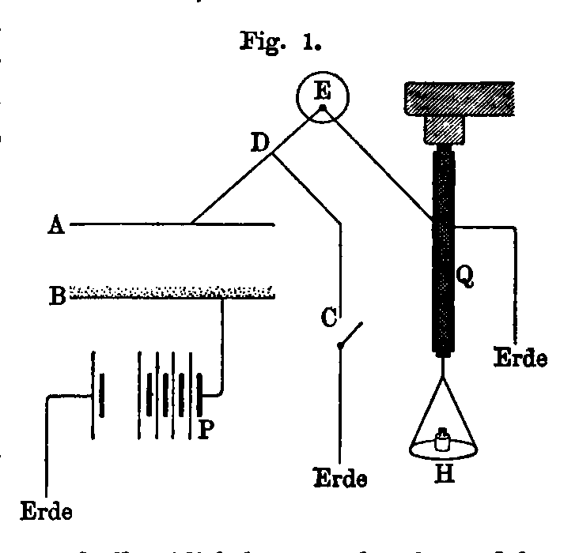  

Die benutzte Methode besteht in der Messung der Leitfähigkeit
der Luft unter der Einwirkung der radioaktiven Substanzen.
Diese Methode hat den Vorteil, schnell zu sein und vergleichbare
Zahlen zu liefern. Der benutzte Apparat besteht im wesentlichen
aus einem Plattenkondensator&nbsp;$AB$ (Fig.&nbsp;1). Die fein pulverisirte
aktive Substanz ist auf der Platte&nbsp;$B$ ausgebreitet und macht die
Luft zwischen den Platten leitend. Um diese Leitfähigkeit zu
messen, bringt man die Platte&nbsp;$B$ auf ein hohes Potential, indem
man sie mit dem einen Pol einer kleinen Akkumulatorenbatterie&nbsp;$P$
verbindet, deren andrer Pol an Erde liegt. Da die Platte&nbsp;$A$
durch den Draht&nbsp;$GD$ an Erde gelegt ist, so entsteht ein elektrischer
Strom zwischen den Platten. Das Potential der Platte&nbsp;$A$
wird durch ein Elektrometer&nbsp;$E$ gemessen. Unterbricht man in&nbsp;$C$
die Verbindung mit der Erde, so ladet sich die Platte&nbsp;$A$ und die
Ladung bewirkt eine Ablenkung des Elektrometers. Die Geschwindigkeit
der Ablenkung ist proportional der Stromintensität
und kann zu ihrer Messung dienen.

Es ist jedoch vorzuziehen, bei Ausführung der Messung die
Ladung der Platte&nbsp;$A$ zu kompensiren, so daß man das Elektrometer
auf Null erhält.
Die hier in Frage kommenden
Ladungen sind
außerordentlich schwach,
sie können mit Hülfe
eines piezoelektrischen
Quarzes&nbsp;$Q$ kompensirt
werden, dessen eine Belegung
mit&nbsp;$A$, die andre
mit der Erde verbunden
ist. Man unterwirft die
Quarzplatte einer Zugkraft
von bekannter  
Größe durch Aufsetzen
von Gewichten auf eine
Schale&nbsp;$H$: diese Zugkraft wird allmählich hervorgebracht und bewirkt
eine allmähliche Entwicklung einer bekannten Elektrizitätsmenge
während der Dauer der Messung. Der Vorgang kann
derart regulirt werden, daß in jedem Augenblick eine Kompensation
stattfindet zwischen der den Kondensator durchfließenden
und der entgegengesetzten vom Quarz herrührenden
Elektrizitätsmenge.[^1]

[^1]: Man erreicht dieses Resultat leicht, indem man das Gewicht
  in der Hand hält, und es nur ganz allmählich auf die Platte&nbsp;H
  niedersinken läßt, so daß man den Lichtzeiger des Elektrometers
  auf Null erhält. Mit ein wenig Übung erlangt man leicht den hierzu
  nötigen Handgriff. Diese Methode zur Messung schwacher Ströme ist
  von Herrn J. *Curie* in seiner Doktorarbeit
  beschrieben worden.

Man kann so in absolutem Maße die während einer
gegebenen Zeit den Kondensator durchfließende Elektrizitätsmenge,
d.&nbsp;h. die Stromintensität, messen. Die Messung ist unabhängig
von der Empfindlichkeit des Elektrometers.

Wenn man eine gewisse Anzahl derartiger Messungen ausführt,
so sieht man, daß die Radioaktivität ein ziemlich genau
meßbares Phänomen ist. Sie variirt wenig mit der Temperatur
und wird kaum von den Schwankungen der Zimmertemperatur
beeinflußt; auch eine Belichtung der aktiven Substanz ist ohne
Einfluß. Die Stromintensität zwischen den Kondensatorplatten
wächst mit deren Oberfläche; für einen gegebenen Kondensator
und gegebene Substanz wächst der Strom mit der Potentialdifferenz
zwischen den Platten, mit dem Druck des Gases, das den
Kondensator erfüllt, und mit dem Abstand der Platten (vorausgesetzt,
daß dieser Abstand nicht gar zu groß im Verhältniß
zum Durchmesser ist). Jedoch strebt der Strom für sehr hohe
Potentialdifferenz einem praktisch konstanten Grenzwert zu. Dies
ist der **Sättigungs-** oder **Grenzstrom**.
Ferner variirt von
einem gewissen ziemlich großen Abstand der Platten ab der
Strom kaum mehr mit dem Abstand. Der unter diesen Bedingungen
erhaltene Strom ist es, der bei meinen Untersuchungen
als Maß der Radioaktivität genommen wurde, wenn sich der Kondensator
in Luft von Atmosphärendruck befand.

Ich gebe als Beispiel einige Kurven, die die Stromstärke als
Funktion des mittleren Feldes zwischen den Platten für zwei verschiedene
Plattenabstände darstellen. Platte&nbsp;$B$ war mit einer sehr
dünnen Schicht pulverisirten Uranmetalls bedeckt; die mit dem
Elektrometer verbundene Platte&nbsp;$A$ war mit einem Schutzring versehen.

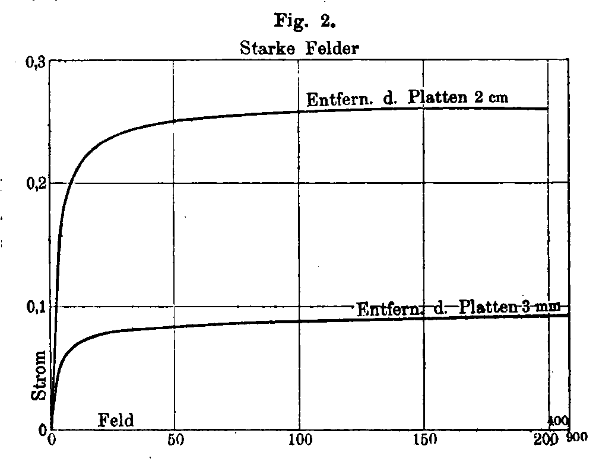

Fig.&nbsp;2 zeigt, daß die Stromintensität für starke Potentialdifferenzen
zwischen den Platten konstant wird. Fig.&nbsp;3 stellt
dieselbe Kurve in einem anderen Maßstabe dar und enthält bloß
die Resultate für schwache Potentialdifferenzen; der Quotient aus
Stromstärke und Potentialdifferenz ist für schwache Spannungen
konstant und stellt die Initialleitfähigkeit zwischen den Platten
dar. Man kann also zwei wichtige charakteristische Konstanten
dieses Phänomens unterscheiden: 1. Die
**Initialleitfähigkeit** für
schwache Potentialdifferenzen, 2. den **Grenzstrom**
für starke
Potentialdifferenzen. Dieser Grenzstrom ist es, der als Maß für
die Radioaktivität angenommen wurde.

Außer der zwischen den Platten besonders hergestellten
Potentialdifferenz existirt zwischen ihnen noch eine Kontaktkraft,
und die Wirkungen dieser beiden Stromursachen addiren sich;
infolgedessen ändert sich der Absolutwert des Stromes mit dem
Vorzeichen der äußeren Potentialdifferenz. Jedoch ist für hohe
Spannungen der Einfluß der Kontaktkraft zu vernachlässigen und
die Stromstärke unabhängig von dem Vorzeichen des Feldes
zwischen den Platten.

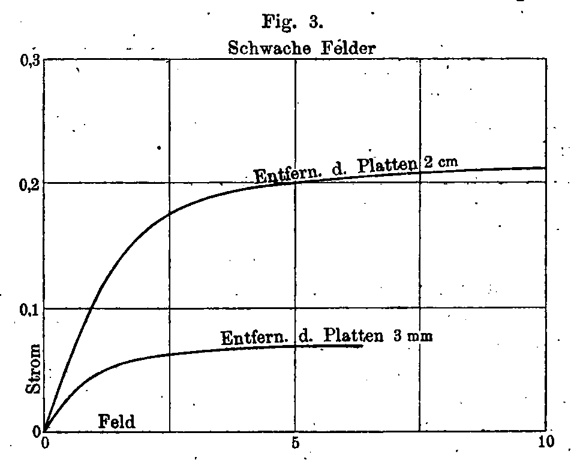

Die Leitfähigkeit der Luft und andrer Gase unter der Einwirkung
der Becquerelstrahlen ist von mehreren Physikern
studirt worden.[@bh1897cr; @kbss1897nat1; @bs1897pm]
Eine sehr vollständige Untersuchung des
Gegenstandes veröffentlichte Herr
*Rutherford*.[@re1899pm]
Die Gesetze der in Gasen durch Becquerelstrahlen hervorgerufenen
Leitfähigkeit sind dieselben wie die bei Röntgenstrahlung
gefundenen. Der Mechanismus der Erscheinung scheint in beiden
Fällen derselbe zu sein. Die Theorie der Ionisation der Gase
unter der Wirkung der Röntgen- oder Becquerelstrahlung giebt
sehr guten Aufschluß über die beobachteten Tatsachen. Diese
Theorie soll hier nicht weiter erörtert werden; ich erinnere nur
an die Resultate, zu denen sie führt:

1. Die Zahl der pro Sekunde im Gase producirten Ionen wird
proportional gesetzt der im Gase absorbirten Strahlungsenergie.

2. Um den einer bestimmten Strahlung entsprechenden
Grenzstrom zu erhalten, muß man einerseits diese Strahlung vom
Gase vollständig absorbiren lassen, indem man einen genügend
große absorbirende Masse benutzt; andrerseits muß man zur
Hervorbringung des Stromes alle erzeugten Ionen benutzen, indem
man ein so starkes Feld herstellt, daß die Zahl der sich
wieder vereinigenden Ionen nur einen unwesentlichen Bruchteil
der in derselben Zeit erzeugten Gesamtzahl von Ionen beträgt,
und diese fast vollständig von dem Strom zu den Elektroden geführt
werden. Das hierzu nötige elektrische Feld ist um so
höher, je stärker die Ionisation.

Nach neueren Untersuchungen von Herrn
*Townsend*[@tjs1901pm] ist
das Phänomen bei schwachem Gasdruck komplicirter. Der Strom
scheint zuerst bei wachsender Potentialdifferenz einem konstanten
Grenzwert zuzustreben, aber von einer gewissen Potentialdifferenz
an beginnt der Strom wieder mit dem Felde zu wachsen und zwar
äußerst schnell. Herr *Townsend* nimmt an, daß dieses Anwachsen
von einer neuen Ionisation herrührt, die von den Ionen
selbst erzeugt wird, wenn sie unter der Einwirkung des elektrischen
Feldes eine genügend große Geschwindigkeit annehmen, damit
ein Gasmolekül, wenn es von diesen Geschossen getroffen wird,
zerbrochen und in die Ionen, aus denen es besteht, zerteilt wird.
Ein starkes elektrisches Feld und schwacher Druck begünstigen
diese Ionisation durch die schon vorhandenen Ionen, und sobald
dies eintritt, wächst die Stromstärke dauernd mit dem mittleren
Felde zwischen den Platten. Der Grenzstrom kann also nur erhalten
werden, wenn die ionisirende Ursache einen gewissen Wert
nicht überschreitet, so daß die Sättigung bereits bei Feldern erreicht
wird, bei denen die Ionisation durch Ionenstoß noch nicht stattgefunden
hat. Diese Bedingung ist bei meinen Versuchen erfüllt.

Die Größenordnung des Sättigungsstromes, den man mit
Uranverbindungen erhält, beträgt etwa $10^{-11}$&nbsp;Ampère für einen
Kondensator, dessen Platten 8&nbsp;cm Durchmesser und 3&nbsp;cm Abstand
haben. Die Thoriumverbindungen geben Ströme von derselben
Größenordnung und die Aktivitäten der Oxyde von Uran und Thor
sind ganz analog.

## c) Radioaktivität der Uran- und Thorverbindungen.

Es folgen zunächst einige Zahlen, die ich mit verschiedenen
Uranverbindungen erhalten habe; $i$&nbsp;bedeutet die Stromstärke in
Ampère:

                                            $i\cdot 10^11$
------------------------------------------ ------------------
Metallisches Uran (etwas kohlehaltig)       2,3
Schwarzes Uranoxyd, $\text{U}_2\text{O}_5$  2,6
Grünes Uranoxyd, $\text{U}_2\text{O}_4$     1,8
Uransäurehydrat                             0,6
Natriumuranat                               1,2
Kaliumuranat                                1,2
Ammoniumuranat                              1,3
Uranosulfat                                 0,7
Urankaliumsulfat                            0,7
Uranylnitrat                                0,7
Urankupferphosphat                          0,9
Uranylsulfat                                1,2

Die Dicke der angewandten Schicht von Uranverbindungen
hat wenig Einfluß, vorausgesetzt, daß die Schicht zusammenhängend
ist. Einige Versuche hierüber ergaben:

                      Schichtdicke (mm)   $i\cdot10^11$
-------------------- ------------------- ---------------
Uranoxyd              0,5                 2,7
  „                   3,0                 3,0
Ammoniumuranat        0,5                 1,3
  „                   3,0                 3,0

Man kann hieraus schließen, daß die Absorption der Uranstrahlen
durch die emittirende Substanz sehr stark ist, da die aus
tieferen Schichten kommenden Strahlen keinen merklichen Effekt  
hervorbringen.

Aus den Zahlen, die ich[@cs1898cr] mit Thorverbindungen erhalten
habe, ergab sich folgendes:

1. Die Dicke der angewandten Schicht ist von beträchtlichem
Einfluß, besonders beim Oxyd.

2. Das Phänomen ist nur dann regelmäßig, wenn man eine
sehr dünne aktive Schicht benutzt (z.&nbsp;B. 0,25&nbsp;mm). Wenn man
dagegen eine dicke Schicht (6&nbsp;mm) benutzt, so erhält man zwischen
weiten Grenzen schwankende Zahlen, besonders im Falle des Oxyds:

<!-- end of list -->

             Schichtdicke (mm)   $i\cdot10^11$
----------- ------------------- ---------------
Thoroxyd              0,25                2,2
  „                   0,5                 2,5
  „                   2,5                 4,7
  „                   3,0                 5,5 im Mittel
  „                   6,0                 5,5 &bdquo;&nbsp;&bdquo;
Thorsulfat            0,25                0,8

Es ist hier also eine Ursache zu Unregelmäßigkeiten vorhanden,
die bei den Uranverbindungen nicht existirt. Die mit
einer Oxydschicht von 6&nbsp;mm erhaltenen Zahlen variiren zwischen
3,7 und&nbsp;7,3.

Die Untersuchungen, die ich über die Absorption der Uran-
und Thorstrahlen angestellt habe, ergaben, daß die Thorstrahlen
ein größeres Durchdringungsvermögen besitzen als die Uranstrahlen,
und daß die vom Thoroxyd in dicker Schicht emittirten
Strahlen durchdringender sind als diejenigen, die es in dünner
Schicht emittirt. Es wurden z.&nbsp;B. folgende Zahlen für den
Bruchteil der Strahlung erhalten, den ein Aluminiumblatt
von 0,01&nbsp;mm Dicke hindurchläßt:

-------------------------------------------------------------
                              Vom Aluminium
 Strahlende Substanz        durchgelassener Bruchteil
                              der Strahlung
-------------------------  ---------------------------
Uran                          0,18

Uranoxyd,
$\text{U}_2\text{O}_5$        0,20

Ammoniumuranat                0,20

Urankupfersulfat              0,21

Thoroxyd, 0,25 mm dick        0,38

Thoroxyd, 0,5 mm dick         0,47

Thoroxyd, 3,0 mm dick         0,70

Thoroxyd, 6,0 mm dick         0,70

Thorsulfat, 0,25 mm dick      0,38
------------------------------------------------------------

Bei den Uranverbindungen ist die Absorption dieselbe, welches
auch immer die benutzte Verbindung sei, woraus der Schluß zu
ziehen ist, daß die von den verschiedenen Verbindungen emittirten
Strahlen von gleicher Art sind.

Die Eigentümlichkeiten der Thorstrahlung sind bereits Gegenstand
sehr ausführlicher Untersuchungen gewesen. Herr
*Owens*[@orb1899pm]
hat gezeigt, daß man einen konstanten Strom in einem geschlossenen
Apparat erst nach ziemlich langer Zeit erhält, und
daß die Stromstärke sehr stark durch die Wirkung eines Luftstroms
reducirt wird (was bei den Uranverbindungen nicht der
Fall ist). Herr *Rutherford*[@re1900pm1]
hat analoge Versuche gemacht
und sie dahin interpretirt, daß das Thor und seine Verbindungen
nicht bloß Becquerelstrahlen aussenden, sondern auch eine aus
außerordentlich feinen Partikeln bestehende Emanation, die einige
Zeit lang nach ihrer Emission radioaktiv bleibt und von einem
Luftstrom mit fortbewegt werden kann.

Die Eigentümlichkeiten der Thorstrahlung, die sich auf die
Schichtdicke und die Wirkung eines Luftstromes beziehen, sind
eng verbunden mit der **Erscheinung der inducirten Radioaktivität
  und ihrer Fortpflanzung von Schicht zu Schicht**.
Diese Erscheinung ist zuerst am Radium beobachtet worden und
soll weiter unten beschrieben werden.

Die Radioaktivität der Uran- und Thorverbindungen stellt
eine **Eigenschaft der Atome** dar. Herr
*Becquerel*[@bh1896cr6]
beobachtete bereits, daß alle Verbindungen des Urans aktiv
sind, und schloß daraus, daß ihre Aktivität durch die Gegenwart
des Elements Uran bedingt sei; er zeigte ferner, daß das
Uran stärker aktiv ist als seine Salze. Ich habe von diesem
Gesichtspunkt aus die Uran- und Thorverbindungen untersucht
und eine große Anzahl von Messungen ihrer Aktivität unter
verschiedenen Bedingungen ausgeführt. Es folgt aus allen diesen
Messungen, daß die Radioaktivität dieser Substanzen tatsächlich
eine Eigenschaft des Atoms ist. Sie scheint hier eng verknüpft
mit der Anwesenheit der Atome der beiden betrachteten Elemente
und wird weder durch Änderung des physikalischen Zustandes,
noch durch chemische Umwandlungen zerstört. Die chemischen
Verbindungen und Mischungen, welche Uran und Thor enthalten,
sind um so aktiver, je mehr sie von diesen Metallen enthalten,
indem jede unaktive Substanz einerseits als träge Beimengung
wirkt, andrerseits einen Teil der Strahlung absorbirt.

## d) Ist die Radioaktivität der Atome eine allgemeine Erscheinung?

Wie bereits oben gesagt, habe ich danach gesucht, ob andre
Substanzen außer den Uran- und Thorverbindungen aktiv wären.
Ich ging bei diesen Untersuchungen von der Idee aus, daß es sehr
wenig wahrscheinlich sei, daß die Radioaktivität als Eigenschaft
der Atome betrachtet, nur einer bestimmten Art von Materie zukomme,
unter Ausschluß aller übrigen. Die Messungen, die ich
gemacht habe, erlaubten den Schluß, daß für die augenblicklich
bekannten chemischen Elemente, incl.&nbsp;die allerseltensten und
unsichersten, die von mir studirten Verbindungen wenigstens 100mal
weniger aktiv in meinem Apparat wären als das metallische Uran.
Von den bekannteren Elementen habe ich verschiedene Verbindungen
untersucht, von den seltenen Körpern nur diejenigen
Verbindungen, die ich mir gerade verschaffen konnte. Folgendes
ist die Liste der Substanzen, die ich als Element oder in Verbindung
untersucht habe:

1. Alle Metalle und Nichtmetalle, die leicht erhältlich sind,
und einige seltenere in ziemlich reinem Zustand aus der Sammlung
von Herrn *Etard* an der ȃcole de physique et de
chimie industrielles de la ville de Paris«.

2. Die folgenden seltenen Körper: Gallium, Germanium,
Neodym, Praseodym, Niobium, Skandium, Gadolinium, Erbium,
Samarium und Rubidium (von Herrn *Demarçay* geliehen);
Yttrium, Ytterbium mit Neoerbium (von Herrn *Urbain*
geliehen).[^2]

[^2]:  Ich bin den genannten Forschern, denen ich die bei meinen
  Untersuchungen benutzten Proben verdanke, zu großem Danke
  verpflichtet. Ich danke auch Herrn *Moissan*,
  der mir das für meine Versuche nötige metallische Uran gab.

3. Eine große Anzahl von Gesteinen und Mineralien.

Innerhalb der Empfindlichkeitsgrenze meines Apparates habe
ich außer dem Uran und Thor keinen einfachen Körper gefunden,
dessen Atome radioaktiv sind.[^3]

[^3]:  Neuere Versuche (siehe litterarische Ergänzungen) haben ergeben,
  daß die Radioaktivität doch allgemein verbreitet zu sein scheint.
  Die in Frage kommenden Aktivitäten sind jedoch mehrere 1000mal
  schwächer als die des Urans. (Anmerk. d.&nbsp;Übers.)
	
Ich muß hier jedoch einige Worte
bezüglich des Phosphors einfügen. Feuchter weißer Phosphor,
zwischen die Kondensatorplatten gebracht, macht die Luft zwischen
den Platten leitend.[@ejgh1890ann]
Gleichwohl betrachte ich diesen Körper
nicht als radioaktiv nach Art des Urans und Thors. Der Phosphor
oxydirt sich nämlich hierbei und sendet Licht aus, während
die Uran- und Thorverbindungen radioaktiv sind, ohne eine
chemische Änderung zu erfahren, die mit den bekannten Mitteln
nachweisbar wäre. Ferner ist der Phosphor weder in seiner roten
Modifikation, noch in Verbindungen aktiv.

In einer neuen Arbeit hat Herr *Bloch*[@be1903ssfp]
gezeigt, daß der
Phosphor, wenn er sich an der Luft oxydirt, Ionen erzeugt, die
sehr schwach beweglich sind, die Luft leitend machen und Kondensation
des Wasserdampfes hervorrufen.

Uran und Thor sind die beiden Elemente des größten Atomgewichts
(240 und 232), man findet sie häufig in denselben
Mineralien.

## e) Radioaktive Mineralien.

Ich habe in meinem Apparat verschiedene Mineralien
untersucht.[^4]

[^4]:  Mehrere Mineralproben sind mir aus der Museumssammlung
  durch Herrn *Lacroix* freundlichst zur Verfügung
  gestellt worden.

Mehrere davon zeigten sich aktiv, z.&nbsp;B. die Pechblende,
der Chalkolit, Autunit, Monazit, Thorit, Orangit, Fergusonit,
Cleveit usw. Die folgende Tabelle enthält die Intensität&nbsp;$i$ des mit
metallischem Uran und mit verschiedenen Mineralien erhaltenen
Stromes in Ampere:

                                         $i\cdot 10^11$
-------------------------------------- ------------------
Uran                                    7,3
Pechblende aus Johanngeorgenstadt       8,3
Pechblende aus Joachimsthal             7,0
Pechblende aus Pzibram                  6,5
Pechblende aus Cornwallis               1,6
Cleveit                                 1,4
Chalcolit                               5,2
Autunit                                 2,7
Verschiedene Thorite                    0,1 0,3 0,7 1,5 1,4
Orangit                                 2,0
Monazit                                 0,5
Xenotim                                 0,03
Äschynit                                0,7
Fergusonit (zwei Proben)                0,4 0,1
Samarskit                               1,1
Niobit (zwei Proben)                    0,1 0,3
Tantalit                                0,02
Carnotit                                6,2

Carnotit ist ein neuerdings von
*Friedel* und *Cumenge*
entdecktes, aus Uranvanadat bestehendes Mineral.
Der mit Orangit (einem Thoroxyd-haltigen Mineral) erhaltene
Strom variirt stark mit der angewandten Schichtdicke; vermehrte
man diese Dicke von 0,25 bis 6&nbsp;mm, so wuchs der Strom von
1,8 auf&nbsp;2,7.

Alle Mineralien, die sich radioaktiv zeigen, enthalten Uran
oder Thor, ihre Aktivität ist also nicht weiter erstaunlich, doch
ist die Intensität der Erscheinung bei gewissen Materialien unerwartet
groß. So findet man Pechblenden (uranoxydhaltiges
Mineral), die viermal aktiver sind als metallisches Uran. Chalkolit
(krystallisirtes Urankupferphosphat) ist zweimal aktiver als Uran.
Autunit (Urancalciumphosphat) ist ebenso aktiv wie Uran. Diese
Tatsachen waren in Widerspruch mit den früheren Betrachtungen,
nach denen kein Mineral stärker aktiv hätte sein dürfen als Uran
oder Thor.

Um diesen Punkt aufzuklären, habe ich nach dem
*Debray*schen([@dh1861acp], p.&nbsp;445)
Verfahren künstlichen Chalkolit hergestellt unter Benutzung
reiner Ausgangssubstanzen. Dieses Verfahren besteht
in der Mischung einer Lösung von Urannitrat mit einer Lösung
von Kupferphosphat in Phosphorsäure und Erhitzung auf 50 bis
60 Grad. Nach einiger Zeit bilden sich die Chalkolitkrystalle in
der Flüssigkeit.

Der so erhaltene Chalkolit besitzt eine durchaus normale,
seiner Zusammensetzung entsprechende Aktivität; sie ist 2,5&nbsp;mal
kleiner als die des Urans.

Es wurde hiernach sehr wahrscheinlich, daß die Pechblende,
der Chalkolit, der Autunit ihre starke Aktivität einer kleinen
Quantität beigemengter stark aktiver Substanz verdanken, die
verschieden ist vom Uran, vom Thor und den überhaupt bekannten
einfachen Körpern. Wenn sich dies wirklich so verhielte, glaubte
ich, hoffen zu dürfen, diese Substanz mittels gewöhnlicher
chemisch analytischer Verfahren aus dem Mineral extrahiren
zu können.

# Zweites Kapitel. Die neuen radioaktiven Substanzen.

## a) Untersuchungsmethoden.

Die Resultate der Untersuchungen radioaktiver Mineralien,
die im vorigen Kapitel erörtert wurden, veranlaßten Herrn Curie
und mich zu dem Versuche, aus der Pechblende eine neue radioaktive
Substanz zu extrahiren. Als Untersuchungsmethode
konnten wir uns nur der Radioaktivität selbst bedienen, da wir
kein andres Merkmal der hypothetischen Substanz kannten. In
folgender Weise kann man die Radioaktivität für eine derartige
Untersuchung benutzen: Man mißt die Aktivität eines Produkts
und führt dann mit ihm eine chemische Trennung aus; man mißt
die Aktivität aller hierbei erhaltenen Produkte und stellt fest, ob
die radioaktive Substanz völlig in einem davon geblieben ist, oder
ob sie sich in irgend einem Verhältnisse zwischen ihnen geteilt
hat. Auf diese Weise hat man ein Erkennungsmittel, das in
mancher Hinsicht mit der Spektralanalyse verglichen werden
kann. Um vergleichbare Zahlen zu erhalten, muß man die Aktivität
der Substanzen im festen und gut getrockneten Zustande
untersuchen.

## b) Polonium, Radium, Aktinium.

Die Analyse der Pechblende führte uns unter Anwendung
der eben erörterten Methode zu der Feststellung der Existenz
zweier chemisch verschiedener, stark aktiver Substanzen in diesem
Mineral, des **Poloniums**, das wir allein,
und des **Radiums**, das
wir zusammen mit Herrn *Bémont* entdeckt haben.[@cs1898cr; @cpcsbg1898cr]

Das **Polonium** ist eine dem Wismut in chemisch analytischer
Beziehung verwandte Substanz und begleitet dieses bei den
Trennungen. Man erhält ein immer Polonium-reicheres Wismut
durch eins der folgenden Fraktionirungsverfahren:

1. Sublimation der Sulfide im Vakuum; das aktive Sulfid
ist flüchtiger als das des Wismuts.

2. Ausfällung der salpetersauren Lösung mit Wasser; das
niedergeschlagene Subnitrat ist viel aktiver als das gelöst
zurückbleibende Salz.

3. Ausfällung einer sehr stark sauren Chloridlösung mit
Schwefelwasserstoff. Die niedergeschlagenen Sulfide sind bedeutend
aktiver als das gelöst zurückbleibende Salz.

Das **Radium** ist eine Substanz, die das aus der Pechblende
extrahirte Baryum begleitet; es folgt dem Baryum in seinen
Reaktionen und läßt sich von ihm durch den Löslichkeitsunterschied
der Chloride in Wasser, alkoholhaltigem Wasser oder mit
Salzsäure versetztem Wasser trennen. Wir bewirkten die Trennung
der Chloride von Baryum und Radium, indem wir ihr Gemenge
einer fraktionirten Krystallisation unterwarfen, wobei das Radiumchlorid
weniger löslich war als das Baryumchlorid.

Eine dritte stark radioaktive Substanz ist von Herrn
*Debierne*[@dal1899cr; @dal1900cr2]
in der Pechblende festgestellt und von ihm als
**Aktinium** bezeichnet worden. Das Aktinium begleitet gewisse
in der Pechblende enthaltene Körper der Eisengruppe. Es
scheint hauptsächlich dem Thorium verwandt, von dem es noch
nicht getrennt werden konnte. Die Extraktion des Aktiniums
aus der Pechblende ist eine sehr heikle Arbeit; die Trennungen
sind im allgemeinen unvollständig.

Alle drei neuen radioaktiven Substanzen finden sich in der
Pechblende nur in ganz verschwindend kleiner Menge. Um sie
in konzentrirtem Zustande zu erhalten, mußten wir die Behandlung
von mehreren Tonnen Uranmineralrückständen unternehmen. Im
Groben geschieht die Behandlung in einer Fabrik; hierauf folgt ein
umständliches Reinigungs- und Koncentrirungsverfahren. So
kommen wir dazu, aus den Tausenden von Kilogrammen von
Ausgangssubstanz einige Decigramme von Endprodukten zu gewinnen,
deren Aktivität im Verhältniß zu der des Minerals, aus
dem sie stammen, ganz außerordentlich groß ist. Es ist klar, daß
diese gesamte Arbeit langwierig, heikel und kostspielig ist.[^longnote]

[^longnote]:
    Wir haben zahlreiche Verpflichtungen gegen alle, die uns bei
  dieser Arbeit zu Hülfe gekommen sind. Wir danken herzlich den
  Herren *Mascart* und *Michel Lévy*
  für ihre wohlwollende Unterstützung.
  Dank der freundlicher Vermittlung des Herrn Prof. *Sueß*
  hat die österreichische Verwaltung in liebenwürdigster Weise die
  erste Tonne vorbehandelter Rückstände zu unsrer Verfügung gestellt
  (aus der Staatswerkstatt Joachimsthal in Böhmen). Die Akademie
  der Wissenschaften zu Paris, die »Société d‘Encouragement pour
  l'industrie nationale« und ein anonymer Geber haben uns die Mittel
  zur Behandlung einer gewissen Quantität von Substanz gegeben. Unser
  freund, Herr *Debierne*, hat die Behandlung des Minerals geleitet,
  die in der Fabrik der »Société centrale de produits chimiques«
  ausgeführt wurde. Diese Gesellschaft hatte sich bereit erklärt, die
  Behandlung ohne Nutzen für sich auszuführen. Allen diesen sprechen
  wir unsren aufrichtigsten Dank aus.

    Ganz neuerdings hat das »Institut de France«
		20 000&nbsp;Frcs.&nbsp;zur
  Extraktion radioaktiver Substanzen zu unsrer Verfügung gestellt.
  Dank dieser Summe konnten wir die Behandlung von fünf Tonnen
  Mineral unternehmen.

In Anschluß an unsere Arbeit wurden noch andere radioaktive
Substanzen angekündigt. Herr
*Giesel*[@gf1900ber; @gf1901ber]
einerseits, die Herren *Hofmann* und *Strauß*[@hs1900ber]
andrerseits teilten mit, daß
wahrscheinlich noch eine dem Blei in seinen chemischen Eigenschaften
verwandte radioaktive Substanz existire. Man weiß
jedoch noch wenig über diese Substanz.
Von allen diesen neuen radioaktiven Substanzen ist bis jetzt
das Radium das einzige, das im Zustande eines reinen Salzes dargestellt
wurde.

## c) Spektrum des Radiums.

Es war von hervorragender Wichtigkeit, mit allen nur möglichen
Mitteln die bei dieser Arbeit gemachte Hypothese der
Existenz neuer radioaktiver Elemente zu kontrolliren. Im Falle
des Radiums ergab die Spektralanalyse eine vollständige Bestätigung
dieser Hypothese.

  Herr *Demarçay* war gern bereit, die Prüfung der neuen
radioaktiven Substanz mittels der exakten Methode, welche er
bei dem Studium photographirter Funkenspektra anwendet, auszuführen.
Die Unterstützung durch einen so kompetenten Gelehrten
war für uns eine große Wohltat. Wir bewahren ihm eine
tiefe Dankbarkeit dafür, daß er sich mit dieser Arbeit befaßte.
Die Resultate der Spektralanalyse haben uns Gewißheit verschafft
zu einer Zeit, da wir noch Zweifel über die Interpretation unsrer
Resultate hatten.^[Wir hatten kürzlich den Schmerz, diesen ausgezeichneten Gelehrten
  zu verlieren, mitten in seinen schönen Untersuchungen über
  die seltenen Erden und die Spektroskopie, deren Methoden man wegen
  ihrer Vollendung und Präcision nicht genug bewundern kann. Wir bewahren
  der vollendeten Liebenswürdigkeit, mit der er an unsrer Arbeit
  teilgenommen hat, ein inniges Andenken.]

Die ersten Proben von mäßig aktivem Radium-haltigen Baryumchlorid,
die *Demarçay* untersuchte, zeigten ihm gleichzeitig
mit den Baryumlinien eine neue Linie von merklicher
Intensität und der Wellenlänge $\lambda = 381,47\,\mu\mu$
im ultravioletten
Spektrum. Mit den darauf hergestellten stärker aktiven Produkten
sah *Demarçay* die Linie 381,47 sich verstärken;
gleichzeitig erschienen andre neue Linien und in dem Spektrum hatten
die neuen Linien und die Baryumlinien vergleichbare Intensität.
Eine weitere Koncentration lieferte ein Produkt, in dem das neue
Spektrum vorherrscht, und einzig die allein noch sichtbaren stärksten
drei Baryumlinien zeigen die Anwesenheit dieses Metalls als
bloße Verunreinigung an. Dieses Produkt kann also als fast
reines Radiumchlorid betrachtet werden. Endlich konnte ich
durch eine neue Reinigung ein außerordentlich reines Radiumchlorid
herstellen, in dessen Spektrum die Hauptlinien des Baryums
kaum mehr sichtbar sind.

Folgendes sind nach *Demarçay*[@dea1898cr; @dea1899cr; @dea1900cr]
die Hauptlinien des
Radiums für den Teil des Spektrums zwischen $\lambda=500,0$ und
$\lambda=350,0$ Tausendstel Mikron ($\mu\mu$).
Die Intensität jeder Linie
ist durch eine Zahl angegeben, wobei die stärkste Linie gleich&nbsp;16
gesetzt ist.

         Intensität
------- ------------
 483,63  10
 472,69  5
 469,98  3
 469,21  7
 468,30  14
 464,19  4
 453,85  9
 443,61  8
 434,06  13
 381,47  16
 364,96  12

Alle Linien sind deutlich und scharf; die drei Linien 381,47,
468,30 und 434,06 sind stark, sie erreichen gleiche Intensität mit
den stärksten bekannten Linien. Ferner bemerkt man in dem
Spektrum zwei starke verwaschene Banden; die erste symmetrische
erstreckt sich von 463,10 bis 462,19 mit einem Maximum bei
462,75; die zweite stärkere ist nach dem Ultraviolett hin
abgeschattet, sie beginnt plötzlich bei 446,37, erreicht ein
Maximum bei 445,52, das sich bis 445,34 erstreckt und dann folgt
eine verwaschene Bande, die, allmählich schwächer werdend, bis
439 reicht.

In dem weniger brechbaren, nicht photographirten Teil des
Funkenspektrums liegt die einzige bemerkbare Linie bei (ungefähr)
566,5; sie ist jedoch viel schwächer als 482,63.

Der Allgemeinanblick des Spektrums entspricht dem der
Erdalkalimetalle, deren Spektra bekanntlich aus starken Linien
und verwaschenen Banden bestehen.

Nach *Demarçay* kann man das Radium zu den Körpern
allerempfindlichster Spektralreaktion rechnen. Ich konnte aus
meiner Koncentrirungsarbeit schließen, daß in der ersten Probe,
die die Linie 381,47 deutlich zeigte, das Verhältniß des darin
enthaltenen Radiums sehr klein sein mußte (vielleicht 0,02 Proz).
Gleichwohl bedarf es einer 50mal größeren Aktivität als die
des metallischen Urans, um die Hauptlinien des Radiums in den
photographirten Spektren deutlich zu bemerken. Mit einem
empindlichen Elektrometer kann man die Radioaktivität eines
Produktes erkennen, die nur ${}^{1}/_{100}$
der des metallischen Urans
beträgt. Man sieht also, daß zur Erkennung der Anwesenheit
des Radiums die Radioaktivität ein mehrere 1000mal empfindlicheres
Zeichen ist als die Spektralreaktion.

Das stark aktive Wismut-Polonium und das stark aktive
Thorium-Aktinium, die von *Demarçay* geprüft wurden, ergaben
bis jetzt nur die Linien des Wismuts und Thors.

In einer neuen Veröffentlichung kündigt Herr
*Giesel*,[@gf1902pz] der sich mit der Darstellung des Radiums befaßt 
hat, an, daß das Radiumbromid die Flamme rot färbt.
Das Flammenspektrum des
Radiums enthält zwei schöne rote Banden, eine Linie im Blaugrün
und zwei schwache Linien im Violett.

## d) Abscheidung der neuen radioaktiven Substanzen.

Der erste Teil des Verfahrens besteht darin, daß man aus
den Uranmineralien das Radium-haltige Baryum, das Poloniumhaltige
Wismut und die das Aktinium enthaltenden seltenen
Erden absondert. Wenn man diese drei Ausgangsprodukte erhalten
hat, so sucht man aus jedem von ihnen die neue radioaktive
Substanz zu isoliren. Dieser zweite Teil der Arbeit geschieht
mittels einer Fraktionirungsmethode. Es ist bekanntlich sehr
schwierig, ein Mittel zur vollkommenen Trennung zweier sehr
verwandter Elemente zu finden. Die Fraktionirungsmethoden
sind hier also unerläßlich. Außerdem darf man, wenn ein Element
einem andren nur spurenweise beigemengt ist, eine vollkommene
Trennungsmethode auf das Gemisch überhaupt nicht anwenden,
selbst wenn man eine kennen würde. Man würde tatsächlich
riskiren, die durch diese Operation abzuscheidende Spur von Substanz
gänzlich zu verlieren.

Ich habe mich speciell damit befaßt, das Radium und das
Polonium zu isoliren. Nach einer Arbeit von mehreren Jahren
bin ich jedoch nur mit dem ersten der beiden Körper zum Ziele
gelangt.

Da die Pechblende ein kostbares Mineral ist, haben wir
darauf verzichtet, große Quantitäten davon zu behandeln. In
Europa geschieht die Verarbeitung dieses Minerals im Bergwerk
von Joachimsthal in Böhmen. Das zerkleinerte Mineral wird
zuerst mit Soda geröstet und das Produkt dieses Verfahrens zuerst
in warmem Wasser, dann in verdünnter Schwefelsäure ausgelaugt.
Die Lösung enthält das Uran, dem die Pechblende ihren Wert
verdankt. Der unlösliche Rückstand wird fortgeworfen. Dieser
Rückstand enthält die radioaktiven Substanzen, seine Aktivität
ist 4,5&nbsp;mal größer als die des metallischen Urans. Die
österreichische Regierung, der das Bergwerk gehört, hat uns
freundlicherweise eine Tonne dieses Rückstandes zu unsrer Untersuchung
zur Verfügung gestellt und das Bergwerk angewiesen, uns noch
mehrere Tonnen der Substanz zu liefern.

Es war durchaus nicht leicht, den Rückstand in der Fabrik
mittels eines laboratoriumsmäßigen Verfahrens zu behandeln.
Herr *Debierne*
übernahm es, diese Frage zu studiren und die
fabrikmäßige Behandlung zu organisiren. Der wichtigste Punkt
der von ihm angegebenen Methode besteht darin, daß man durch
Kochen der Substanz in koncentrirter Sodalösung die Sulfate in
Karbonate verwandelt. Dieser Vorgang umgeht die sonst notwendige
Schmelzung mit Soda.

Der Rückstand enthält hauptsächlich die Sulfate von Blei
und Calcium, ferner Silicium, Aluminium und Eisenoxyd. Außerdem
finden sich in mehr oder weniger großer Menge beinahe alle
Metalle (Kupfer, Wismut, Zink, Kobalt, Mangan, Nickel, Vanadium,
Antimon, Thallium, die seltenen Erden, Niobium, Tantal,
Arsen, Baryum usw.) darin vor. Das Radium befindet sich
in dieser Mischung von Sulfaten als das am wenigsten lösliche.
Um es aufzulösen, muß die Schwefelsäure so weit als
möglich beseitigt werden. Dazu beginnt man die Behandlung
des Rückstandes mit einer koncentrirten kochenden Natronlauge.
Die mit dem Blei, Aluminium und Calcium verbundene Schwefelsäure
geht großenteils als Natriumsulfat in Lösung, das durch
Auswaschung mit Wasser beseitigt wird. Durch das Alkali entfernt
man gleichzeitig das Blei, Silicium und Aluminium. Der
unlösliche Teil wird dann mit Wasser gewaschen und der Einwirkung
gewöhnlicher Salzsäure ausgesetzt. Diese Operation bewirkt
den völligen Aufschluß der Substanz und löst sie zum
größten Teil. Aus dieser Lösung kann man das Polonium und
Aktinium ausscheiden: Ersteres wird durch Schwefelwasserstoff
niedergeschlagen, letzteres findet sich in den Hydraten, die durch
Ammoniak aus der Lösung niedergeschlagen werden, nachdem
diese von den Sulfaten getrennt und oxydirt ist. Das Radium
bleibt in dem unlöslichen Teil. Dieser Teil wird mit Wasser gewaschen,
sodann mit einer koncentrirten, kochenden Sodalösung
behandelt. Wenn nur wenige nicht angegriffene Sulfate zurückgeblieben
sind, so bewirkt diese Operation eine vollkommene Verwandlung
der Baryumsulfate in Karbonate. Man wäscht darauf
die Substanz sehr gründlich mit Wasser aus und unterwirft sie
der Einwirkung von Salzsäure, die durchaus frei von Schwefelsäure
sein muß. Die Lösung, die das Radium, wie auch das
Polonium und Aktinium enthält, wird filtrirt und mit Schwefelsäure
niedergeschlagen. Man erhält so rohe Sulfate von Radium-haltigem
Baryum, die auch Calcium, Blei und Eisen enthalten und
ein wenig Aktinium mit sich gerissen haben. Die Lösung enthält
noch ein wenig Aktinium und Polonium, die in derselben
Weise getrennt werden können, wie von der ersten salzsauren
Lösung.

Aus einer Tonne Rückstand erhält man so 10 bis 20&nbsp;kg rohe
Sulfate, deren Aktivität 30- bis 60&nbsp;mal größer ist als die des
metallischen Urans. Man schreitet nunmehr zu ihrer Reinigung.
Dazu kocht man sie in Soda und verwandelt sie in Chloride. Die
Lösung wird mit Schwefelwasserstoff behandelt, woraus eine
kleine Quantität aktiver Sulfide resultirt, die Polonium enthalten.
Man filtrirt die Lösung, oxydirt sie durch die Wirkung von Chlor
und schlägt sie mit reinem Ammoniak nieder. Die niedergeschlagenen
Oxyde und Hydrate sind stark aktiv und zwar rührt
die Aktivität vom Aktinium her. Die filtrirte Lösung wird mit
Soda niedergeschlagen. Die niedergeschlagenen Karbonate der
Erdalkalien werden gewaschen und in Chloride verwandelt. Diese
Chloride werden zur Trockenheit eingedampft und mit koncentrirter
reiner Salzsäure gewaschen. Das Chlorcalcium löst sich
beinahe vollständig, während das Radium-haltige Chlorbaryum
unlöslich bleibt. Man erhält so pro Tonne Ausgangssubstanz
ungefähr 8&nbsp;kg Radium-haltigen Baryums, dessen Aktivität ungefähr
60&nbsp;mal größer ist als die des metallischen Urans. Dieses
Chlorid ist reif zur Fraktionirung.

## e) Polonium.

Wie bereits oben gesagt, schlägt man durch Einleitung von
Schwefelwasserstoff in die verschiedenen im Laufe des Verfahrens
erhaltenen salzsauren Lösungen aktive Sulfide nieder, deren Aktivität
vom Polonium herrührt. Diese Sulfide enthalten hauptsächlich
Wismut, ein wenig Kupfer und Blei. Letzteres Metall ist
darin nur in geringem Maße enthalten, da es zum großen Teil
durch die Natronlauge entfernt worden ist, und da sein Chlorid
wenig löslich ist. Antimon und Arsen befinden sich nur in minimaler
Menge in den Oxyden, da ihre Oxyde durch das Natron
gelöst sind. Um hieraus stark aktive Sulfide zu erhalten, benutzte
man folgendes Verfahren. Die stark sauren Chloridlösungen
wurden durch Schwefelwasserstoff niedergeschlagen. Die
hierbei anfallenden Sulfide sind stark aktiv, man benutzt sie zur
Herstellung des Poloniums. In der Lösung bleiben die Substanzen,
die bei Gegenwart eines Überschusses von Salzsäure nur unvollkommen
niedergeschlagen werden (Wismut, Blei, Antimon). Um
die Fällung zu vollenden, verdünnt man die Lösung mit Wasser,
behandelt sie von neuem mit Schwefelwasserstoff und erhält ein
zweites Quantum von Sulfiden, das viel weniger aktiv als das
erste ist und im allgemeinen fortgeworfen wird. Zur weiteren
Reinigung der Sulfide wäscht man sie mit Schwefelammonium,
wodurch die übrig bleibenden Spuren von Antimon und Arsen
beseitigt werden. Dann wäscht man sie mit Wasser, dem Ammoniumnitrat
zugesetzt ist, und behandelt sie mit verdünnter
Salpetersäure. Die Lösung ist niemals vollständig, man behält
immer einen mehr oder weniger großen unlöslichen Rückstand,
den man nach Gutdünken nochmals behandeln kann. Die Lösung
wird auf ein kleines Volumen eingedampft und entweder durch
Ammoniak oder durch viel Wasser niedergeschlagen. In beiden
Fällen verbleiben Blei und Kupfer, im zweiten Fall auch ein
wenig fast unaktives Wismut in Lösung.

Der aus Oxyden oder Subnitraten bestehende Niederschlag
wird in folgender Weise fraktionirt: Man löst den Niederschlag
in Salpetersäure und fügt der Lösung Wasser zu bis zur Bildung
einer genügenden Menge von Niederschlag. Bei dieser Operation
muß man berücksichtigen, daß der Niederschlag sich zuweilen
erst nach einiger Zeit bildet. Man trennt ihn von der überstehenden
Flüssigkeit und löst ihn von neuem in Salpetersäure;
beide so erhaltenen Flüssigkeitsmengen unterwirft man von neuem
einer Füllung durch Wasser und so fort. Man vereinigt die verschiedenen
Portionen nach Maßgabe ihrer Aktivität, indem man
die Koncentration so weit wie möglich zu treiben sucht. Man
erhält so eine kleine Quantität von Substanz, deren Aktivität
enorm ist, die aber nichtsdestoweniger im Spektroskop bis jetzt
nur die Linien des Wismut gegeben hat.

Leider hat man wenig Aussicht, auf diesem Wege zu einer
Isolirung des Poloniums zu gelangen. Die beschriebene
Fraktionirungsmethode bietet große Schwierigkeiten, und dasselbe gilt
von andren Fraktionirungsmethoden auf nassem Wege. Welches
auch immer der angewandte Proceß sei, es bilden sich sehr leicht
Verbindungen, die in verdünnten, wie in koncentrirten Säuren
absolut unlöslich sind. Diese Verbindungen können nur aufgelöst
werden, wenn man sie vorher in den metallischen Zustand
überführt, z.&nbsp;B. durch Schmelzung mit Cyankalium. Da die Zahl
der auszuführenden Operationen sowieso schon beträchtlich ist,
so bietet dieser Umstand eine enorme Schwierigkeit für den Fortschritt
der Fraktionirung; dieser Übelstand ist um so schwerwiegender,
als das Polonium eine Substanz ist, die, einmal aus
der Pechblende entfernt, allmählich an Aktivität einbüßt. Dieses
Nachlassen der Aktivität ist übrigens langsam; so hat z.&nbsp;B. eine
Probe von Polonium-haltigem Wismutnitrat in 11&nbsp;Monaten nur
die Hälfte seiner Aktivität eingebüßt.

Beim Radium bietet sich keine analoge Schwierigkeit. Die
Radioaktivität bleibt ein treuer Führer für die Koncentrirung;
diese Koncentrirung selbst bietet keinerlei Schwierigkeit, und die
Fortschritte der Arbeit konnten von Anfang an durch die Spektralanalyse
kontrollirt werden.

Als die weiter unten zu besprechenden Erscheinungen der
inducirten Aktivität bekannt wurden, konnte man natürlich annehmen,
daß das Polonium, das nur die Spektrallinien des Wismuts
zeigt und dessen Aktivität mit der Zeit abnimmt, kein neues
Element, sondern durch die Nachbarschaft des Radiums in der
Pechblende inducirtes Wismut sei. Ich bin nicht davon überzeugt,
daß diese Anschauung richtig sei. Im Laufe meiner langen
Arbeit über das Polonium habe ich chemische Wirkungen konstatirt,
die ich weder mit gewöhnlichem, noch mit durch Radium
aktivirtem Wismut jemals beobachtet habe. Diese chemischen
Effekte bestehen in erster Linie in der äußerst leichten Bildung
unlöslicher Verbindungen, von denen oben die Rede war (speciell
Subnitrate), zweitens in der Farbe und dem Aussehen der Niederschläge,
die man durch Wasserzusatz zur Lösung von Poloniumhaltigem
Wismutnitrat erhält. Diese Niederschläge sind manchmal
weiß, aber meistens von einem mehr oder weniger lebhaftem Gelb,
das bis zum tiefen Rot geht.

Die Abwesenheit von anderen Spektrallinien als denen des
Wismuts beweist durchaus nicht mit Sicherheit, daß die Substanz
nur Wismut enthält, denn es giebt Körper, deren Spektralreaktion
sehr wenig empfindlich ist.

Es wäre nötig, eine kleine Quantität Polonium-haltigen Wismuts
in möglichst großer Koncentration herzustellen und dieses
chemisch zu untersuchen, vor allem bezüglich des Atomgewichts
des Metalls. Diese Untersuchung konnte noch nicht ausgeführt
werden, wegen der eben erwähnten Schwierigkeit bei der chemischen
Arbeit.

Wenn es erwiesen wäre, daß das Polonium ein neues
Element ist, so wäre es darum nicht weniger wahr, daß dieses
Element nicht beliebig lange im stark aktiven Zustande existiren
kann, wenigstens sobald es von dem Mineral getrennt
ist. Man kann also die Frage auf zwei verschiedene Weisen betrachten:

1. Entweder ist die ganze Aktivität des Poloniums bloß
von den benachbarten radioaktiven Substanzen inducirt. Das
Polonium hätte dann also die Fähigkeit, seine Atome in langdauernder
Form zu induciren, eine Fähigkeit, die nicht allen Substanzen
zuzukommen scheint;^[Siehe auch neuere Versuche von *F. Giesel*.[@gf1903ber2] (Anm. d. Übers.)]

2. oder die Aktivität ist eine dem
Polonium selbst angehörige, die sich unter gewissen Bedingungen
von selbst zerstört, unter gewissen anderen Bedingungen, die in
dem Mineral realisirt sind, beständig sein kann. Die Erscheinung
der Atomaktivirung durch Kontakt ist so wenig bekannt, daß es
an jeder Grundlage mangelt, um sich eine bestimmte Meinung in
dieser Frage zu bilden.

Ganz kürzlich ist eine Arbeit von Herrn
*Marckwald*[@mw1902ber]
über das Polonium erschienen. *Marckwald*
taucht einen reinen
Wismutstab in eine Lösung von Wismutchlorid, das durch Behandlung
von Pechblendenrückständen erhalten ist. Nach einiger Zeit bedeckt
sich der Stab mit einem stark aktiven Niederschlag und
die Lösung enthält nur noch inaktives Wismut. *Marckwald*
erhält ebenfalls einen sehr aktiven Niederschlag, wenn er Zinnchlorid
einer Lösung von radioaktivem Wismutchlorid hinzufügt.
Er schließt daraus, daß das aktive Element dem Tellur analog
ist, und giebt ihm den Namen **Radiotellur**. Die aktive
Substanz *Marckwald*s scheint mit dem Polonium identisch
durch
ihre Herkunft und durch die stark absorbirbaren Strahlen, die
sie aussendet. Die Wahl eines neuen Namens für diese Substanz
ist jedenfalls bei dem gegenwärtigen Stande der Frage noch unnötig.

## f) Herstellung des reinen Radiumchlorids.

Der von mir angewandte Weg zur Aussonderung reinen
Radiumchlorids aus dem Radium-haltigen Baryumchlorid besteht
darin, daß man das Gemenge der Chloride einer fraktionirten
Krystallisation unterwirft, zuerst in reinem Wasser, dann in
Wasser, dem Salzsäure zugesetzt ist. Man benutzt also den
Unterschied in der Löslichkeit der beiden Chloride, wobei das
Radiumchlorid weniger löslich ist als das Baryumchlorid.

Beim Beginn der Fraktionirung gebraucht man reines destillirtes
Wasser; man löst das Chlorid auf und kocht die Lösung bis
zur Sättigung ein. Dann läßt man durch Abkühlung in einer
offenen Schale auskrystallisiren. Es bilden sich auf dem Grunde
schöne festhaftende Krystalle, von denen die überstehende
Mutterlauge leicht abgegossen werden kann. Wenn man eine
Probe dieser Lösung zur Trockenheit eindampft, so findet man,
daß das hierbei erhaltene Chlorid ungefähr fünfmal weniger aktiv
ist als das auskrystallisirte. Man hat also das Chlorid in zwei
Teile A und B geteilt, von denen A viel aktiver ist als&nbsp;B. Man
erneuert mit jedem der Chloride A und B die Operation und erhält
mit jedem von ihnen zwei neue Fraktionen. Wenn die Krystallisation
beendet ist, vereinigt man den weniger aktiven Teil
des Chlorids A mit dem stärker aktiven des Chlorids&nbsp;B, da diese
merklich dieselbe Aktivität haben. Man hat jetzt also drei Teile,
die man von neuem derselben Behandlung unterwirft; man läßt
jedoch die Zahl der Portionen nicht dauernd wachsen, da sich in
dem Maße, wie die Anzahl wächst, die Aktivität der am stärksten
löslichen Portion vermindert. Wenn diese Portion eine nur noch
ganz unbedeutende Aktivität besitzt, so entfernt man sie aus dem
Verfahren. Hat man die gewünschte Anzahl von Portionen erhalten,
so fraktionirt man auch die am wenigsten lösliche (an
Radium reichste) Portion nicht weiter und entfernt sie aus dem
Verfahren.

Man operirt mit einer konstanten Anzahl von Portionen.
Nach jeder Reihe von Operationen wird die Mutterlauge der einen
Portion auf die Krystalle der nachfolgenden gegossen; aber
wenn man nach einer Reihe die löslichste Portion entfernt hat, so
macht man im Gegensatz dazu bei der nächsten Reihe eine neue
Portion mit der löslichsten Fraktion und entfernt dagegen die
Krystalle, die die am stärksten aktive Portion bilden. Durch die
stete Abwechslung dieser beiden Operationen erhält man einen
sehr regelmäßigen Fraktionirungsmechanismus, in dem die Zahl
der Portionen und die Aktivität jeder von ihnen konstant bleiben;
jede Portion ist hierbei ungefähr fünfmal aktiver als die folgende.
An der einen Seite (am Ende) entfernt man hier ein fast unaktives
Produkt, während man an der andren Seite (an der Spitze) ein
an Radium angereichertes Chlorid erntet. Die in den Portionen
enthaltene Substanzmenge wird natürlich immer geringer und die
verschiedenen Portionen enthalten um so weniger Substanz, um
so aktiver sie sind. Anfangs wurde mit sechs Portionen operirt
und die Aktivität des am Ende entfernten Chlorids betrug nur
noch 0.1 der des Urans.

Wenn man so einen großen Teil der inaktiven Substanz eliminirt
hat und die Portionen klein geworden sind, wird es zwecklos,
eine so schwache Aktivität noch zu eliminiren; man schaltet
also eine Portion am Ende der Fraktionsreihe aus und fügt an
der Spitze eine Portion hinzu, die aus dem vorher gewonnenen
aktiven Chlorid gebildet ist. Man wird jetzt also ein an Radium
reicheres Chlorid ernten als vorher. Man fährt mit der Anwendung
dieses Systems fort, bis die Krystalle an der Spitze der Reihe aus
reinem Radiumchlorid bestehen. Wenn die Ausführung der Fraktionirung
eine sehr vollkommene war, so bleiben nur sehr kleine
Mengen aller Zwischenprodukte übrig.

Wenn die Fraktionirung weit fortgeschritten und die in den
einzelnen Portionen enthaltene Substanzmenge sehr klein geworden
ist, so wird die Trennung durch Krystallisation weniger
wirksam, da die Abkühlung zu schnell erfolgt und das Volumen
der abzugießenden Lösung zu klein wird. Dann empfiehlt es
sich, dem Wasser eine bestimmte Menge von Salzsäure hinzusetzen,
die um so größer werden muß, je weiter die Fraktionirung
fortschreitet.

Der Vorteil dieses Zusatzes besteht in einer Vermehrung der
Lösungsmenge, da die Chloride in verdünnter Salzsäure weniger
löslich sind als in reinem Wasser. Außerdem wird aber auch die
Fraktionirung hierdurch wirksamer; die Differenz zwischen den
beiden Fraktionen eines bestimmten Produkts wird jetzt sehr
beträchtlich; bei Anwendung von Wasser mit viel Salzsäure erhält
man deshalb ausgezeichnete Trennungen und kann mit bloß drei
oder vier Portionen auskommen. Es empiehlt sich, dieses Verfahren
sogleich anzuwenden, sowie nur die Substanzmenge klein
genug geworden ist, um es ohne Schwierigkeiten zu können.

Die Krystalle, die sich aus stark saurer Lösung niederschlagen,
haben die Form sehr langer Nadeln, die für das Baryumchlorid
genau so aussehen wie für das Radiumchlorid. Beide
sind doppelbrechend. Die Krystalle des Radium-haltigen Baryums
schlagen sich farblos nieder, aber wenn die Menge des Radiums
genügend groß wird, nehmen sie nach einiger Zeit eine gelbe
Farbe an, die bis zum Orange geht, manchmal auch eine schöne
rosa Färbung. Diese Färbung verschwindet beim Auflösen. Die
Krystalle des reinen Radiums färben sich nicht oder wenigstens
nicht so schnell; die Färbung scheint also an die gleichzeitige
Anwesenheit von Baryum und Radium gebunden zu sein. Das
Maximum der Färbung wird mit einer bestimmten Koncentration
des Radiums erreicht, und man kann diese Eigenschaft benutzen,
um den Fortschritt der Fraktionirung zu kontrolliren. Solange
die aktivste Portion sich noch färbt, enthält sie eine merkliche
Menge von Baryum, wenn sie selbst sich nicht mehr färbt, wohl
aber die folgenden Portionen, so besteht sie im wesentlichen aus
reinem Radiumchlorid.

Ich habe manchmal die Bildung eines Krystallgemenges beobachtet,
von dem ein Teil farblos blieb, wahrend der andre sich
färbte. Es scheint möglich, die farblosen Krystalle durch Aussuchen
abzutrennen, doch habe ich es nicht versucht.

Gegen Schluß des Fraktionirungsverfahrens ist das Aktivitätsverhältniß 
der aufeinander folgenden Portionen nicht mehr dasselbe
wie im Anfange und auch nicht mehr so regelmäßig;
eine ernsthafte Störung im Gange des Verfahrens tritt jedoch
nicht ein.

Auch die fraktionirte Fällung einer wässrigen Lösung von
Radium-haltigem Baryumchlorid durch Alkohol führt zur Isolirung
des Radiumchlorids, das sich zuerst niederschlägt. Diese anfangs
von mir angewandte Methode wurde später zu Gunsten der eben
beschriebenen aufgegeben, die mehr Regelmäßigkeit besitzt.

Gleichwohl habe ich manchmal die Fällung durch Alkohol
benutzt, um Radiumchlorid zu reinigen, das eine kleine Spur von
Baryumchlorid enthält. Letzteres bleibt in der leicht wässrigen
alkoholischen Lösung zurück, und kann so entfernt werden.

Herr *Giesel* der sich seit der Publikation unserer ersten
Untersuchungen mit der Herstellung radioaktiver Körper befaßte,
empfiehlt die Trennung des Radiums vom Baryum durch fraktionierte
Krystallisation eines Gemenges der Bromide. Ich konnte
feststellen, daß dieses Verfahren tatsächlich sehr vorteilhaft ist,
besonders im Beginn der Fraktionierung.

Welches Fraktionirungsverfahren man auch anwenden mag,
jedenfalls sollte man es durch Messung der Aktivität kontrolliren.
Dabei ist zu bemerken, daß eine Radiumverbindung, wenn sie aus
dem gelösten Zustande in den festen übergeführt wird, sei es durch
Fällung, sei es durch Krystallisation, im Beginn eine um so geringere
Aktivität besitzt, je länger sie sich im Zustand der Lösung
befand. Die Aktivität wächst sodann während mehrerer Monate
bis zu einer stets gleichen Grenze. Der Endwert der Aktivität
ist fünf- bis sechsmal größer als der Anfangswert. Diese Veränderungen,
auf die ich weiter unten zurückkommen werde,
müssen bei der Messung der Aktivität berücksichtigt werden.
Wenn auch die Endaktivität besser definirt ist, so ist es doch
praktischer, im Laufe eines chemischen Verfahrens die Anfangsaktivität
des festen Produkts zu messen.

Die Aktivität der stark aktiven Substanzen ist von einer
ganz andren Größenordnung als die des Minerals, aus dem sie
stammen (sie ist $10^4$ mal größer). Wenn man diese Radioaktivität
mit der im Beginn dieser Arbeit erläuterten Methode mißt (Fig.&nbsp;1),
so kann man die dem Quarz zu erteilende Belastung nicht über
eine gewisse Grenze vermehren. Diese Belastung betrug bei
unsren Versuchen im Maximum 4000&nbsp;g, entsprechend einer
entwickelten Elektrizitätsmenge von 25&nbsp;elektrostatischen
Einheiten. Wir können also nur im Verhältniß von 1&nbsp;zu 4000
variirende Aktivitäten mit ein und derselben Oberfläche der aktiven
Substanz messen.
Um den Meßbarkeitsbereich auszudehnen, lassen wir die Oberfläche
in einem bestimmten Verhältniß sich ändern. Die aktive Substanz
bedeckt dann auf der Platte&nbsp;B eine kreisförmige Zone von
bekanntem Radius. Da die Aktivität unter diesen Bedingungen
nicht genau der Oberfläche proportional ist, so bestimmt man
empirisch Koefficienten, die eine Vergleichung der Aktivitäten bei
ungleicher Oberfläche ermöglichen. Wenn auch dieses Hülfsmittel
versagt, muß man zu absorbirenden Schirmen und andren
entsprechenden Maßnahmen seine Zuflucht nehmen, auf die ich
hier nicht näher eingehen will. Alle diese mehr oder weniger
unvollkommenen Maßnahmen genügen jedoch, um eine Kontrolle
bei den Untersuchungen zu haben.

Wir haben auch den Strom im Kondensator gemessen, indem
wir ihn in einen Kreis mit einer Batterie kleiner Akkumulatoren
und einem empfindlichen Galvanometer schalteten. Die häufig
notwendige Kontrolle der Galvanometerempfindlichkeit ließ uns
von der Anwendung dieser Methode bei den laufenden Messungen
absehen.

## g) Bestimmung des Atomgewichts des Radiums.

Im Laufe meiner Arbeit habe ich mehrmals das Atomgewicht
des in den Proben Radium-haltigen Baryumchlorids enthaltenen
Metalls untersucht. Jedesmal, wenn ich nach Abschluß einer
neuen Verarbeitung einen neuen Vorrat Radium-haltigen Baryumchlorids
zu behandeln hatte, trieb ich die Koncentrirung so weit
wie möglich, derart, daß ich 0,1 bis 0,5&nbsp;g einer Substanz erhielt,
in der fast die ganze Aktivität des Gemenges enthalten war. Aus
dieser kleinen Substanzmenge füllte ich durch Alkohol oder Salzsäure
einige Milligramm, die zur spektralanalytischen Untersuchung
bestimmt wurden. Dank seiner ausgezeichneten Methode
bedurfte Herr *Demarçay* nur dieser minimalen Substanzmenge,
um eine Photographie des Funkenspektrums aufzunehmen. Mit
dem übrig bleibenden Produkt führte ich eine Atomgewichtsbestimmung
aus.

Ich benutzte die klassische Methode, die darin besteht, daß
man das in einer bestimmten Menge wasserfreien Chlorids enthaltene
Chlor als Chlorsilber bestimmt. Als Kontrollversuch bestimmte
ich das Atomgewicht des Baryums auf dieselbe Weise,
unter denselben Bedingungen und mit derselben Substanzmenge,
zuerst 0,5&nbsp;g dann bloß&nbsp;0,1&nbsp;g. Die gefundenen Zahlen lagen
stets zwischen 137 und 138. Die Methode liefert also selbst mit einer
so kleinen Substanzmenge genügend gute Resultate.

Die beiden ersten Bestimmungen wurden mit Chloriden gemacht,
von denen das eine 230mal, das andre 600mal aktiver
war als Uran. Diese beiden Versuche ergaben innerhalb der
Fehlergrenze dieselbe Zahl, wie der Versuch mit reinem Baryumchlorid.

Man konnte also die Auffindung einer Differenz nur bei Anwendung
eines viel stärker aktiven Produkts erhoffen. Der folgende
Versuch, der mit einem Chlorid, das 3500mal aktiver war
als Uran, ausgeführt wurde, ließ zum erstenmal eine zwar kleine,
aber sichere Differenz bemerken; ich fand für das mittlere Atomgewicht
des in dem Chlorid enthaltenen Metalls 140, was darauf
hinwies, daß das Atomgewicht des Radiums viel höher sein mußte
als das des Baryums. Als ich dann immer aktivere Produkte
anwandte, die das Radiumspektrum in immer größeren Intensität
zeigten, konstatirte ich auch, daß die erhaltenen Zahlen immer
größer wurden, wie aus der folgenden Tabelle hervorgeht
(A&nbsp;bedeutet
die Aktivität des Chlorids, die des Urans gleich&nbsp;1 gesetzt;
M&nbsp;das gefundene Atomgewicht):

------------------------------------------------------------
  A         M
--------- ------- ----------------------------------------------
 3500      140    Radiumspektrum sehr schwach

 4700      141

 7500      145,8  Radiumspektrum stark, aber Baryumspektrum
                   noch weit vorherrschend.

 Größen-
 ordnung   173,8  Beide Spektren von ungefähr gleicher Stärke.
 $10^6$    225     Baryum nur noch spurenweise vorhanden.
----------------------------------------------------------------

Die Zahlen der Spalte A sind nur als rohe Angaben zu betrachten.
Die Auswertung der Aktivität stark aktiver Körper ist in
der Tat aus weiter unten zu erörternden Gründen sehr schwierig.

Im Laufe des oben beschriebenen Verfahrens erhielt ich im
März&nbsp;1902 0,12&nbsp;g
eines Radiumchlorids, dessen spektralanalytische
Untersuchung Herr *Demarçay* freundlichst ausführte. Dieses
Radiumchlorid war nach Herrn *Demarçay*s
Meinung so gut wie
rein; gleichwohl zeigte sein Spektrum die Hauptlinien des Baryums
noch mit merklicher Stärke. Ich habe mit diesem Chlorid vier
Einzelbestimmungen hintereinander ausgeführt, deren Resultate
folgende sind:

-------------------------------------------------------------
    Wasserfreies
		Radiumchlorid    Chlorsilber    M
		(g)               (g)
--- --------------   -------------  ---------
I   0,115&nbsp;0     0,113&nbsp;0   220,7

II  0,114&nbsp;8     0,111&nbsp;9   223,0

III 0,111&nbsp;35    0,108&nbsp;8   222,8

IV  0,109&nbsp;25    0,108&nbsp;45  223,1
-------------------------------------------------------------

Ich unternahm sodann eine neue Reinigung des Chlorids und
gelangte zu einer noch reineren Substanz, in deren Spektrum die
beiden stärksten Baryumlinien nur noch sehr schwach sind. Unter
Berücksichtigung der Empfindlichkeit der Spektralreaktion des
Baryums meint Herr *Demarçay*,
daß dieses gereinigte Chlorid
nur noch minimale Spuren von Baryum enthält, die das Atomgewicht
nicht mehr in angebbarem Betrage beeinflussen können. –
Mit diesem vollkommen reinen Radiumchlorid machte ich drei
Bestimmungen mit folgenden Resultaten:

-------------------------------------------------------------
    Wasserfreies
		Radiumchlorid    Chlorsilber    M
		(g)               (g)
--- --------------   -------------  ---------
I   0,091&nbsp;92    0,088&nbsp;90  225,3

II  0,089&nbsp;36    0,086&nbsp;27  225,8

III 0,088&nbsp;39    0,085&nbsp;89  224,0
-------------------------------------------------------------

Diese Zahlen ergeben als Mittel 225. Sie sind, ebenso wie
die früheren, unter der Annahme berechnet, daß das Radium
zweiwertig sei, daß also sein Chlorid die
Formel $\text{RaCl}_2$ habe, und
unter Zugrundelegung folgender Zahlen für das Silber und das
Chlor: Ag = 107,8; Cl = 35,4.

Aus diesen Versuchen folgt als Atomgewicht des Radiums&nbsp;225.[@cs1899cr; @cs1900cr1; @cm1902cr] Ich halte diese Zahl für auf eine Einheit genau.

Die Wägungen wurden mit einer genau justirten
*Curie*schen
aperiodischen Wage gemacht, deren Empfindlichkeit
${}^{1}/_{20}$&nbsp;mg betrug.
Diese direkt ablesbare Wage erlaubt die Ausführung sehr schneller
Wägungen, was sehr wesentlich ist bei der Wägung von wasserfreien
Radium- und Baryumchloriden, die selbst bei Anwesenheit
von Trockenmitteln im Wagekasten langsam Wasser absorbiren.
Die zu wägenden Substanzen befanden sich in einem
Platintiegel, der seit langer Zeit im Gebrauch war; ich habe mich
überzeugt, daß sein Gewicht sich während einer Operation nicht
um ${}^{1}/_{10}$&nbsp;mg änderte.

Das durch Krystallisation erhaltene, Krystallwasser enthaltende
Chlorid wurde in den Tiegel gebracht und durch Erhitzung
im Trockenschrank in Anhydrid verwandelt. Der Versuch
ergiebt, daß, wenn das Chlorid einige Stunden auf 100° gehalten
wurde, sein Gewicht sich nicht mehr ändert, selbst wenn man die
Temperatur auf 200° erhöht und während einiger Stunden erhält.
Das so erhaltene wasserfreie Chlorid bildet also einen wohldefinirten
Körper.

Ich teile einige Messungen hierüber mit: Das Chlorid (1&nbsp;dg)
wird bei 55° im Trockenschrank getrocknet und in einem Exsikkator
mit Phosphorsäureanhydrid gestellt; es verliert dann langsam an
Gewicht, woraus hervorgeht, daß es noch etwas Wasser enthält;
während 12 Stunden betrug dieser Verlust etwa 3&nbsp;mg. Man bringt
das Chlorid wieder in den Trockenschrank und steigert die Temperatur
auf&nbsp;100°.
Während dieser Operation verliert das Chlorid 6,3&nbsp;mg.
Während weiterer 3 Stunden und 15 Minuten verliert es noch
2,5&nbsp;mg. Man erhält die Temperatur 45 Minuten lang zwischen
100° und&nbsp;120°,
wodurch ein Gewichtsverlust von 0,1&nbsp;mg entsteht.
Weitere 30 Minuten auf 125° gelassen, verliert das Chlorid nichts.
Sodann 30 Minuten auf 150° gehalten, verliert es 0,1&nbsp;mg. Endlich
4&nbsp;Stunden lang auf 200° erhitzt, erfahrt es einen Gewichtsverlust
von 0,15&nbsp;mg. Während aller dieser Operationen änderte
sich das Gewicht des Tiegels um 0,05&nbsp;mg.

Nach jeder Bestimmung des Atomgewichts wurde das Radium
folgendermaßen wieder in Chlorid zurückverwandelt: Die Flüssigkeit,
die nach der Analyse Radium- und Silbernitrat im Überschuß
enthielt, wurde mit reiner Salzsäure versetzt und das Chlorsilber
durch Filtration beseitigt; dann wurde die Flüssigkeit mehrer
Male mit einem Überschuß reiner Salzsäure zur Trockne eingedampft.
Der Versuch ergiebt, daß man auf diese Weise die
Salpetersäure vollständig beseitigen kann.

Das zur Analyse dienende Chlorsilber war stets radioaktiv
und selbstleuchtend. Ich überzeugte mich, daß es keine wägbare
Menge von Radium mitgerissen habe, indem ich die darin enthaltene
Silbermenge bestimmte. Zu diesem Zwecke wurde das in dem
Tiegel enthaltene geschmolzene Chlorsilber durch Wasserstoff
reducirt, der aus verdünnter Salzsäure und Zink hergestellt war;
nach Auswaschung wurde der Tiegel mit dem darin enthaltenen
metallischen Silber gewogen.

Ich habe ferner durch einen Versuch konstatirt, daß das Gewicht
des regenerirten Radiumchlorids ebenso groß war wie vor
der Operation. Bei anderen Versuchen begann ich die neuen
Operationen, ohne eine vollständige Verdampfung des Waschwassers
abzuwarten.

Diese Prüfungen besitzen nicht dieselbe Genauigkeit wie die
direkten Versuche; sie erlaubten gleichwohl die Feststellung, daß
kein merklicher Fehler untergelaufen war.

Nach seinen chemischen Eigenschaften gehört das Radium
zur Reihe der Erdalkalimetalle. Es bildet in dieser Reihe das
höhere Homologe des Baryums. Nach seinem Atomgewicht kommt
das Radium auch in der *Mendelejeff*schen
Tabelle hinter das
Baryum in die Kolumne der Erdalkalien und in die Zeile, die
schon das Uran und das Thor enthält.

## h) Eigenschaften der Radiumsalze.

Die Radiumsalze: Chlorid, Nitrat, Karbonat, Sulfat sehen, in
festem Zustande dargestellt, ebenso aus wie die entsprechenden
Baryumsalze, sie färben sich jedoch alle im Laufe der Zeit.

Die Radiumsalze leuchten im Dunkeln.

In ihren chemischen Eigenschaften verhalten sich Radiumsalze
genau so, wie die entsprechenden Baryumsalze. Die Löslichkeit
des Radiumchlorids ist jedoch geringer wie die des Baryumchlorids;
die Löslichkeit der Nitrate in Wasser scheint merklich
dieselbe.

Die Radiumsalze sind der Sitz einer fortwährenden selbsttätigen
Wärmeentwicklung.

Reines Radiumchlorid ist paramagnetisch. Seine
Magnetisirungszahl&nbsp;$k$
(Verhältniß des magnetischen Moments der Masseneinheit
zur Feldintensität) ist von den Herren *Curie*
und *Cheneveau*[@cpc1903soc]
mittels eines eigens hierzu konstruirten Apparates gemessen
worden. Die Messung geschah durch Vergleich mit der Magnetisirungszahl
des Wassers unter Anbringung der Korrektion für
den Magnetismus der Luft. Man fand so:
$$k = 1,05 \,\cdot\, 10^{-6}.$$
Reines Baryumchlorid ist diamagnetisch, seine Magnetisirungszahl
beträgt:
$$k = -0,40\,\cdot\, 10^{-6}.$$
Ganz entsprechend diesen Resu1taten findet man für ein
Radium-haltiges Baryumchlorid mit etwa 17 Proz.&nbsp;Radiumchlorid
diamagnetisches Verhalten und eine Magnetisirungszahl:^[Im Jahre 1899 teilte Herr *St. Meyer*[@ms1899ann]
  mit, daß radiumhaltiges Baryumkarbonat paramagnetisch sei. Herr
  Meyer hatte jedoch mit einem sehr wenig Radium enthaltenden Präparat
  gearbeitet, dessen Gehalt an Radium wahrscheinlich höchstens
  ein Tausendstel betrug. Das Präparat hätte sich demnach diamagnetisch
  zeigen müssen. Wahrscheinlich enthielt der Körper eine kleine 
  eisenhaltige Verunreinigung.]
$$k = -0,20\,\cdot\, 10^{-6}.$$

## i) Fraktionirung gewöhnlichen Baryumchlorids.

Wir suchten festzustellen, ob das käufliche Baryumchlorid
nicht kleine Spuren von Radiumchlorid enthielte, die zu gering
waren, um mit unsrem Meßapparat wahrgenommen zu werden.
Zu diesem Zwecke unternahmen wir die Fraktionirung einer
großen Menge von käuflichem Baryumchlorid, in der Erwartung,
eine etwa vorhandene Spur von Radiumchlorid dadurch konzentriren
zu können.

50 kg käuflichen Baryumchlorids wurden mit schwefelsäurefreier
Salzsäure gefällt, wobei 20&nbsp;kg gefällten Chlorids erhalten
wurden. Dieses wurde in Wasser aufgelöst und wieder teilweise
durch Salzsäure gefällt, wobei man 8,5&nbsp;kg Niederschlag erhielt.
Dieses Chlorid wurde der beim Radium-haltigen Baryum angewandten
Fraktionirungsmethode unterworfen, wobei man an
der Spitze der Fraktionirung 10&nbsp;g Chlorid geringster Löslichkeit
ausschied. Dieses Chlorid zeigte in unsrem Meßapparat keinerlei
Aktivität; es enthielt also kein Radium; dieser Körper ist demnach
in den das Baryum liefernden Mineralien nicht enthalten.

# Drittes Kapitel. Strahlung der neuen radioaktiven Substanzen.

## a) Methoden zur Untersuchung der Strahlen.

Um die von den radioaktiven Substanzen emittirte Strahlung
zu untersuchen, kann man irgend eine Eigenschaft dieser Strahlung
benutzen. Man kann also entweder die Wirkung der Strahlen
auf die photographische Platte, oder ihre Eigenschaft, die Luft
zu ionisiren und leitend zu machen, oder endlich ihre Fähigkeit,
die Fluorescenz gewisser Substanzen zu erregen, benutzen. Ich
werde im Folgenden, wenn ich von einem dieser verschiedenen
Verfahren spreche, zur Abkürzung folgende Ausdrücke gebrauchen:
Radiographische, elektrische, fluoroskopische Methode.

Die beiden ersteren wurden von Anfang an zur Untersuchung
der Uranstrahlen benutzt; die fluoroskopische Methode kann nur
auf die neuen, stark aktiven Substanzen angewandt werden, denn
die schwach radioaktiven Substanzen, wie Uran und Thor, bringen
keine merkliche Fluorescenz hervor. Die elektrische Methode ist
die einzige, die präcise Intensitätsmessungen erlaubt; die beiden
andren sind von diesem Gesichtspunkte aus betrachtet hauptsächlich
zur Erlangung qualitativer Resultate gegeignet, und können
nur ganz grobe Intensitätsmessungen liefern. Die mit den drei
betrachteten Methoden erhaltenen Resultate sind, wenn überhaupt,
nur ganz roh mit einander vergleichbar und gestatten
manchmal überhaupt keinen Vergleich. Die empfindliche Platte,
das sich ionisirende Gas, der Fluorescenzschirm sind ebenso viele
Empfänger, welche Strahlungsenergie absorbiren und in eine
andre Energieform transformiren sollen; nämlich in chemische
Energie, Ionenenergie oder in Lichtenergie. Jeder Empfänger
absorbirt einen Bruchteil der Strahlung, dessen Größe wesentlich
von seiner Natur abhängt. Es wird weiter unten gezeigt werden,
daß die Strahlung zusammengesetzter Natur ist; die von den verschiedenen
Empfängern absorbirten Strahlungsbruchteile können
sehr quantitativ und qualitativ verschieden sein. Endlich ist es
weder sicher, noch auch nur wahrscheinlich, daß die absorbierte
Energie von dem Empfänger vollständig in die zur Beobachtung
erwünschte Form transformirt wird: ein Teil dieser Energie kann
in Wärme verwandelt werden, oder in Emission von Sekundärstrahlen,
die je nachdem zur Hervorbringung der beobachteten
Erscheinung angenommen werden oder nicht, oder in chemische
Wirkungen, die verschieden sind von der zu beobachtenden usw.,
es hängt somit auch der Nutzeffekt des Empfängers bezüglich
der bescheinigten Efficienz wesentlich von der Natur des Empfängers
ab.

Vergleichen wir zwei Proben radioaktiver Substanz mit
einander, von denen die eine Radium, die andere Polonium enthält,
und die in dem in Fig.&nbsp;1 dargestellten Plattenapparat gleiche
Activität zeigen. Bedeckt man beide mit einem dünnen Aluminiumblatt,
so wird das zweite beträchtlich schwächer aktiv erscheinen
als das erste und dasselbe wird bei Benutzung desselben
Fluorescenzschirms für beide der Fall sein, wenn der Schirm
genügend dick ist oder sich in einiger Entfernung von den beiden
radioaktiven Substanzen befindet.

## b) Energie der Strahlung

Welche Untersuchungsmethode man auch anwendet, man
findet immer, daß die Strahlungsenergie der neuen radioaktiven
Substanzen beträchtlich größer ist, als die des Urans und Thors.
So wird z.&nbsp;B. eine photographische Platte bei kleiner Entfernung
sozusagen augenblicklich beeinflußt, während eine Exposition von
24 Stunden nötig ist, wenn man mit Uran oder Thor operiert.
Ein Fluorescenzschirm wird bei Berührung mit den neuen radioaktiven
Substanzen lebhaft erhellt, während man mit Uran oder
Thor keine Spur von Licht wahrnehmen kann. Endlich ist auch
die Wirkung auf die Luft vielmals stärker, etwa
im Verhältniß&nbsp;$10^6$. Es ist jedoch, streng genommen, überhaupt
nicht mehr möglich, die **Totalintensität der Strahlung** wie
beim Uran mit der eingangs beschriebenen elektrischen Methode
(Fig.&nbsp;1) zu bestimmen. In der Tat wird beim Uran die Strahlung
nahezu vollständig in der Luftschicht zwischen den Platten
absorbirt, und der Grenzstrom wird bereits bei einer Spannung
von 100 Volt erreicht. Dies ist jedoch nicht mehr bei den stark
aktiven Substanzen der Fall. Ein Teil der Radiumstrahlung besteht
aus sehr durchdringenden Strahlen, die den Kondensator
und die Metallplatten durchsetzen und überhaupt nicht zur Ionisation
der Luft zwischen den Platten ausgenutzt werden. Ferner
kann der Grenzstrom durchaus nicht immer mit den verfügbaren
Spannungen erreicht werden; so ist z.&nbsp;B. für das stark aktive
Polonium der Strom noch zwischen 100 und 500 Volt der Spannung
proportional. Die experimentellen Bedingungen, die den
Messungen eine einfache Bedeutung geben, sind hier also nicht
erfüllt, und die erhaltenen Zahlen können somit nicht als ein
Maß der Totalstrahlung betrachtet werden; sie bieten in dieser
Hinsicht nur eine grobe Annäherung.

## c) Zusammengesetzte Natur der Strahlung.

Die Arbeiten verschiedener Physiker (der Herren *Becquerel*,
*Meyer* und *v. Schweidler*, *Giesel*,
*Villard*, *Rutherford*,
P.&nbsp;und S.&nbsp;*Curie*) haben gezeigt, daß die Strahlung der 
radioaktiven Substanzen sehr komplicirter Natur ist. Man kann drei
Arten von Strahlung unterscheiden, die ich nach der von Herrn
*Rutherford* angenommenen Bezeichnungsweise durch die Buchstaben
$\alpha$, $\beta$, $\gamma$ unterscheiden will.

1. Die $\alpha$-Strahlen sind wenig durchdringende Strahlen, die
den Hauptteil der Strahlung auszumachen scheinen. Diese
Strahlen sind durch die Art ihrer Absorption in der Materie
charakterisirt. Das magnetische Feld wirkt sehr wenig auf sie,
so daß man sie zuerst für magnetisch unablenkbar gehalten hat.
In einem sehr starken Magnetfeld werden die $\alpha$-Strahlen jedoch
ein wenig abgelenkt; die Ablenkung erfolgt in derselben Weise
wie bei den Kathodenstrahlen, aber im umgekehrten Sinne; dasselbe
gilt für die Kanalstrahlen in den Entladungsröhren.

2. Die $\beta$-Strahlen sind im Ganzen weniger absorbirbar als
die vorigen. Sie werden im Magnetfelde in gleicher Weise und
im gleichen Sinne abgelenkt wie die Kathodenstrahlen.

3. Die $\gamma$-Strahlen sind durchdringende Strahlen, die vom
Magnetfelde nicht beeinflußt werden, und den Röntgenstrahlen
vergleichbar sind.

Die Strahlen einer Gruppe können ein in sehr weiten Grenzen
variables Durchdringungsvermögen haben, wie aus den Versuchen
mit $\beta$-Strahlen hervorgeht.

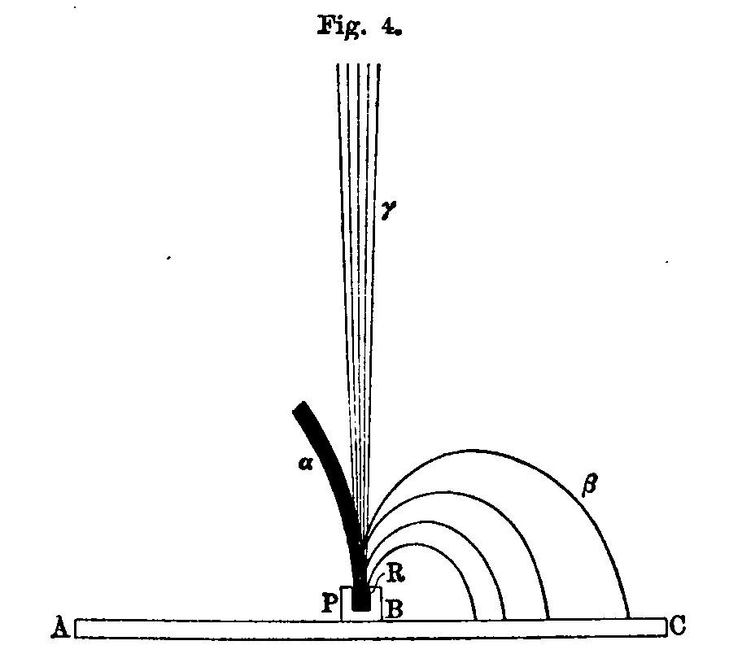

Denken wir uns folgenden Versuch: Das Radium&nbsp;$R$ befindet
sich in einer kleinen Höhlung, die in einen Bleiblock&nbsp;$P$ eingegraben
ist (Fig.&nbsp;4). Ein geradliniges und wenig sich verbreiterndes
Strahlenbündel entweicht aus dem Troge. Nehmen
wir an, daß in der Umgebung der Vertiefung ein gleichförmiges,
sehr starkes magnetisches Feld erzeugt werde, senkrecht zur
Zeichnungsebene und von vorn nach hinten gerichtet. Dann
werden die drei Strahlengruppen von einander getrennt werden.

Die wenig intensiven $\gamma$-Strahlen setzen ihren geradlinigen Weg
fort, ohne eine Spur von Ablenkung. Die $\beta$-Strahlen werden wie
Kathodenstrahlen abgelenkt und beschreiben kreisförmige Bahnen
in der Zeichnungsebene, deren Krümmungsradius in weiten
Grenzen variirt. Wenn der Trog auf eine photographische Platte
$AC$ aufgesetzt wird, so wird der von den $\beta$-Strahlen getroffene
Teil $BC$ der Platte beeinflußt. Die $\alpha$-Strahlen endlich bilden
ein sehr intensives Bündel, das nur wenig abgelenkt und ziemlich
schnell in der Luft ebsorbirt wird. Diese Strahlen beschreiben
in der Zeichnungsebene eine Bahn von sehr großem
Krümmungsradius; der Sinn der Ablenkung ist der entgegengesetzte
wie bei den $\beta$-Strahlen.

Bedeckt man die Höhlung mit einem dünnen Aluminiumschirm (0,1&nbsp;m dick),
so werden die $\alpha$-Strahlen großenteils absorbirt,
die $\beta$-Strahlen viel weniger, und die $\gamma$-Strahlen überhaupt
nicht in merklichem Maße.

In der soeben beschriebenen Form kann der Versuch nicht
wirklich ausgeführt werden; die Versuche, aus denen die Wirkung
des Magnetfeldes auf die verschiedenen Strahlenarten hervorgeht,
sollen weiter unten besprochen werden.

## d) Wirkung des Magnetfeldes.

Aus dem obigen ergiebt sich, daß die von den radioaktiven
Substanzen emittirten Strahlen eine große Zahl von Eigenschaften
mit den Kathodenstrahlen und den Röntgenstrahlen gemeinsam
haben. Die Kathodenstrahlen ionisiren ebenso wie die Röntgenstrahlen
die Luft, wirken auf die photographischen Platten, erregen
Fluorescenz, erfahren keine regelmäßige Reflexion. Aber
die Kathodenstrahlen unterscheiden sich von den Röntgenstrahlen
darin, daß sie durch die Einwirkung eines Magnetfeldes aus ihrer
geradlinigen Bahn abgelenkt werden, und daß sie eine negative
elektrische Ladung mit sich führen.

Die Tatsache, daß das magnetische Feld auf die Strahlung
der radioaktiven Körper wirkt, wurde fast gleichzeitig von den
Herren *Giesel*[@gf1899ann1],
*Meyer* und *v.&nbsp;Schweidler*[@msse1899wien1; @msse1899wien2; @msse1899pz1; @msse1899pz2]
und *Becquerel*[@bh1899cr]
entdeckt^[Siehe auch *Elster* und *Geitel*.[@ejgh1899vdp]]. Diese Physiker fanden, daß die Strahlen der radioaktiven
Körper in derselben Weise und im selben Sinne abgelenkt
werden wie die Kathodenstrahlen; ihre Beobachtungen bezogen
sich auf die $\beta$-Strahlen.

Herr *Curie*[@cp1900cr]
zeigte, daß die Radiumstrahlung aus zwei
wohl zu unterscheidenden Strahlengruppen besteht, von denen
die eine im Magnetfelde stark ablenkbar ist ($\beta$-Strahlen),
während die andre unempfindlich gegen die Wirkung des Feldes zu
sein scheint ($\alpha$- und $\gamma$-Strahlen,
die unter der gemeinsamen Bezeichnung
**ablenkbare Strahlen** zusammengefaßt wurden).

Bei den von uns hergestellten Poloniumpräparaten hat Herr
*Becquerel* keine Emission von Strahlen, die den Kathodenstrahlen
entsprechen, beobachtet. Im Gegensatz hierzu hat Herr
*Giesel* an einem von ihm hergestellten Poloniumpräparat zuerst
die Wirkung des Magnetfeldes beobachtet. Unter allen von uns
hergestellten Poloniumpräparaten hat keines jemals den Kathodenstrahlen
analoge Strahlen gezeigt.

Das *Giesel*sche Polonium emittirt die kathodenstrahlartige
Strahlung nur im frisch hergestellten Zustande, es ist wahrscheinlich,
daß diese Strahlung von der Erscheinung der inducirten
Radioaktivität herrührt, von der weiter unten die Rede
sein wird.

Folgende Versuche dienten zum Nachweis, daß ein Teil der
Radiumstrahlung, und zwar nur ein Teil aus leicht ablenkbaren
Strahlen besteht ($\beta$-Strahlen). Die Versuche geschahen mittels
der elektrischen Methode[@cp1900cr].

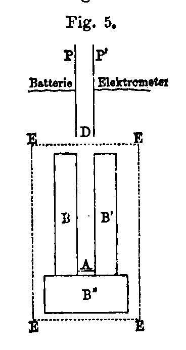

Der radioaktive Körper $A$ (Fig.&nbsp;5) sendet Strahlen in der
Richtung $AD$ zwischen die Platten $P$ und&nbsp;$P'$. Die Platte $P$ wird
auf einem Potential von 500 Volt erhalten,
die Platte $P'$ ist mit einem Elektrometer und
einem piezoelektrischen Quarz verbunden.
Man mißt die Stärke des unter dem Einfluß
der Strahlung die Luft durchfließenden
Stromes. Mittels eines Elektromagneten kann
man nach Belieben innerhalb des ganzen
Bereiches $EEEE$ ein magnetisches Feld erzeugen,
das senkrecht zur Zeichnungsebene
verläuft. Wenn die Strahlen auch nur schwach
abgelenkt werden, so gelangen sie nicht
mehr zwischen die Platten, und der Strom
wird unterdrückt. Die Bahn der Strahlen
ist durch die Bleimassen $BB'B''$ sowie durch
die Polschuhe des Elektromagneten begrenzt;
wenn die Strahlen abgelenkt werden, so werden sie von den
Bleimassen $B$ und $B'$ absorbirt.

Die erhaltenen Resultate hängen wesentlich von dem Abstand
$AD$ der Strahlungsquelle $A$ von dem Beginn des Kondensators
bei $D$ ab. Ist die Entfernung $AD$ ziemlich groß (größer
als 7&nbsp;cm), so wird der größte Teil (etwa 90&nbsp;Proz.) der Radiumstrahlung,
die den Kondensator erreicht, von einem Magnetfelde
von 2500 Einheiten abgelenkt und unterdrückt. Diese Strahlen
sind die $\beta$-Strahlen. Ist die Entfernung $AD$ kleiner als 65&nbsp;mm,
so wird ein weniger beträchtlicher Teil der Strahlen vom Felde
abgelenkt; dabei wird dieser Teil bereits vollständig in einem
Felde von 2500 Einheiten abgelenkt, so daß eine Erhöhung der
Feldstärke auf 7000 Einheiten keine Vermehrung des beseitigten
Bruchteiles der Strahlung hervorbringt.

Der durch das Feld nicht abgelenkte Bruchteil der Strahlung
ist um so größer, je kleiner die Entfernung zwischen der
Strahlungsquelle und dem Kondensator. Für sehr kleine Abstände
bilden die ablenkbaren Strahlen nur noch einen ganz geringen
Bruchteil der Gesamtstrahlung.

Die durchdringenden Strahlen bestehen also zum großen
Teil aus ablenkbaren Strahlen von der Art der Kathodenstrahlen
($\beta$-Strahlen).

Mit der soeben beschriebenen Anordnung konnte die Wirkung
des Magnetfeldes auf die $\alpha$-Strahlen bei den angewandten
Feldstärken kaum beobachtet werden. Die sehr beträchtliche,
scheinbar unablenkbare Strahlung, die man bei kleinem Abstande
von der Strahlungsquelle beobachtete, bestand aus $\alpha$-Strahlen;
die bei großer Entfernung beobachtete unablenkbare Strahlung
bestand aus $\gamma$-Strahlen.

Filtrirt man das Bündel durch ein Absorptionsmittel (Aluminium,
oder schwarzes Papier), so werden die hindurchgehenden
Strahlen fast alle im Magnetfelde abgelenkt, so daß durch den
Absorptionsschirm und das Magnetfeld zusammen fast die ganze
Strahlung im Kondensator unterdrückt wird; der übrig bleibende
Rest besteht nur noch aus $\gamma$-Strahlen, deren Menge gering ist.
Die $\alpha$-Strahlen werden von dem Schirm absorbirt.

Ein Aluminiumblatt von 0,01&nbsp;mm Dicke genügt, um fast
alle schwer ablenkbaren Strahlen zu unterdrücken, wenn die Substanz
sich ziemlich weit entfernt vom Kondensator befindet; für
kleinere Abstände (34 und 51&nbsp;mm) sind zwei Aluminiumblätter
von 1 bis 100&nbsp;mm nötig, um dasselbe Resultat zu erreichen.

Ähnliche Messungen mit ganz analogem Resultat wurden an
vier strahlenden Substanzen (Chloriden und Karbonaten) von sehr
verschiedener Aktivität gemacht.

Man findet bei allen Präparaten, daß die magnetisch ablenkbaren
durchdringenden Strahlen ($\beta$-Strahlen) nur einen geringen
Bruchteil der Gesamtstrahlung ausmachen; sie kommen bei den
Messungen nur wenig in Betracht, wenn man die Gesamtstrahlung
benutzt, um die Luft leitend zu machen.

Auch die Poloniumstrahlung kann mittels der elektrischen
Methode beobachtet werden. Wenn man die Entfernung $AD$
des Poloniums vom Kondensator variirt, so bemerkt man zuerst,
so lange die Entfernung ziemlich groß ist, gar keinen Strom;
nähert man das Polonium, so bemerkt man, daß für eine gewisse
Entfernung, die bei dem untersuchten Präparat 4&nbsp;cm betrug, die
Strahlung sich plötzlich mit großer Intensität bemerkbar macht;
der Strom wächst dann gleichmäßig, wenn man das Polonium
weiter nähert, doch bringt das Magnetfeld unter diesen Bedingungen
keinen merklichen Effekt hervor. Es sieht so aus, als
ob die Poloniumstrahlen im Raume begrenzt wären und in Luft
kaum eine Art von Scheidewand überschritten, die die Substanz
im Abstande von einigen Centimetern umgiebt.

Ich muß hier einige wichtige allgemeine Einschränkungen
bezüglich der Deutung der soeben beschriebenen Versuche machen.
Wenn ich von dem durch den Magneten abgelenkten Bruchteil
der Strahlung spreche, so handelt es sich dabei nur um diejenigen
Strahlen, die im Stande sind, einen Strom im Kondensator zu
erzeugen. Wenn man als Reagenz für die Becquerelstrahlen die
Fluorescenz oder die Wirkung auf die photographische Platte
benutzte, so würde der Bruchteil wahrscheinlich ein andrer
werden; eine Intensitätsmessung hat eben im allgemeinen nur
einen Sinn für die gerade angewandte Meßmethode.

Die Poloniumstrahlen sind von der Art der $\alpha$-Strahlen. Bei
den soeben beschriebenen Versuchen wurde keinerlei Einfluß des
Magnetfeldes auf diese Strahlen bemerkt, doch war die Anordnung
derartig, daß eine schwache Ablenkung unbemerkbar
bleiben mußte.

Versuche mittels der radiographischen Methode bestätigten
die Resultate der obigen Versuche. Benutzt man Radium als
Strahlungsquelle und fängt die Strahlen auf einer Platte auf, die
parallel zum ursprünglichen Strahlenbündel und senkrecht zum
Felde steht, so erhält man die sehr scharfe Spur zweier durch
das Feld getrennter Strahlenbündel, von denen das eine abgelenkt
ist, das andre nicht. Die $\beta$-Strahlen bilden das abgelenkte
Bündel; die nur sehr wenig abgelenkten $\alpha$-Strahlen vermischen
sich fast ganz mit dem unabgelenkten Bündel der $\alpha$-Strahlen.

## e) Ablenkbare $\beta$-Strahlen.

Es folgte aus den Versuchen der Herren *Giesel*
und *Meyer*
und *v. Schweidler*, daß die Strahlung der radioaktiven Körper
wenigstens zum Teil vom Magnetfeld abgelenkt wird, und daß
diese Ablenkung ebenso geschieht wie bei den Kathodenstrahlen.
Herr *Becquerel*[@bh1900cr1; @bh1900cr2; @bh1900cr3]
hat die Wirkung des Feldes auf die Strahlen
mittels der radiographischen Methode untersucht. Die benutzte
Anordnung war die der Fig.&nbsp;4. Das Radium befand sich in
einer Bleischale&nbsp;$P$, die auf der Schichtseite einer in schwarzes
Papier eingehüllten photographischen Platte $AC$ stand. Das
Ganze befand sich zwischen den Polen eines Elektromagneten,
dessen Feld senkrecht zur Zeichnungsebene verlief.

Wenn das Feld von vorn nach hinten gerichtet ist, so wird
der Teil $BC$ der Platte von Strahlen getroffen, die nach Zurücklegung
kreisförmiger Bahnen auf die Platte zurückgeworfen
werden und sie in rechtem Winkel schneiden. Diese Strahlen sind
$\beta$-Strahlen.

*Becquerel* zeigte, daß das Bild aus einem breiten diffusen
Bande, einem richtigen kontinuirlichen Spektrum besteht, woraus
hervorgeht, daß das von der Quelle ausgesandte ablenkbare
Strahlenbündel aus einer unendlichen Zahl verschieden ablenkbarer
Strahlen besteht. Bedeckt man die Schicht der Platte mit
verschiedenen Absorptionsmitteln (Papier, Glas, Metalle), so wird
ein Teil des Spektrums unterdrückt, und es ergiebt sich, daß diejenigen
Strahlen, die am stärksten im Magnetfelde abgelenkt
werden, oder anders ausgedrückt, diejenigen, deren Bahn den
kleinsten Krümmungsradius hat, am stärksten absorbirt werden.
Für jeden Schirm beginnt die Einwirkung auf die Platte erst bei
einem gewissen Abstand von der Strahlungsquelle, und dieser
Abstand ist um so größer, je stärker der Schirm absorbirt.

## f) Ladung der ablenkbaren Strahlen.

Die Kathodenstrahlen sind, wie *Perrin*[@pj1895cr; @pj1897acp]
gezeigt hat, mit
negativer Elektrizität geladen. Sie vermögen ferner nach den
Versuchen der Herren *Perrin* und *Lenard*[@lp1898ann]
ihre Ladung durch
mit der Erde verbundene Metallschirme und durch isolirende
Substanzen hindurch zu transportiren. An jeder Stelle, wo 
Kathodenstrahlen absorbirt werden, findet eine kontinuirliche 
Entwicklung negativer Elektrizität statt. Wir stellten fest, daß
dasselbe für die ablenkbaren $\beta$-Strahlen des Radiums stattfindet.
**Die ablenkbaren $\beta$-Strahlen sind mit negativer Elektrizität
geladen**[@cpcm1900cr].

Die radioaktive Substanz sei auf einer der Platten eines
Kondensators ausgebreitet und die Platte zur Erde abgeleitet; die
zweite mit dem Elektrometer verbundene Platte empfängt und
absorbirt die von der Substanz emittirten Strahlen. Wenn die
Strahlen geladen sind, so sollte man einen kontinuirlichen 
Elektrizitätszufluß zum Elektrometer erwarten. Als wir dieses Experiment
in Luft ausführten, konnten wir keine Ladung der Strahlen
nachweisen, aber in dieser Form ist der Versuch auch nicht
empfindlich genug. Die Luft zwischen den Platten wird durch
die Strahlen leitend gemacht, das Elektrometer ist also nicht
mehr isolirt und kann nur ziemlich starke Ladungen anzeigen.
Damit die $\alpha$-Strahlen den Versuch nicht stören, kann man
sie durch Bedeckung der Strahlungsquelle mit einem dünnen
Metallschirm unterdrücken; das Resultat des Versuchs wird dadurch
nicht geändert.^[Genau gesagt, bemerkt man bei diesen Versuchen immer eine
  Ablenkung am Elektrometer, doch kann man leicht feststellen, daß
  diese Ablenkung die Wirkung der elektromotorischen Kontaktkraft
  ist, die zwischen der mit dem Elektrometer verbundenen Platte und
  den benachbarten Leitern besteht; infolge der Leitfähigkeit der von
  den Radiumstrahlen durchstrahlten Luft bringt diese Kraft eine 
  Ablenkung des Elektrometers hervor.]

Wir haben den Versuch in Luft ohne besseren Erfolg
wiederholt, indem wir die Strahlen in das Innere eines mit dem
Elektrometer verbundenen *Faraday*schen Cylinders eindringen
ließen.^[
  Die Anbringung des *Faraday*schen Cylinders ist nicht 
  notwendig, sie könnte jedoch gewisse Vorteile bieten, falls die 
  Strahlung von den getroffenen Wänden eine starke diffuse Zersetzung 
  erführe. Man könnte dann hoffen, die etwa vorhandenen diffus 
  zerstreuten Strahlen aufzufangen und auszunutzen.]
  
Man konnte sich schon nach den vorangehenden Versuchen
davon Rechenschaft geben, daß die Ladung der von dem angewandten
Präparat ausgehenden Strahlung nur schwach sein
konnte.

Um eine schwache Elektrizitätsentwicklung auf einem die
Strahlen absorbirenden Leiter zu konstatiren, muß der Leiter
elektrisch gut isolirt sein; dazu muß man ihn aber vor der Einwirkung
der Luft schützen, indem man ihn entweder in ein sehr
vollkommen evakuirtes Gefäß bringt,^[
  Versuche im Vakuum hat neuerdings Herr W. *Wien*
  ausgeführt[@ww1903pz]. (Anm. d.&nbsp;Übers.)]
oder ihn mit einem guten
festen Dielektrikum umgiebt. Die letztere Anordnung wurde von
uns benutzt.

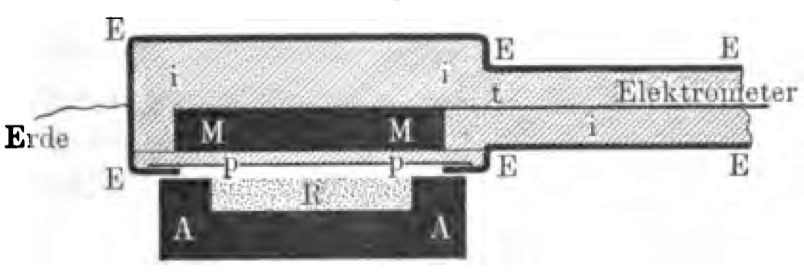

Eine leitende Scheibe $MM$ (Fig.&nbsp;6) ist durch einen Metallstab&nbsp;$t$
mit dem Elektrometer verbunden; Scheibe und Stab sind
vollständig von dem Isolirmittel $iiii$ umgeben; das ganze ist von
einer Metallhülle $EEEE$ umgeben, die in leitender Verbindung
mit der Erde steht. Auf einer Seite der Scheibe sind Isolirschicht&nbsp;$pp$
und Metallhülle sehr dünn. Diese Seite ist der Strahlung
des Radium-haltigen Baryumsalzes $R$ ausgesetzt, das sich
frei in einem Bleitrog befindet.^[Die isolirende Schicht muß völlig kontinuirlich sein. Jede 
  luftgefüllte Spalte, die von dem inneren Leiter bis zur metallischen
  Hülle reicht, giebt zu einem Stroms Veranlassung, der von den
  Kontaktelektromotorischen Kräften herrührt und die durch das Radium 
  leitend gemachte Luft durchfließt.]
Die von dem Radium emittirten
Strahlen durchsetzen die Metallhülle und die isolirende Schicht&nbsp;$pp$
und werden in der Metallscheibe $MM$ absorbirt. Diese wird
dadurch der Sitz einer kontinuirlichen und konstanten Entwicklung
negativer Elektrizität, die man am Elektrometer konstatirt
und mittels des piezoelektrischen Quarzes mißt.

Der so erzeugte Strom ist sehr schwach. Mit sehr aktivem
Radium-haltigen Baryumchlorid in einer Schicht von 2,5&nbsp;cm
Oberfläche und 0,2&nbsp;cm Dicke erhält man einen Strom von der
Größenordnung $10^{-11}$&nbsp;Ampere, nachdem die benutzten Strahlen
vor ihrer Absorption in der Scheibe $MM$ eine Aluminiumschicht
von 0,01&nbsp;mm und eine Hartgummischicht von 0,3&nbsp;mm Dicke
durchsetzt haben.

Wir haben hintereinander Blei, Kupfer und Zink für die
Scheibe $MM$, Hartgummi und Paraffin als Isolirmittel benutzt;
die erhaltenen Resultate waren dieselben. Der Strom wird
schwächer, wenn man die Strahlungsquelle $R$ entfernt, oder ein
schwächer aktives Präparat benutzt.

Dieselben Resultate erhielten wir, als wir die Scheibe $MM$
durch einen mit Luft gefüllten, aber von einem Isolirmittel umhüllten
*Faraday*schen Cylinder ersetzten. Die durch die dünne
isolirende Platte $pp$ verschlossene Öffnung des Cylinders befand
sich der Strahlungsquelle gegenüber.

Endlich haben wir auch den umgekehrten Versuch gemacht,
der darin besteht, daß man den Bleitrog mit dem isolirenden
Medium umgiebt und mit dem Elektrometer verbindet (Fig.&nbsp;7),
während das Ganze mit einer geerdeten Metallhülle umgeben ist.

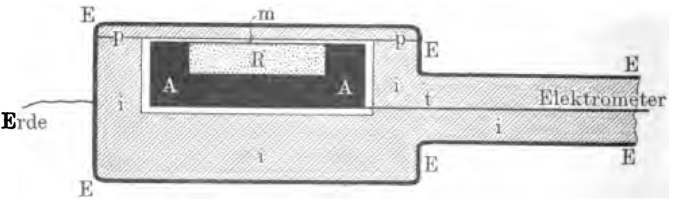

Bei dieser Anordnung beobachtet man am Elektrometer, daß
das Radium eine positive Ladung von gleicher Größe annimmt,
wie die negative bei dem ersten Versuch. Die Strahlen des Radiums
durchdringen die dünne Schicht&nbsp;$pp$ und nehmen beim
Verlassen des inneren Leiters negative Elektrizität mit sich fort.

Die $\alpha$-Strahlen des Radiums kommen bei diesen Versuchen
nicht in Betracht, da sie schon in sehr dünnen Schichten fester
Substanz fast vollständig absorbirt werden. Die soeben beschriebene
Methode eignet sich auch nicht für die Untersuchung der
Poloniumstrahlen, da diese ebenfalls wenig Durchdringungsvermögen
besitzen. Wir bemerkten keine Spur einer Ladung beim
Polonium, das nur $\alpha$-Strahlen emittirt; aus dem eben genannten
Grunde kann man jedoch aus diesem Versuch keinen Schluß ziehen.

Es findet also bei den ablenkbaren $\beta$-Strahlen des Radiums,
ebenso wie bei den Kathodenstrahlen, ein Transport von Elektrizität
statt. Nun hat man bisher niemals die Existenz elektrischer
Ladungen gekannt, die nicht an Materie geknüpft waren.
Man kam also dazu, sich für die Untersuchung der ablenkbaren
$\beta$-Strahlen des Radiums derselben Theorie zu bedienen, die 
augenblicklich für die Kathodenstrahlen in Gebrauch ist. Nach dieser
ballistischen Theorie, die von Sir W. *Crookes* aufgestellt,
später
von Herrn J. J. *Thomson* entwickelt und vervollständigt ist,
bestehen die Kathodenstrahlen aus äußerst feinen Teilchen, die
von der Kathode mit großer Geschwindigkeit fortgeschleudert
werden und mit negativer Elektrizität geladen sind. Man kann
also annehmen, daß das Radium negativ geladene Partikel in den
Raum hinaussendet.

Ein Radiumpräparat, das in einer dünnen, vollkommen isolirenden
festen Hülle eingeschlossen ist, muß sich von selbst auf
ein sehr hohes Potential laden. Nach der ballistischen Hypothese
müßte dieses Potential so lange anwachsen, bis die Potentialdifferenz
gegen die umgebenden Leiter genügend groß wird, um
die Entfernung der emittirten elektrisirten Teilchen zu verhindern
und sie zur Strahlungsquelle zurückzuführen.^[
  In Wirklichkeit wird wegen der stets unvollkommenen Isolation
  schon bei schwächeren Ladungen ein stationärer Zustand erreicht.
  (Anm.\ d.&nbsp;Übers.)]
  
Wir haben durch Zufall ein derartiges Experiment gemacht.
Ein sehr aktives Radiumpräparat war seit langem in einem Glasröhrchen
eingeschlossen. Um das Röhrchen zu öffnen, machten
wir einen Strich mit einem Glasmesser auf dem Glase. In diesem
Moment hörten wir deutlich das Geräusch eines Funkens, und
als wir darauf das Glas mit einer Lupe untersuchten, fanden
wir, daß es an der durch den Strich geschwächten Stelle von
einem Funken durchbohrt war. Dieser Vorgang ist durchaus
vergleichbar mit der Durchbrechung des Glases einer zu stark
geladenen Leydenerflasche.

Die gleiche Erscheinung wiederholte sich mit einer andren
Röhre. Ja, Herr *Curie*, der die Röhre hielt, spürte sogar im
Moment, als der Funke übersprang, in seinen Fingern einen elektrischen 
Entladungsschlag.^[Siehe auch [@de1903pz].]

Gewisse Gläser sind sehr gute Isolatoren. Wenn man das
Radium in ein zugeschmolzenes, gut isolirendes Röhrchen einschließt,
kann man erwarten, daß in einem bestimmten Moment
die Röhre von selbst durchbohrt wird. **Das Radium ist das
erste Beispiel eines Körpers, der sich von selbst elektrisch
ladet.**

## g) Wirkung des elektrischen Feldes auf die ablenkbaren $\beta$-Strahlen des Radiums.

Da die ablenkbaren $\beta$-Strahlen des Radiums den Kathodenstrahlen
vergleichbar sind, so müssen sie von einem elektrischen
Felde in derselben Weise wie diese abgelenkt werden, d.&nbsp;h. wie
ein negativ geladenes, träges Teilchen, das mit großer Geschwindigkeit 
in den Raum hinausgeschleudert wird. Die Existenz
dieser Ablenkung wurde einerseits von Herrn Dorn,[@de1900ed]
andrerseits
von Herrn *Becquerel*[@bh1900cr3] nachgewiesen.

Betrachten wir einen Strahl, der den Raum zwischen den
beiden Platten eines Kondensators durchsetzt. Die Strahlrichtung
sei parallel zu den Platten. Wenn man zwischen diesen ein
elektrisches Feld erzeugt, so ist der Strahl der Einwirkung dieses
gleichförmigen Feldes längs seines ganzen Weges&nbsp;$l$ zwischen den
Kondensatorplatten unterworfen. Infolge dieser Einwirkung wird
der Strahl nach der positiven Platte hin abgelenkt und beschreibt
einen Parabelbogen; wenn er das Feld verläßt, setzt er seinen
Weg geradlinig fort in Richtung der Tangente an den Parabelbogen
im Austrittspunkt. Man kann den Strahl auf einer photographischen
Platte auffangen, die senkrecht zur ursprünglichen
Richtung steht. Man beobachtet die Wirkung auf die Platte
für das Feld Null und für eine bekannte Feldstärke, und leitet
daraus den Wert&nbsp;$\delta$ der Ablenkung ab, die gleich der Entfernung
der beiden Punkte ist, in denen die neue und die ursprüngliche
Strahlrichtung dieselbe zur ursprünglichen Richtung senkrechte
Ebene treffen. Wenn $h$ die Entfernung dieser Ebene vom Kondensator,
d.&nbsp;h. von der Grenze des Feldes ist, so erhält man durch
eine einfache Rechnung:

&nbsp;

wobei $m$ die Masse des bewegten Teilchens, $e$ seine Ladung,
$v$ seine Geschwindigkeit und&nbsp;$F$ die Feldstärke bedeutet.

Die Versuche *Becquerel*s gestatteten ihm eine angenäherte
Bestimmung von&nbsp;$\delta$.

## h) Verhältniß von Ladung zur Masse eines vom Radium emittirten negativ geladenen Teilchens.

Ein träges Teilchen von der Masse $m$ und der negativen
Ladung&nbsp;$e$ werde mit der Geschwindigkeit&nbsp;$v$ in ein gleichförmiges
Magnetfeld hineingeschleudert, das senkrecht zur ursprünglichen
Geschwindigkeit verläuft; das Teilchen beschreibt dann in einer
Ebene, die durch die Anfangsrichtung geht und senkrecht zum
Felde steht, einen Kreisbogen vom Krümmungsradius&nbsp;$\rho$, für den,
wenn $H$ die Feldstärke bedeutet, die Beziehung gilt:

$H\rho = mv/e$.

Wenn man für ein und denselben Strahl die elektrische 
Ablenkung&nbsp;$\delta$ und den Krümmungsradius&nbsp;$\rho$ in einem magnetischen
Felde gemessen hat, so kann man aus den beiden Versuchen die
Werte für $e/m$ und die Geschwindigkeit $v$ berechnen.

Die *Becquerel*schen Versuche lieferten eine erste Annäherung
hierfür. Sie ergaben für $e/m$ einen angenäherten Wert von&nbsp;$10^7$
absoluten elektromagnetischen Einheiten, und für&nbsp;$v$ einen
Wert von $1,6\cdot10^{10}$ cm/sek.
Diese Zahlen sind von derselben
Größenordnung wie bei den Kathodenstrahlen.

Genaue Untersuchungen über denselben Gegenstand wurden
von Herrn *Kaufmann*[@kw1901goe; @kw1902goe; @kw1902pz; @kw1903goe]
gemacht. Er unterwarf ein sehr
feines Bündel von Radiumstrahlen der gleichzeitigen Einwirkung
eines elektrischen und eines magnetischen Feldes, die
beide gleichförmig und gleichgerichtet waren, und zwar senkrecht
zur ursprünglichen Richtung des Bündels. Das Bild auf
einer Platte, die senkrecht zur ursprünglichen Richtung und von
der Quelle aus gerechnet jenseits der Grenzen des Feldes aufgestellt
war, erhält die Form einer Kurve, von der jeder Punkt
einem der Strahlen des ursprünglichen heterogenen Bündels entspricht.
Die am stärksten durchdringenden und am wenigsten
ablenkbaren Strahlen sind dabei diejenigen, deren Geschwindigkeit
die größte ist.

Aus den Versuchen *Kaufmann*s folgt, daß für die Radiumstrahlen,
deren Geschwindigkeit wesentlich größer ist als die der
Kathodenstrahlen, das Verhältniß $e/m$ mit zunehmender Geschwindigkeit
abnimmt.

Nach den Arbeiten von *J.&nbsp;J.&nbsp;Thomson*[@tjj1898pm]
und *Townsend*[@tjs1900pt]
müssen wir annehmen, daß das bewegte Teilchen, aus dem der
Strahl besteht, eine Ladung besitzt, die gleich ist derjenigen, die
ein Wasserstoffatom in der Elektrolyse transportirt, daß also
diese Ladung für alle Strahlen dieselbe ist. Man muß daraus
schließen, daß die Masse des Teilchens mit zunehmender Geschwindigkeit
wächst.

Nun führen aber theoretische Betrachtungen zu der Anschauung,
daß die Trägheit des Teilchens mit der Bewegung
der Ladung eng zusammenhängt, da die Geschwindigkeit einer
in Bewegung befindlichen Ladung nicht ohne Energieaufwand
verändert werden kann. Anders ausgedrückt: Die Trägheit des
Teilchens ist elektromagnetischen Ursprungs und die Masse des
Teilchens ist wenigstens zum Teil eine scheinbare oder 
elektromagnetische Masse. Herr *Abraham*[@am1902goe]
geht noch weiter und
nimmt an, daß die Masse des Teilchens völlig elektromagnetischen
Ursprungs ist. Wenn man nach dieser Hypothese die Masse&nbsp;$m$
für eine gegebene Geschwindigkeit&nbsp;$v$ berechnet, so findet man,
daß $m$ unendlich groß wird, wenn $v$ sich der Lichtgeschwindigkeit
nähert und daß $m$ einen konstanten Wert annimmt, wenn
die Geschwindigkeit klein gegen die des Lichtes ist. Die Versuche
Kaufmanns sind in Übereinstimmung mit dieser Theorie,
deren Wichtigkeit groß ist, da sich die Möglichkeit voraussehen
läßt, die Grundlagen der Mechanik auf der Dynamik kleiner
geladener und in Bewegung befindlicher Centra aufzubauen.^[Einige Ausführungen über diesen Gegenstand sowie eine sehr
  vollständige Untersuchung über die geladenen Centra (Eiektronen oder
  Korpuskeln) nebst Citaten der zugehörigen Arbeiten befindet sich in
  der Dissertation von Herrn *Langevin*[@lp1902phd].]

Folgendes sind die von Herrn *Kaufmann* für $e/m$ und für
$v$ erhaltenen Zahlen^[Berechnet nach [@kw1903goe], Tab.&nbsp;III.]:

------------------------------------------------------------
 $v\cdot10^{-10}$    $e/m\cdot10^{-7}$     $e/m\cdot10^{-10}$ 
                       beobachtet          aus dem Wert von
											                       $v$ berechnet
------------------ --------------------- ----------------------
 2,90                   0,692               0,722

 2,82                   0,835               0,861
 
 2,74                   0,972               0,953
 
 2,60                   1,07                1,08
 
 2,48                   1,16                1,18
 
 2,36                   1,24                1,25
 
 2,24                   1,29                1,32
 
 2,12                   1,33                1,38

 0,53                  1,865^*^             1,78
										 
 0,00                   ---                 1,80
------------------------------------------------------------------

\* (beobachtet von *Simon*[@ss1899ann] für Kathodenstrahlen.)

Herr *Kaufmann* schloß aus seinen Versuchen, daß der
Grenzwert von&nbsp;$e/m$ für Radiumstrahlen sehr kleiner Geschwindigkeit^[wenn solche beobachtet wären. (Anm. des Übersetzers)]
derselbe sein würde, wie für Kathodenstrahlen.

Seine genauesten Messungen hat *Kaufmann* mit einem
ihm von uns zur Verfügung gestellten kleinen Körnchen reinen
Radiumchlorides gemacht.

Nach den Versuchen *Kaufmann*s besitzen gewisse Teile
der $\beta$-Strahlung des Radiums eine Geschwindigkeit, die der des
Lichtes ganz nahe kommt. Es ist verständlich, daß diese so
schnellen Strahlen ein sehr großes Durchdringungsvermögen der
Materie gegenüber besitzen.

## i) Wirkung des Magnetfeldes auf die $\alpha$-Strahlen.

In einer neueren Arbeit kündigte Herr *Rutherford*[@re1902pz]
an,
daß in einem sehr starken elektrischen oder magnetischen Felde
die $\alpha$-Strahlen des Radiums schwach abgelenkt werden, derart,
wie es bei schnell bewegten, positiv geladenen Teilchen der Fall
sein würde. *Rutherford* schloß aus seinen Versuchen, daß
die Geschwindigkeit der $\alpha$-Strahlen von der Größenordnung
$2,5\cdot10^9$ cm/sek
und das Verhältniß&nbsp;$e/m$ von der Größenordnung
$6\cdot10^3$ wäre, d.&nbsp;h. $10^4$mal
kleiner als die ablenkbaren $\beta$-Strahlen.
Weiter unten soll gezeigt werden, daß diese Schlüsse 
*Rutherford*s mit den bisher bekannten
Eigenschaften der $\alpha$-Strahlen in
Einklang sind und zum Teil wenigstens von dem Absorptionsgesetz
dieser Strahlen Rechenschaft geben.

Die Versuche *Rutherford*s wurden von Herrn
*Becquerel*[@bh1903cr1; @bh1903cr2]
bestätigt. *Becquerel* zeigte ferner, daß die Poloniumstrahlen
sich im Magnetfelde ebenso wie die $\alpha$-Strahlen des Radiums 
verhielten und bei gleicher Feldstärke denselben Krümmungsradius
anzunehmen scheinen wie diese. Aus den *Becquerel*schen
Versuchen folgt ferner, daß die $\alpha$-Strahlen kein magnetisches
Spektrum zu bilden scheinen, sondern sich wie eine homogene
Strahlung verhalten, bei der alle Strahlen gleich stark abgelenkt
werden.^[S.&nbsp;a. *des Coudres*[@dct1903pz] (Anm.&nbsp;d.&nbsp;Übers.)]

## k) Wirkung des Magnetfeldes auf die Strahlen andrer radioaktiver Substanzen.

Es wurde im Vorangehenden gezeigt, daß das Radium drei
Strahlenarten emittirt, nämlich $\alpha$-Strahlen,
die den Kanalstrahlen,
$\beta$-Strahlen, die den Kathodenstrahlen verwandt sind, und nicht
ablenkbare durchdringende $\gamma$-Strahlen. Das Polonium emittirt
nur $\alpha$-Strahlen. Von den andren radioaktiven Körpern scheint
das Aktinium sich wie das Radium zu verhalten, doch ist die
Untersuchung der Strahlung dieses Körpers noch nicht so weit
fortgeschritten, wie die der Radiumstrahlung. Von den schwach
radioaktiven Körpern weiß man jetzt, daß das Uran und das
Thor sowohl $\alpha$-Strahlen, als auch ablenkbare
$\beta$-Strahlen emittiren
(*Becquerel*, *Rutherford*).

## l) Verhältniß der ablenkbaren $\beta$-Strahlen in der Radiumstrahlung.

Wie bereits gesagt, vermehrt sich die relative Intensität der
$\beta$-Strahlen mit zunehmender Entfernung von der Strahlungsquelle.
Dennoch treten diese Strahlen niemals allein auf, und
für große Entfernungen beobachtet man immer auch das Vorhandensein
von $\gamma$-Strahlen. Das Vorhandensein nicht ablenkbarer,
sehr durchdringender Strahlen in der Radiumstrahlung
wurde zuerst von Herrn *Villard*[@vp1900cr]
beobachtet. Diese Strahlen
bilden nur einen geringen Anteil der Strahlung, wenn man sie
mit der elektrischen Methode mißt, und ihr Vorhandensein entging
uns bei unsren ersten Versuchen, sodaß wir damals mit
Unrecht glaubten, daß bei großer Entfernung die Strahlung nur
ablenkbare Strahlen enthielte.

Folgendes sind die numerischen Resultate, die bei Versuchen
nach der elektrischen Methode mit einem Apparat entsprechend
dem der Fig.&nbsp;5 erhalten wurden. Das Radium war von dem
Kondensator nur durch die umgebende Luft getrennt. Ich bezeichne
mit $d$ den Abstand der Strahlungsquelle vom Kondensator.
Setzt man den Strom, der ohne Magnetfeld für jede einzelne
Entfernung erhalten wurde, gleich 100, so bedeuten die
Zahlen der zweiten Zeile den bei Erregung des Feldes übrigbleibenden
Strom. Diese Zahlen können als der prozentuale Anteil
der $\alpha$- und $\gamma$-Strahlen betrachtet werden, da die Ablenkung
der $\alpha$-Strahlen bei der benutzten Anordnung kaum bemerkbar
sein konnte.

Bei großen Entfernungen hat man keine $\alpha$-Strahlen mehr
und die unabgelenkte Strahlung besteht dann nur noch aus
$\gamma$-Strahlen.

Versuche bei kleinem Abstand:

-------------------------------  ---- ---- ---- ----
$d$ in cm                        3,4  5,1  6,0  6,5
Unabgelenkte Strahlen in Proz.   74   56   33   11
-----------------------------------------------------

Versuche bei großem Abstand, mit einem bedeutend aktiveren
Präparat als bei der vorigen Reihe:

-------------------------------  ---- ---- ---- ---- ---- ---- ----
$d$ in cm                        14   30   53   80   98   124  157
Unabgelenkte Strahlen in Proz.   12   14   17   14   16   14   11
--------------------------------------------------------------------

Man sieht, daß von einer gewissen Entfernung an der Anteil
der nicht abgelenkten Strahlen in der Strahlung annähernd konstant
ist. Diese Strahlen gehören wahrscheinlich alle zu den
$\gamma$-Strahlen. Die Unregelmäßigkeiten der Zahlen in der zweiten
Zeile wollen übrigens nicht viel bedeuten, wenn man bedenkt
daß die Totalintensität des Stromes in den beiden äußersten Versuchen
im Verhältniß 660 zu&nbsp;10 stand. Die Messungen konnten
bis zu einer Entfernung von 1,57&nbsp;m von der Strahlungsquelle
ausgedehnt werden, und wir wären jetzt im Stande, noch weiter
zu gehen.

Bei der folgenden Versuchsreihe war das Radium in einem
sehr engen Glasröhrchen eingeschlossen, das unter dem Kondensator
und parallel zu den Platten sich befand. Die emittirten
Strahlen hatten, ehe sie zu dem Kondensator gelangten, eine
gewisse Glas- und Luftschicht zu passiren:

-------------------------------  ---- ---- ---- ---- ---- ---- ---- ---- ----
$d$ in cm                        2,5  3,3  4,1  5,9  7,5  9,6  11,8 13,9 17,2
Unabgelenkte Strahlen in Proz.   88   33   21   16   14   10   9    9    10
------------------------------------------------------------------------------

Wie in den früheren Versuchen konvergiren die Zahlen der
zweiten Zeile gegen einen konstanten Grenzwert, wenn die Entfernung&nbsp;$d$
wächst, aber die Grenze wird praktisch schon für
einen kleineren Abstand erreicht als in den früheren Reihen, weil
die $\alpha$-Strahlen in dem Glase stärker absorbirt werden, als die
$\beta$- und $\gamma$-Strahlen.

Auch folgender Versuch zeigt, daß eine dünne Aluminiumschicht
(von 0,01&nbsp;mm Dicke) hauptsächlich die $\alpha$-Strahlen absorbirt.
Wenn das Präparat 5&nbsp;cm vom Kondensator entfernt war, so fand
man, durch Erregung des Magnetfeldes, daß das Verhältniß der
übrigen Strahlen zu den $\beta$-Strahlen 71&nbsp;Proz.\ betrug. Bedeckt
man das Präparat mit dem Aluminiumblatt, so findet man, daß
bei derselben Entfernung die durcbgelassene Strahlung fast vollständig
vom Magnetfeld abgelenkt wird, weil die $\alpha$-Strahlen von
dem Blatt absorbirt worden sind. Dasselbe Resultat erhält man
mit Papier als Absorptionsschirm.

Der größte Teil der Radiumstrahlung besteht aus $\alpha$-Strahlen,
die wahrscheinlich hauptsächlich von der Oberfläche der strahlenden
Substanz emittirt werden. Wenn man die Dicke der
strahlenden Schicht variirt, so wächst die Stromstärke mit dieser
Dicke; die Vermehrung ist aber nicht für die Gesamtheit der
Strahlen der Zunahme der Dicke proportional; sie ist für die
$\beta$-Strahlen viel beträchtlicher als
für die $\alpha$-Strahlen, derart, daß
der relative Anteil der $\beta$-Strahlen mit wachsender Schichtdicke
zunimmt. Wenn die Strahlungsquelle sich 5&nbsp;cm vom Kondensator
entfernt befindet, so findet man für eine Dicke der aktiven
Schicht von 0,4&nbsp;mm, daß die Gesamtstrahlung durch die Zahl&nbsp;28
gegeben ist und der Anteil der $\beta$-Strahlen 29&nbsp;Proz. beträgt.
Macht man die Schicht 2&nbsp;mm dick, d.&nbsp;h. fünfmal dicker, so erhält
man eine Gesamtstrahlung gleich&nbsp;102 und einen Anteil der
$\beta$-Strahlen von 45&nbsp;Proz. Die bei dieser Entfernung beobachtete
Gesamtstrahlung ist also auf das 3,6fache und die ablenkbare
$\beta$-Strahlung auf das 5fache gestiegen.

Die vorstehenden Versuche wurden mittels der elektrischen
Methode ausgeführt. Benutzt man die radiographische Methode,
so scheinen gewisse Resultate mit dem Vorstehenden in Widerspruch.
Bei den Versuchen von Herrn *Villard* wurde ein der
Wirkung des Magnetfeldes ausgesetztes Bündel von Radiumstrahlen
auf einem Satze von photographischen Platten aufgefangen.
Das unablenkbare und durchdringende $\gamma$-Strahlenbündel
durchsetzte alle Platten und zeichnete seine Spur auf allen. Das
abgelenkte $\beta$-Bündel wirkte nur auf die erste Platte ein. Dieses
Bündel scheint also keine Strahlen von großem Durchdringungsvermögen
zu enthalten.

Im Gegensatz dazu besteht bei unsren Versuchen ein in Luft
sich fortpflanzendes Bündel bei den größten der Beobachtung 
zugänglichen Entfernungen zu ungefähr ${}^{9}/_{10}$
aus ablenkbaren $\beta$-Strahlen,
und dasselbe ist der Fall, wenn die Strahlungsquelle in eine
kleine zugeschmolzene Glasröhre eingeschlossen ist. Bei den
Versuchen *Villard*s wirken diese ablenkbaren und 
durchdringenden $\beta$-Strahlen nicht mehr
auf die hinteren Platten ein, weil sie
von dem ersten festen Hinderniß, das sie treffen, nach allen
Seiten diffundirt werden und dadurch aufhören ein begrenztes
Bündel zu bilden. Bei unsren Versuchen wurden die von dem
Radium emittirten und das Glas durchsetzenden Strahlen wahrscheinlich
auch von dem Glas diffundirt; da aber die Röhre sehr
klein war, so wirkte sie selbst als Strahlenquelle für die von
ihrer Oberfläche ausgehenden ablenkbaren $\beta$-Strahlen und wir
konnten dieselben bis zu großen Entfernungen von der Röhre
beobachten.

Die Kathodenstrahlen der Entladungsröhren können nur sehr
dünne Schirme durchdringen (Aluminiumschirme bis zu 0,01&nbsp;mm
Dicke). Ein Strahlenbündel, das senkrecht auf den Schirm trifft,
wird nach allen Seiten zerstreut; aber die Zerstreuung ist um so
weniger beträchtlich, je dünner der Schirm, und für sehr dünne
Schirme existirt ein austretendes Bündel, das merklich in die
Verlängerung des einfallenden Bündels fällt[@dct1902pz].

Die ablenkbaren $\beta$-Strahlen des Radiums verhalten sich ähnlich,
doch ist die Veränderung, die das Bündel bei einem Schirm
von derselben Dicke erfährt, viel weniger groß. Nach den Versuchen
Becquerels werden die stark ablenkbaren $\beta$-Strahlen
des Radiums (d.&nbsp;h. diejenigen, deren Geschwindigkeit klein ist)
von einem Aluminiumschirm von 0,1&nbsp;mm Dicke stark zerstreut;
die durchdringenderen und weniger ablenkbaren Strahlen jedoch
(kathodenstrahlartige mit großer Geschwindigkeit) durchdringen
denselben Schirm ohne merkliche Zerstreuung und ohne Deformation
des Bündels, und zwar unabhängig von der Neigung des
Schirmes gegen das Bündel. Die sehr schnellen $\beta$-Strahlen 
durchdringen ohne Zerstreuung eine ziemlich dicke Schicht von Paraffin
(einige Centimeter) und man kann in dieser Schicht die Krümmung
des Bündels unter der Einwirkung eines Magnetfeldes verfolgen.
Je dicker der Schirm ist und je absorbirender seine
Substanz, um so mehr wird das ursprüngliche ablenkbare Bündel
verändert, weil in dem Maße, wie die Schichtdicke wächst, die
Zerstreuung beginnt, sich an immer durchdringenderen Strahlen
bemerkbar zu machen.

Die Luft bewirkt eine Zerstreuung der $\beta$-Strahlen, die zwar
für die stark ablenkbaren Strahlen sehr bemerkbar ist, jedoch viel
weniger in Betracht kommt als die von gleichen Dicken fester
Körper hervorgerufene. Deshalb breiten sich die $\beta$-Stahlen des
Radiums in Luft auf große Entfernungen hin aus.

## m) Durchdringungsvermögen der Strahlung der radioaktiven Substanzen.

Vom Beginn der Untersuchungen über die radioaktiven Substanzen
an beschäftigte man sich mit der Absorption, die verschiedene
Schirme auf die Strahlung dieser Körper ausüben. In
einer ersten Notiz über diesen Gegenstand veröffentlichte ich[@cs1898cr]
einige Zahlen, die am Beginn dieser Schrift mitgeteilt sind und
aus denen das relative Durchdringungsvermögen der Uran- und
Thorstrahlung zu ersehen ist.
Herr *Rutherford*[@re1899pm] untersuchte
specieller die Uranstrahlung und wies ihre Heterogenität nach.
Herr *Owens*[@orb1899pm] kam
zu demselben Schluß bezüglich der Thorstrahlung.
Als sodann die Entdeckung der stark aktiven Substanzen
erfolgte, wurde das Durchdringungsvermögen ihrer Strahlen
sogleich von mehreren Physikern untersucht
(*Becquerel*[@bh1900con],
*Meyer* und *v.&nbsp;Schweidler*[@msse1900pz],
*Curie*, *Rutherford*). Die ersten
Beobachtungen zeigten unzweifelhaft die Heterogenität der Strahlung,
die ein allgemeines Phänomen zu sein und allen radioaktiven
Stoffen zuzukommen scheint. Man befindet sich da
Strahlungsquellen gegenüber, die eine Gesamtheit von Strahlen
emittiren, deren jeder sein eigenes Durchdringungsvermögen hat.
Die Frage komplicirt sich noch dadurch, daß man untersuchen
muß, in welchem Maße die Natur der Strahlung beim Hindurchgang
durch materielle Körper modificirt werden kann, und daß
infolgedessen jede Messungsreihe eine präcise Bedeutung nur für
die gerade angewandte Versuchsordnung hat.

Unter Berücksichtigung dieser Einschränkungen kann man
versuchen, die verschiedenen Versuche miteinander zu vergleichen
und die Gesamtheit der Resultate darzustellen.

Die radioaktiven Körper emittiren eine Strahlung, die sich
in Luft und im Vakuum fortpflanzt; die Fortpflanzung ist geradlinig;
diese Tatsache wird durch die Schärfe und die Form der
Schatten bewiesen, die man erhält, wenn man für die Strahlung
undurchsichtige Körper zwischen die Quelle und die photographische
Platte oder den als Empfänger dienenden Fluorescenzschirm
stellt, wobei die Quelle klein sein muß gegen die Entfernung
vom Empfänger. Verschiedene Versuche, die die geradlinige
Ausbreitung der Strahlung des Urans, des Radiums und des
Poloniums beweisen, sind von Herrn
*Becquerel*[@bh1900cr5; @bh1900cr6] ausgeführt
worden.

Es ist interessant, die Entfernung von der Quelle zu bestimmen,
bis zu der die Strahlen sich in Luft fortpflanzen können,
Wir stellten fest, daß das Radium Strahlen aussendet, die in
mehreren Metern Abstand in Luft beobachtet werden konnten.
Bei einigen unsrer elektrischen Messungen fand eine Einwirkung
der Strahlungsquelle auf die Luft im Kondensator noch bei einer
Entfernung von 2 bis 3&nbsp;m statt. Ebenso haben wir Fluorescenzwirkungen
und photographische Wirkungen noch bei Entfernungen
von derselben Größenordnung erhalten.

Diese Versuche können nur mit sehr intensiven Strahlungsquellen
ausgeführt werden, da, abgesehen von der Absorption der
Luft, die Wirkung auf den Empfänger im umgekehrten Verhältniß
des Entfernungsquadrats variirt, wenn die Quelle von kleinen
Dimensionen ist. Diese sich in große Entfernung vom Radium
ausbreitende Strahlung enthält ebensowohl kathodenstrahlartige
wie nicht ablenkbare Strahlen; die ablenkbaren Strahlen sind jedoch
in der Mehrzahl, gemäß den oben angeführten Versuchen.
Der größte Teil der Strahlen dagegen (die $\alpha$-Strahlen) ist in Luft
auf einen Abstand von etwa 7&nbsp;cm von der Quelle begrenzt.

Ich machte einige Versuche mit Radium, das in einem kleinen
Glasgefäß eingeschlossen war. Die aus diesem Gefäß hervorkommenden
Strahlen durchmaßen einen gewissen Luftraum und
wurden in einem Kondensator aufgefangen, der in gewöhnlicher
Weise zur Messung ihres Ionisationsvermögens mittels der elektrischen
Methode diente. Man veränderte die Entfernung&nbsp;$d$ der
Quelle vom Kondensator und maß den im Kondensator erhaltenen
Sättigungsstrom. Folgendes sind die Resultate einer Messungsreihe:

 $d$ cm   $i$     $i\cdot d^2\cdot 10^{-3}$
-------- ------- ---------------------------
 10       127,0   13
 20        38,0   15
 30        17,4   16
 40        10,5   17
 50         6,9   17
 60         4,7   17
 70         3,8   19
100        1,65   17

Von einem gewissen Abstand an ändert sich die Intensität
der Strahlung merklich wie das Quadrat der Entfernung vom
Kondensator.

Die Poloniumstrahlung breitet sich in Luft nur bis zu einer
Entfernung von einigen Centimetern (4 bis 6&nbsp;cm) von der 
Strahlungsquelle aus.

Betrachtet man die Absorption der Strahlung durch feste
Körper, so findet man auch dabei einen fundamentalen Unterschied
zwischen dem Radium und dem Polonium. Das Radium
emittirt Strahlen, die eine dicke Schicht fester Körper zu durchdringen
vermögen, z.&nbsp;B. einige Centimeter Blei oder Glas\cite{cpcm1900con}.
Die Strahlen, die eine große Schichtdicke eines festen Körpers 
durchsetzt haben, sind außerordentlich durchdringend, und man kann
sie praktisch überhaupt nicht vollständig durch irgend einen
Körper absorbiren lassen. Aber diese Strahlen bilden nur einen
geringen Bruchteil der Totalstrahlung, die im Gegensatz hierzu
zum größten Teil bereits durch eine dünne Schicht fester Substanz
absorbirt wird.

Das Polonium dagegen emittirt äußerst absorbirbare Strahlen,
die nur sehr dünne Schichten fester Körper durchdringen können.
Ich gebe als Beispiel einige Zahlen über die Absorption, die
ein Aluminiumblatt von 0,01&nbsp;mm Dicke hervorbringt. Dieses
Blatt wurde über die Substanz gedeckt und war beinahe mit ihr
in Berührung. Die direkte und die von dem Blatt durchgelassene
Strahlung wurden mittels der elektrischen Methode (Fig.&nbsp;1) gemessen;
der Sättigungsstrom wurde in allen Fällen merklich erreicht.
Ich bezeichne mit&nbsp;$a$ die Aktivität der strahlenden Substanz,
die des Urans gleich&nbsp;1 gesetzt.

---------------------------------------------------------------
                                        $a$  Von dem Blatt
																				     durchgelassener
																						 Bruchteil der
																						 Strahlung
----------------------------------- ------- -----------------
Radium-haltiges Baryumchlorid            57  0,32

Radium-haltiges Baryumbromid             43  0,30

Radium-haltiges Baryumchlorid          1200  0,30

Radium-haltiges Baryumsulfat           5000  0,29

Radium-haltiges Baryumsulfat          10000  0,32

Metallisches Wismut-Polonium            ——   0,22

Uranverbindungen                        ——   0,20

Thorverbindungen in dünner Schicht      ——   0,38
----------------------------------------------------------------

Man sieht hieraus, daß Radium-haltige Verbindungen von
ganz verschiedener Aktivität ganz analoge Resultate geben, wie
ich es bereits im Anfang dieser Arbeit für die Uran- und 
Thorverbindungen gezeigt habe. Man sieht auch, wenn man die
Gesamtstrahlung ins Auge faßt, daß dann für die betrachtete 
absorbirende Schicht die verschiedenen strahlenden Substanzen sich
nach abnehmendem Durchdringungsvermögen ihrer Strahlen in
folgender Reihenfolge ordnen: Thor, Radium, Polonium, Uran.  

Diese Resultate sind in Übereinstimmung mit denen, die
Herr *Rutherford*[@rebht1902pm]
in einer Arbeit über diesen Gegenstand veröffentlichte.

*Rutherford* findet übrigens, daß die Reihenfolge dieselbe
ist, wenn Luft die absorbirende Substanz bildet. Es ist jedoch
wahrscheinlich, daß diese Reihenfolge keine absolute Bedeutung
hat und nicht unabhängig von der Natur und der Dicke des betrachteten
Schirms besteht. Der Versuch zeigt ja tatsächlich, daß
das Absorptionsgesetz für Polonium und Radium sehr verschieden
ist, und daß man bei letzterem die Absorption jeder der drei
Strahlenarten für sich betrachten muß.

Das Polonium ist besonders zur Untersuchung der $\alpha$-Strahlen
geeignet, da die in unsrem Besitz befindlichen Präparate keinerlei
andre Strahlen emittiren. Ich machte eine erste Versuchsreihe
mit frisch hergestellten und sehr stark aktiven Poloniumpräparaten.

Ich[@cs1900cr1] fand, daß die Poloniumstrahlen
um so absorbirbarer sind,
je dicker die schon durchstrahlte Schicht von Materie ist. Dieses
merkwürdige Absorptionsgesetz steht im Widerspruch mit dem
für die andren Strahlungen bekannten.

Ich benutzte für diese Untersuchung unsren elektrischen
Meßapparat in folgender Anordnung:

Die beiden Platten eines Kondensators $PP$ und $P'P'$ (Fig.&nbsp;8)
stehen horizontal und sind durch einen mit der Erde verbundenen
Metallkasten $BBBB$ geschirmt. Der aktive Körper&nbsp;$A$ befindet sich
in einer dicken Metallbüchse $CCCC$, die an der Platte&nbsp;$P'P’$ befestigt
ist, und wirkt auf die Luft im Kondensator durch ein Metallnetz&nbsp;$T$
hindurch; nur die das Metallgewebe durchsetzenden Strahlen
werden zur Stromerzeugung benutzt, da das Feld an dem Gewebe
endigt, Die Entfernung $AT$ des aktiven Körpers von dem Gewebe
ist veränderlich. Das Feld zwischen den Platten wird durch
eine Batterie erzeugt; der Strom wird mittels eines Elektrometers
und einen piezoelektrischen Quarzes gemessen.
Indem man in&nbsp;$A$ auf den aktiven Körper verschiedene
Schirme aufsetzt und die Entfernung $AT$ variirt, kann man die
Absorption von Strahlen messen, die in Luft mehr oder weniger
große Wege zurückgelegt haben.

Folgendes sind die mit Polonium erhaltenen Resultate:

Für einen gewissen Wert der Entfernung $AT$ (4&nbsp;cm und
darüber) erhält man keinen Strom; die Strahlen dringen nicht in
den Kondensator ein. Vermindert man den Abstand&nbsp;$AT$, so
macht sich das Auftreten der Strahlen im Kondensator ziemlich
plötzlich bemerkbar, derart, daß man durch eine sehr kleine 
Verringerung der Entfernung von einem sehr schwachen zu einem
sehr merklichen Strome übergeht; von da ab wächst der Strom
regelmäßig, wenn man den strahlenden Körper dem Gewebe&nbsp;$T$
weiter annähert.

Wenn man die strahlende Substanz mit einem Alumiumblatt
von 0,01&nbsp;mm Dicke bedeckt, so ist die dadurch hervorgerufene
Absorption um so größer, je größer die Entfernung&nbsp;$AT$.

Legt man auf das erste Aluminiumblatt ein gleiches zweites,
so absorbirt jedes Blatt einen Bruchteil der auffallenden Strahlung;
dieser Bruchteil ist für das zweite Blatt größer als für das
erste, so daß das zweite stärker absorbirend erscheint.

Die folgende Tabelle enthält: In der ersten Zeile die Abstände
zwischen dem Polonium und dem Gewebe $T$ in Centimetern;
in der zweiten Zeile den Anteil der von einem Aluminiumblatt
durchgelassenen Strahlung in Prozenten; in der dritten Zeile den
von zwei gleichen Aluminiumblättern durchgelassenen Anteil in
Prozenten:

----------------------------------  --- --- --- ---- ----
Entfernung $AT$                     3,5 2,5 1,9 1,45 0,5

Von einem Blatt durchgelassene
Strahlung in Prozenten              0,0 0,0 5,0 10,0 25,0

Von zwei Blättern durchgelassene
Strahlung in Prozenten              0,0 0,0 0,0 0,0  0,7
----------------------------------  --- --- --- ---- ----

Bei diesen Versuchen war der Abstand zwischen den Platten
$P$ und&nbsp;$P'$ 3&nbsp;cm. Man sieht, daß die Zwischenschaltung des
Aluminiumblattes in größerer Entfernung die Strahlung in höherem
Maße schwächt als in kleinerer Entfernung.

Dieser Effekt ist noch ausgesprochener, als aus den obigen
Zahlen hervorzugehen scheint. So bedeutet z.&nbsp;B. die Durchdringung
von 25&nbsp;Proz. für den Abstand 0,5 den Mittelwert des
Durchdringungsvermögens für alle Strahlen, die diese Entfernung
überschreiten, wobei dasjenige für die äußersten Strahlen sehr
schwach ist. Wenn man nur die Strahlen zwischen 0,5 und 1&nbsp;cm
auffinge, so würde man eine noch größere Durchdringung erhalten.
Und in der Tat, wenn man die Platten $P$ und $P'$ einander
auf 0,5&nbsp;cm nähert, so beträgt der von einem Aluminiumblatt
durchgelassene Bruchteil der ursprünglichen Strahlung (für
$AT$: 0,5&nbsp;cm) 47&nbsp;Proz. und bei zwei Blättern 5&nbsp;Proz.

Ich machte kürzlich eine neue Versuchsreihe mit denselben
Poloniumpräparaten, deren Aktivität unterdessen beträchtlich
abgenommen hatte, da zwischen beiden Versuchsreihen ein Zeitraum
von drei Jahren lag.

Bei den alten Versuchen war das Polonium als Subnitrat verwandt;
bei den neuen bestand es aus metallischen Körnern, die
durch Schmelzung des Subnitrats mit Cyankalium erhalten waren.
Ich stellte fest, daß die Poloniumstrahlung ihre wesentlichsten
Charaktere behalten hatte, und fand auch einige neue Resultate.
Folgende Bruchteile der Strahlung wurden für verschiedene
Entfernungen&nbsp;$AT$ von einem aus vier dünnen Schichten von
Blattaluminium gebildeten Schirm durchgelassen:

----------------------------------  --- --- ---
Entfernung $AT$ in Centimetern      0   1,5 2,6

Vom Schirm durchgelassene
Proz. der Strahlung                 76  66  39
----------------------------------  --- --- ---

Ich konstatirte ferner, daß die von einem bestimmten Schirm
absorbirte Strahlung mit der Dicke der schon vorher von der
Strahlung durchlaufenen festen Schicht wächst, doch gilt dies nur
von einer bestimmten Entfernung&nbsp;$AT$ ab. Wenn diese Entfernung
Null ist (das Polonium also dicht an dem Netz, außerhalb
oder innerhalb des Kondensators), so beobachtet man, daß von
mehreren aufeinander gelegten gleichen Schirmen jeder denselben
Bruchteil der auffallenden Strahlung absorbirt, oder anders 
ausgedrückt, daß die Intensität der Strahlung als Funktion der 
durchstrahlten Schichtdicke nach einem Exponentialgesetz abfällt, wie
es für eine homogene und von der Schicht in ihrer Natur nicht
veränderte Strahlung der Fall ist.

Ich teile einige Zahlenwerte über diese Versuche mit:

Bei einem Abstand $AT = 1,5$ cm läßt ein dünnes Aluminiumblatt
0,51 der auftretenden Strahlung durch, wenn es allein vorhanden
ist, und bloß 0,34, wenn ein zweites gleiches Blatt
darunter liegt.

Dagegen läßt dasselbe Blatt bei einer Entfernung $AT = 0$
in beiden Fällen denselben Bruchteil der auffallenden Strahlung
hindurch; und zwar beträgt der Bruchteil 0,71, ist also viel
größer als im ersten Falle.

Die folgenden Zahlen wurden für einen Abstand $AT = 0$
und eine Schicht von aufeinander liegenden sehr dünnen Blättern
als Größe des von jedem Blatt hindurchgelasaenen Bruchteils der
auf ihn fallenden Strahlung erhalten:

------------------------------------------------------------
 Neun aufeinander liegende   Sieben aufeinander liegende
  dünne Kupferblätter        dünne Aluminiumblätter
--------------------------- -------------------------------
0,72                         0,69

0,78                         0,94

0,75                         0,95

0,77                         0,91

0,70                         0,92

0,77                         0,93

0,69                         0,91

0,79

0,68
------------------------------------------------------------

Unter Berücksichtigung der Schwierigkeiten bei der Verwendung
sehr dünner Absorptionsschirme und ihrer genauen
Übereinanderschichtung können die Zahlen in jeder Spalte als
konstant angesehen werden; nur die erste Zahl in der Reihe für
Aluminium zeigt eine stärkere Absorption an als die folgenden
Zahlen.

Die $\alpha$-Strahlen des Radiums verhalten sich wie die 
Poloniumstrahlen. Man kann diese Strahlen beinahe rein beobachten, wenn 
man die viel ablenkbareren $\beta$-Strah1en durch ein Magnetfeld zur
Seite wirft; die $\gamma$-Strahlen kommen praktisch
neben den $\alpha$-Strahlen
kaum in Betracht. Man kann jedoch nur von einem gewissen
Abstand von der Quelle an so verfahren. Bei einem Versuch
dieser Art wurden die folgenden Resultate erhalten. Es wurde
der von einem Aluminiumblatt von 0,01&nbsp;mm Dicke hindurchgelassene
Bruchteil der Strahlung gemessen; dieses Blatt befand
sich immer an derselben Stelle, dicht über der Strahlungsquelle.
Man beobachtete mit dem in Fig.&nbsp;5 dargestellten Apparat den
Strom im Kondensator für verschiedene Werte des Abstandes&nbsp;$AD$,
einmal mit, das andre Mal ohne den Schirm.

----------------------------------  --- --- ---
Abstand $AD$                        6,0 5,1 3,4

Vom Aluminium durchgelassene
Prozente der Strahlung              3   7   24
----------------------------------  --- --- ---

Auch hier werden also die Strahlen, die am weitesten durch
Luft gegangen sind, vom Aluminium am stärksten absorbirt. Es
besteht somit eine weitgehende Analogie zwischen den absorbirbaren
$\alpha$-Strahlen des Radiums und den Poloniumstrahlen.

Die ablenkbaren $\beta$-Strahlen und die nicht ablenkbaren
$\gamma$-Strahlen sind dagegen ganz andrer Natur. Die Versuche
mehrerer Physiker, vor allem der Herren
*Meyer* und *v.&nbsp;Schweidler*[@msse1900pz]
ergeben deutlich, daß, wenn man die Gesamtstrahlung des
Radiums betrachtet, das Durchdringungsvermögen mit der bereits
durchstrahlten Sohichtdicke wächst, wie es auch für die Röntgenstrahlen 
der Fall ist. Bei diesen Versuchen kommen die $\alpha$-Strahlen
kaum in Betracht, weil diese Strahlen praktisch schon durch sehr
dünne Schirme beseitigt werden. Was hindurchgeht, das sind
einerseits die mehr oder weniger diffundirten $\beta$-Strahlen, 
anderseits die wahrscheinlich den Röntgenstrahlen analogen
$\gamma$-Strahlen.

Ich teile einige Resultate meiner diesbezüglichen Versuche mit:

Das Radium ist in einem Glasgefäß eingeschlossen. Die
austretenden Strahlen durchlaufen eine Luftschicht von 30&nbsp;cm und
werden in einer Reihe von Glasplatten von je 1,3&nbsp;mm Dicke aufgefangen;
die erste Platte läßt 49&nbsp;Proz. der auffallenden Strahlung
hindurch, die zweite 84&nbsp;Proz. und die dritte 85&nbsp;Proz.

Bei einer andren Versuchsreihe befand sich das Radium in
einem Glasgefäß in 10&nbsp;cm Abstand von dem auffangenden
Kondensator. Auf das Gefäß wurden eine Reihe von Bleiplatten
gelegt, die jede eine Dicke von 0,115 mm hatten. Das Verhaltniß
der hindurchgelassenen zur auffallenden Strahlung für jede der 
aufeinander folgenden Platten ist durch folgende Zahlenreihe gegeben:

$0,40\quad 0,60\quad 0,72\quad 0,79\quad 0,89\quad 0,92\quad 0,94\quad 0,94\quad 0,97$

Für eine Reihe von vier Bleischirmen von je 1,5&nbsp;mm Dicke
wird das Verhaltniß der durchgelassenen zur auffallenden Strahlung
durch folgende Zahlen gegeben:

$0,09\quad 0,78\quad 0,84\quad 0,82.$

Aus diesen Versuchen geht hervor, daß bei einem Anwachsen
der Schichtdicke von 0,1&nbsp;mm bis zu 6&nbsp;mm das Durchdringungsvermögen
der Strahlung dauernd zunimmt. Ich fand unter
gleichen Versuchsbedingungen, daß ein Bleischirm von 1,8&nbsp;cm
Dicke 2&nbsp;Proz. der auf ihn fallenden Strahlung hindurchläßt; ein
Bleischirm von 5,3&nbsp;cm Dicke läßt noch 0,4&nbsp;Proz. der auffallenden
Strahlung hindurch. Ich konstatirte ferner, daß die von einem
Bleischirm von 1,5 mm Dicke hindurchgelassene Strahlung zum
großen Teil aus ablenkbaren (kathodenstrahlartigen) Strahlen bestand.
Letztere sind also nicht nur im stande, große Entfernungen
in Luft zu durchlaufen, sondern auch beträchtliche Schichtdicken
von so stark absorbirenden festen Körpern wie Blei.

Wenn man mit dem in Fig.&nbsp;2 dargestellten Apparat die Absorption
der Gesamtstrahlung des Radiums durch ein Aluminiumblatt
von 0,01&nbsp;mm Dicke beobachtet, wobei das Blatt sich immer
in derselben Entfernung von der strahlenden Substanz befindet,
während die Entfernung $AD$ des Kondensators verändert wird,
so bilden die erhaltenen Resultate die Übereinanderlagerung der
von den drei Strahlengruppen herrührenden Ergebnisse. Beobachtet
man bei großem Abstand, so überwiegen die durchdringenden
Strahlen und die Absorption ist schwach; beobachtet man bei
kleinem Abstand, so überwiegen die $\alpha$-Strahlen und die Absorption
ist um so schwächer, je mehr man sich der Substanz nähert;
für eine mittlere Entfernung hat die Absorption ein Maximum
und das Durchdringungsvermögen ein Minimum.

----------------------------------  --- --- --- --- ---
Abstand $AD$                        7,1 6,5 6,0 5,1 3,4

Vom Aluminium durchgelassene
Prozente der Strahlung              91  82  58  41  48
----------------------------------  --- --- --- --- ---

Gleichwohl zeigen gewisse Absorptionsversuche doch eine
gewisse Analogie zwischen den $\alpha$-Strahlen und den ablenkbaren
$\beta$-Strahlen.

So fand z.&nbsp;B. Herr *Becquerel*, daß die absorbirende Wirkung
eines festen Schirmes auf die $\beta$-Strahlen zunimmt, wenn
man die Entfernung des Schirmes von der Quelle vergrößert;
wenn man also die Strahlen der Einwirkung eines Magnetfeldes
unterwirft, wie in Fig.&nbsp;4, so läßt ein unmittelbar auf die 
Strahlungsquelle gelegter Schirm einen größeren Teil des magnetischen
Spektrums bestehen als ein auf die photographische Platte gelegter
Schirm. Diese Veränderung der Absorptionswirkung des Schirmes
mit der Entfernung desselben von der Quelle ist ganz analog dem,
was für die $\alpha$-Strahlen gefunden; sie wurde von den Herren
*Meyer* und *v.&nbsp;Schweidler*
bestätigt, die sich der fluoroskopischen
Methode bedienten; Herr *Curie* und ich beobachteten dieselbe
Tatsache mit der elektrischen Methode. Die Entstehungsbedingungen
dieses Phänomens sind noch nicht näher untersucht.
Wenn man jedoch das Radium in ein Glasröhrchen einschließt
und in ziemlich große Entfernung vom Kondensator bringt, der
von einer dünnen Aluminiumhülle umgeben ist, so ist es gleichgültig,
ob man den Schirm bei der Quelle oder beim Kondensator
aufstellt; der erhaltene Strom ist in beiden Fällen derselbe.

Die Untersuchung der $\alpha$-Strahlen hatte mich[@cs1900cr1]
zu der Ansicht
geführt, daß diese Strahlen sich wie Projektile verhalten,
die mit einer gewissen Geschwindigkeit fortgeschleudert werden
und beim Passiren von Hindernissen an Geschwindigkeit verlieren.
Gleichwohl besitzen diese Strahlen geradlinige Fortpflanzung, wie
Herr *Becquerel* durch folgenden Versuch nachwies. Das die
Strahlen emittirende Polonium befand sich in einer sehr feinen
geradlinigen Vertiefung, die in ein Kartonblatt eingeschnitten war.
Man hatte also eine lineare Strahlungsquelle. Ein Kupferdraht
von 1,5&nbsp;mm Durchmesser befand sich parallel zur Quelle in einem
Abstand von&nbsp;4,9&nbsp;mm. Eine photographische Platte war parallel
hierzu in einem Abstand von 8,65&nbsp;mm aufgestellt. Nach einer
Exposition von 10 Minuten erschien der geometrische Schatten
des Drahtes in durchaus vollkommener Form, in den vorausberechneten
Dimensionen und mit einem sehr feinen Halbschatten
auf jeder Seite, der durchaus der Breite der Quelle entsprach.
Der Versuch gelang ebenso, wenn man auf den Draht ein doppeltes
Aluminiumblatt legte, das die Strahlen durchdringen mußten.

Es handelt sich also um Strahlen, die scharfe geometrische
Schatten geben können. Der Versuch mit dem Aluminium zeigt,
daß die Strahlen durch das Blatt nicht diffundirt werden und daß
dieses auch nicht in nennenswerter Menge Sekundärstrahlen
analog den sekundären Röntgenstrahlen emittirt.

Die Versuche *Rutherford*s zeigen, daß die Projektile, aus
denen die $\alpha$-Strahlen bestehen, im Magnetfeld abgelenkt werden,
als seien sie positiv geladen. Die Ablenkung im Magnetfeld ist
um so schwächer, je größer der Ausdruck $mv/e$ ist, wobei $m$ die
Masse, $v$ die Geschwindigkeit und $e$ die Ladung des Teilchens
bedeutet. Die Kathodenstrahlen des Radiums werden schwach
abgelenkt, weil ihre Geschwindigkeit enorm ist; sie haben ferner
ein großes Durchdringungsvermögen, weil die Teilchen gleichzeitig
große Geschwindigkeit und sehr kleine Masse haben. Teilchen
dagegen, die bei gleicher Ladung und kleinerer Geschwindigkeit
eine viel größere Masse haben, werden zwar ebenso schwach ablenkbar
im Magnetfelde sein, anderseits aber notwendig sehr absorbirbare
Strahlen ergeben. Aus den Versuchen von Rutherford
scheint hervorzugehen, daß dies für die $\alpha$-Strahlen der Fall ist.

Um eine Wirkung der $\alpha$-Strahlen handelt es sich wahrscheinlich
bei dem schönen Versuch mit dem *Crookes*schen
**Spinthariskop**[@cw1903cn]. Dieser Apparat besteht im wesentlichen aus
einem Körnchen Radiumsalz, das am Ende eines Metalldrahtes
vor einem Schirm aus phosphorescirendem Zinksulfid befestigt ist.  
Die Entfernung des Kornes vom Schirm ist sehr klein
(etwa ⅓&nbsp;mm)
und man beobachtet mit einer Lupe die dem Radium zugewandte
Seite des Schirmes. Das Auge bemerkt dann auf dem Schirme
einen wahrhaften Regen von Lichtpunkten, die fortwährend erscheinen
und wieder verschwinden. Der Schirm sieht aus wie
der gestirnte Himmel. In den dem Radium benachbarten Punkten
befinden die Lichtpunkte sich näher aneinander, und in unmittelbarer
Nähe des Radiums erscheint das Leuchten kontinuirlich.  

Durch einen Luftstrom scheint das Phänomen nicht beeinflußt
zu werden; es tritt auch im Vakuum auf; ein noch so dünner
Schirm zwischen dem Radium und dem Leuchtschirm unterdrückt
es; die Erscheinung scheint also von den absorbirbarsten
$\alpha$-Strahlen
des Radiums herzurühren.

Man kann sich vorstellen, daß das Erscheinen eines solchen
Lichtpunktes auf dem phosphorescirenden Schirm von dem Stoße
eines einzelnen Projektils herrühre. Von diesem Gesichtspunkte
aus hätte man es hier also zum erstenmal mit einer Erscheinung
zu tun, bei der man die Einzelwirkung eines Teilchens beobachten
kann, dessen Dimensionen von der Größenordnung derjenigen
eines Atome sind.^[Über die Deutung dieser Erscheinung s.&nbsp;a. eine neuere Arbeit
  von H. *Becquerel*[@bh1903cr3], der das blitzartige 
  Aufleuchten durch Umwandlungsvorgänge in den bestrahlten Krystallen 
  und dadurch verursachte elektrische Entladungen erklärt.
  (Anm. d. Übers.)]

Der Anblick der Lichtpunkte entspricht etwa dem von
Sternen oder stark erleuchteten ultramikroskopischen
Teilchen[@shzr1902ann],
die auf der Netzhaut keine scharfen Bilder erzeugen, sondern nur
Beugungsscheibchen; dies ist in guter Übereinstimmung mit der
Anschauung, daß jeder winzige Lichtpunkt von dem Stoß eines
einzelnen Atoms herrührt.

Die nicht ablenkbaren durchdringenden $\gamma$-Strahlen scheinen
ganz andrer Natur und mehr den Röntgenstrahlen analog zu sein.
Es ist jedoch durch nichts bewiesen, daß nicht auch wenig durchdringende
Strahlen gleicher Art in der Radiumstrahlung enthalten
sein können, denn sie könnten durch die übrige Strahlung verdeckt
sein.

Man sieht hieraus, ein wie komplicirtes Phänomen die Strahlung
der radioaktiven Körper ist. Die Schwierigkeiten vermehren
sich noch dadurch, daß man untersuchen muß, ob die Strahlen
durch die Materie bloß selektiv absorbirt, oder ob sie auch mehr
oder weniger weitgehend umgewandelt werden.

Man weiß erst sehr wenig über diese Frage. Wenn man
jedoch annimmt, daß die Radiumstrahlung Strahlen von der Art
der Röntgen- und der Kathodenstrahlen enthält, so kann man erwarten,
daß diese Strahlung beim Durchschreiten von Schirmen
transformirt wird. Es ist in der Tat bekannt:

1. Daß Kathodenstrahlen, die durch ein Aluminiumfenster
aus der Entladungsröhre heraustreten (*Lenardscher Versuch*) im
Aluminium stark diffundirt werden und gleichzeitig einen 
Geschwindigkeitsverlust erfahren[@lgwe1902bber];
so verlieren z.&nbsp;B. Kathodenstrahlen
von einer Geschwindigkeit $v = 1,4 \cdot 10^{10}$ cm/sec
10&nbsp;Proz. ihrer Geschwindigkeit beim Hindurchgang durch 0,01&nbsp;mm
dickes Aluminium[@dct1902pz].

2. Daß Kathodenstrahlen beim Auftreffen auf ein Hinderniß
Röntgenstrahlen erzeugen.

3. Daß Röntgenstrahlen beim Auftreffen auf ein festes
Hinderniß Sekundärstrahlen erzeugen, die zum Teil aus
Kathodenstrahlen bestehen[@sg1900phd; @cpsg1900cr; @de1900nee].

Man kann also nach Analogie die Existenz all dieser soeben
beschriebenen Erscheinungen bei der Strahlung der radioaktiven
Körper voraussetzen.

Bei der Untersuchung des Hindurchganges der Poloniumstrahlen
durch einen Aluminiumschirm beobachtete Herr
*Becquerel*[@bh1900con]
weder die Produktion von Sekundärstrahlen, noch eine
Umwandlung in kathodenstrahlartige Strahlen.

Ich versuchte, eine Transformation der Poloniumstrahlen
mittels der Methode der Vertauschung der Schirme nachzuweisen.
Wenn zwei übereinander gelegte Schirme&nbsp;$E_1$ und $E_2$, von den
Strahlen durchdrungen werden, so muß die Reihenfolge, in der
sie durchlaufen werden, gleichgültig sein, falls die Strahlen hierbei
nicht umgewandelt werden; wenn dagegen jeder Schirm die
hindurchgelassenen Strahlen transformirt, so ist die Reihenfolge
der Schirme nicht gleichgültig. Wenn z.&nbsp;B. die Strahlen beim
Hindurchgang durch Blei in absorbirbarere verwandelt werden,
das Aluminium dagegen diese Wirkung nicht in gleichem Maße
besitzt, dann muß das System Blei-Aluminium undurchsichtiger
erscheinen als das System Aluminium-Blei; bei Röntgenstrahlen
ist dies tatsächlich der Fall.  

Meine Versuche ergeben das Auftreten dieser Erscheinung
bei den Poloniumstrahlen. Der benutzte Apparat war der in
Fig.&nbsp;8 dargestellte. Das Polonium befand sich in der Büchse
$CCCC$ und die natürlich sehr dünnen Schirme wurden auf das
Metallnetz&nbsp;$T$ gelegt.

Benutzte Schirme    Dicke   Beobachtete Stromstärke
------------------  ------ -------------------------
Aluminium           0,01    +
Messing             0,005   17,9
Messing             0,005   +
Aluminium           0,01     6,7
Aluminium           0,01    +
Zinn                0,005   150,0
Zinn                0,005   +
Aluminium           0,01    125,0
Zinn                0,005   +
Messing             0,005    13,9
Messing             0,005   +
Zinn                0,005    4,4

Die Resultate beweisen also, daß die Strahlung durch feste
Schirme umgewandelt wird. Dieser Schluß ist in Übereinstimmung
mit den Versuchen, nach denen von zwei identischen Metallblättern,
die übereinander gelegt sind, das erste weniger absorbirend erscheint
als das zweite. Es ist hiernach wahrscheinlich, daß die
transformirende Wirkung eines Schirmes um so größer ist, je
weiter sich der Schirm von der Quelle entfernt befindet. Dieser
Punkt ist jedoch noch nicht sichergestellt, und die Natur der Umwandlung
noch nicht im einzelnen untersucht.

Ich wiederholte dieselben Versuche mit einem sehr aktiven
Radiumsalz. Das Ergebniß war negativ. Ich beobachtete nur
ganz unwesentliche Änderungen in der Intensität der Strahlung
bei der Umkehrung der Schirme. Folgende Schirmsysteme wurden
untersucht:

-----------------------------------------------------------------
            Dicke               Dicke
            mm                  mm
----------- ----- ------------- -----
 Aluminium  0,55  und Platin    0,01

 "          0,55  und Blei      0,1

 "          0,55  und Zinn      0,005

 "          1,07  und Kupfer    0,05

 "          0,55  und Messing   0,005

 "          1,07  und "         0,005

 "          0,15  und Platin    0,01

 "          0,15  und Zink      0,05

 "          0,15  und Blei      0,1
------------------------------------------------------

Das System Blei-Aluminium zeigte sich ein wenig undurchsichtiger
als das System Aluminium-Blei, doch war der Unterschied
nicht groß.

Ich konnte also auf diese Weise eine merkliche Umwandlung
der Radiumstrahlen nicht nachweisen. Gleichwohl beobachtete
Herr *Becquerel* bei verschiedenen radiographischen Versuchen
sehr kräftige Wirkungen, die von zerstreuten oder sekundären
Strahlen herrührten, welch letztere von den die Radiumstrahlen
auffangenden Schirmen emittirt wurden. Die wirksamste Substanz
für die Emission von Sekundärstrahlen scheint das Blei
zu sein.

## n) Ionisirende Wirkung der Radiumstrahlen auf isolirende Flüssigkeiten.

Herr *Curie*[@cp1902cr1]
hat gezeigt, daß die Radium- und die Röntgenstrahlen
auf flüssige Dielektrika wie auf Luft wirken, indem sie
ihnen eine gewisse elektrische Leitfähigkeit erteilen. Die 
Versuchsanordnung war folgende (Fig.&nbsp;9):

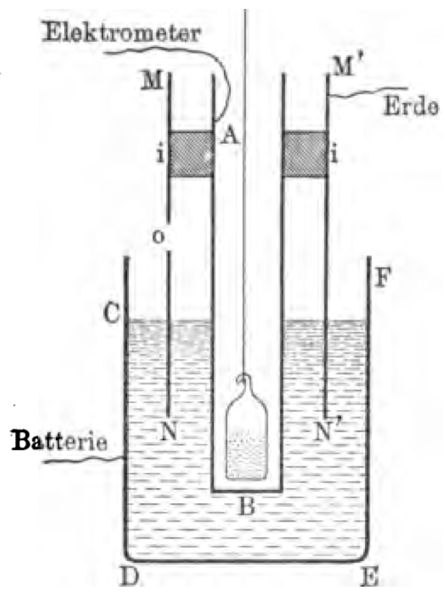

Die zu untersuchende Flüssigkeit befand sich in einem
metallischen Gefäß&nbsp;$CDEF$, in das ein dünnes Kupferrohr&nbsp;$AB$
eintauchte; diese beiden Metallteile
dienen als Elektroden. Das
Gefäß wird mittels einer Batterie
kleiner Akkumulatoren, deren
einer Pol an Erde liegt, auf
einem bekannten Potential erhalten.
Die Röhre $AB$ ist mit
dem Elektrometer verbunden.
Wenn ein Strom die Flüssigkeit
durchfließt, so erhält man das
Elektrometer mit Hülfe des pi\"e{}zoelektrischen
Quarzes auf Null
und mißt dadurch den Strom.
Das Kupferrohr&nbsp;$MNM'N'$ ist
mit der Erde verbunden und
dient als Schutzmantel, um einen
Strom durch die Luft hindurch
abzufangen. Ein Gefäß mit Radium-haltigem Baryumsalz kann
in die Röhre&nbsp;$AB$ eingesenkt werden; die Strahlen wirken auf die
Flüssigkeit, nachdem sie das Glas des Gefäßes und die Metallwände
der Röhre durchsetzt haben. Man kann das Radium auch
wirken lassen, indem man das Glasgefäß unter den Boden&nbsp;$DE$ legt.

Wenn man mit Röntgenstrahlen operirt, so läßt man sie
durch den Boden&nbsp;$DE$ eindringen.

Die Zunahme der Leitfähigkeit unter der Einwirkung der
Radium- oder Röntgenstrahlen scheint für alle Dielektrika stattzufinden;
um jedoch den Effekt nachweisen zu können, muß die
eigene Leitfähigkeit der Flüssigkeit genügend schwach sein, um
nicht die Wirkung der Strahlen zu verdecken.

Für Radium- und für Röntgenstrahlen hat Herr *Curie*
Effekte von gleicher Größenordnung erhalten.

Wenn man mit derselben Anordnung die Leitfähigkeit der
Luft oder eines andren Gases unter der Einwirkung der Becquerelstrahlen
untersucht, so findet man, daß die Stromstärke nur so
lange der Potentialdifferenz der Elektroden proportional ist, als
diese nicht einige Volt überschreitet; bei höheren Spannungen
dagegen wächst der Strom immer weniger schnell und der
Sättigungsstrom wird praktisch bei einer Spannung von 100&nbsp;Volt
erreicht.

Die mit demselben Apparat und demselben sehr aktiven
Präparat untersuchten Flüssigkeiten verhalten sich anders; die
Stromstärke ist der Spannung proportional, wenn diese von 0 bis
450&nbsp;Volt variirt, selbst wenn die Entfernung der Elektroden nicht
größer ist als 6&nbsp;mm. Man kann also die von einem Radiumsalz
in verschiedenen Flüssigkeiten unter gleichen Bedingungen erzeugte
**Leitfähigkeit** vergleichen. Die Zahlen der folgenden
Tabelle geben die Leitfähigkeiten in reciproken Ohms pro Kubikcentimeter:

-------------------- --------------------
Schwefelkohlenstoff   $20,0\cdot10^{-14}$
Petroläther           $15,0\cdot10^{-14}$
Amylen                $14,0\cdot10^{-14}$
Chlorkohlenstoff       $8,0\cdot10^{-14}$
Benzin                 $4,0\cdot10^{-14}$
Flüssige Luft          $1,3\cdot10^{-14}$
Vaselinöl              $1,6\cdot10^{-14}$
-------------------- --------------------

Man kann jedoch annehmen, daß die Flüssigkeiten und die
Gase ein ähnliches Verhalten zeigen, und daß für die Flüssigkeiten
die Proportionalitat zwischen Spannung und Strom nur
bis zu höheren Spannungen reicht als für die Gase. Man könnte
demnach in Analogie mit den Erscheinungen bei Gasen versuchen,
diese Grenze herabzudrücken, indem man eine viel
schwächere Strahlung anwendet. Der Versuch bestätigte diese
Annahme; benutzte man ein 150mal weniger aktives strahlendes
Präparat als das zu den ersten Versuchen dienende, so ergaben
sich für Spannungen von 50, 100, 200 und 400&nbsp;Volt die relativen
Stromstärken 109, 185, 255, 335. Die Proportionalität besteht
nicht mehr, aber der Strom wächst noch stark, wenn man die
Spannungsdifferenz verdoppelt.

Manche von den untersuchten Flüssigkeiten sind fast vollkommene
Isolatoren, wenn sie auf konstanter Temperatur erhalten
und vor der Einwirkung der Strahlen geschützt werden. Hierzu
gehören: Flüssige Luft, Petroläther, Vaselinöl, Amylen. Es ist
hier also sehr leicht, den Effekt der Strahlen zu untersuchen.
Vaselinöl ist viel weniger empfindlich gegen die Strahlen als
Petroläther. Vielleicht kann man diese Tatsache mit der verschiedenen
Flüchtigkeit der beiden Kohlenwasserstoffe in Verbindung
bringen. Flüssige Luft, die in dem Versuchsgefäß eine Zeit
lang gekocht hat, ist empfindlicher als frisch eingegossene; die
von den Strahlen erzeugte Leitfähigkeit ist im ersten Falle um
ein Viertel größer. Herr *Curie* untersuchte die Wirkung der
Strahlen auf Amylen und Petroläther bei +10° und&nbsp;−17°.
Die
von der Strahlung herrührende Leitfähigkeit vermindert sich bloß
um ein Zehntel, wenn man von 10° und&nbsp;−17° übergeht.

Bei Versuchen mit veränderlicher Temperatur der Flüssigkeit
kann man entweder das Radium auf der Temperatur der Umgebung
halten oder es auf dieselbe Temperatur bringen wie die
Flüssigkeit; man erhält in beiden Fällen dasselbe Resultat. Dies
bedeutet, daß die Radiumstrahlung sich nicht mit der Temperatur
verändert und selbst bei der Temperatur der flüssigen Luft noch
ihren Wert behält. Diese Tatsache wurde durch direkte Messungen
bestätigt.^[Versuche über Leitfähigkeit fester Isolatoren bei Bestrahlung
  mit Radiumstrahlen sind von H.&nbsp;*Becquerel*[@bh1903cr4]
  und A.&nbsp;*Becker*[@ba1903ann] ausgeführt
  worden. (Anm.&nbsp;d.&nbsp;Übers.)]
  
## o) Verschiedene Wirkungen, und Anwendungen der ionisirenden Wirkung der Strahlung radioaktiver Körper.

Die Strahlen der neuen radioaktiven Körper bewirken eine
starke Ionisirung der Luft. Man kann durch die Wirkung des
Radiums leicht die **Kondensation des übersättigten Wasserdampfes**
hervorrufen, genau so, wie sie unter der Einwirkung
von Röntgen- und Kathodenstrahlen stattfindet.

Unter dem Einfluß der von den neuen radioaktiven Substanzen
emittirten Strahlen **wird die Funkenlänge zwischen
zwei metallischen Leitern für eine gegebene Potentialdifferenz
vergrößert;** oder anders ausgedrückt, der Funkenübergang
wird durch die Strahlen erleichtert.

Diese Erscheinung rührt von den durchdringendsten Strahlen
her. Wenn man nämlich das Radium mit einem Bleischirm von
2&nbsp;cm Dicke umgiebt, so wird seine Wirkung auf den Funken nicht
merklich geschwächt, obgleich die durch das Blei hindurchgehende
Strahlung nur ein kleiner Bruchteil der Gesamtstrahlung ist.

Macht man durch die Einwirkung radioaktiver Substanzen
die Luft in der Umgebung zweier metallischer Leiter, von denen
der eine mit der Erde, der andre mit einem gut isolirten Elektrometer
verbunden ist, leitend, so nimmt das Elektrometer eine
dauernde Ablenkung an, an der man die elektromotorische Kraft
der galvanischen Kette messen kann, die durch die Luft und die
zwei Metalle gebildet wird (kontakt-elektromotorische Kraft der
beiden Metalle, wenn sie durch Luft getrennt sind). Diese Methode
wurde von Lord *Kelvin*[@kbss1897nat2]
angewandt, wobei Uran die strahlende
Substanz war; eine ähnliche Methode war früher von
*Perrin*[@pj1897cr; @pj1897phd]
angewandt worden, der die ionisirende Wirkung der Röntgenstrahlen
benutzte.

Man kann die radioaktiven Substanzen zum Studium der
atmosphärischen Elektrizität benutzen. Die aktive Substanz befindet
sich in einer kleinen dünnen Aluminiumbüchse am Ende
eines Metallstabes, der mit dem Elektrometer verbunden ist. Die
Luft wird in der Umgebung des Stabendes leitend und der Stab
nimmt das Potential der umgebenden Luft an. Das Radium ersetzt
so vorteilhaft die Flammen oder die *Kelvin*schen Tropfapparate,
die bis dahin allgemein zur Untersuchung der atmosphärischen
Elektrizität benutzt wurden[@pa1900con; @wma1902cra].

## p) Fluorescenz- und Lichtwirkungen.

Die von den neuen radioaktiven Substanzen emittirten Strahlen
erregen die Fluorescenz gewisser Körper. Herr *Curie* und
ich haben diese Erscheinung zuerst entdeckt, indem wir das
Polonium durch ein dünnes Aluminiumblatt hindurch auf eine
Schicht von Baryumplatincyanür wirken ließen. Derselbe Versuch
gelingt noch leichter mit genügend aktivem Radium-haltigen
Baryum. Wenn die Substanz stark radioaktiv ist, so ist die
erzeugte Fluorescenz sehr schön.

Die Zahl der Körper, die unter der Einwirkung der Becquerelstrahlen
phosphorescirend oder fluorescirend werden können, ist
sehr groß. Herr Becquerel untersuchte die Wirkung auf Uransalze,
Diamant, Blende usw. Herr *Bary*[@bp1900cr]
zeigte, daß die Salze
der Alkalien und der alkalischen Erden, die unter der Wirkung
des Lichtes und der Röntgenstrahlen fluoresciren, es auch unter
der Wirkung der Radiumstrahlen tun. Man kann ferner die
Fluorescenz von Papier, Baumwolle, Glas usw. in der Nähe des
Radiums beobachten. Von verschiedenen Glassorten ist das
Thüringerglas besonders helleuchtend. Metalle scheinen nicht
leuchtend zu werden.

Das Baryumplatincyanür ist am geeignetsten zur Untersuchung
der Strahlung der radioaktiven Körper mittels der fluoroskopischen
Methode. Man kann die Wirkung der Radiumstrahlen
auf Entfernungen bis über 2&nbsp;m verfolgen. Phosphorescirendes
Zinksulfid wird außerordentlich hell, doch hat dieser Körper die
Unbequemlichkeit, seine Leuchtkraft einige Zeit nach dem Aufhören
der Einwirkung der Strahlen zu bewahren.

Die Fluorescenzwirkung auf dem Schirme kann auch beobachtet
werden, wenn das Radium vom Schirme durch absorbirende
Körper getrennt ist. Wir beobachteten das Leuchten eines
Baryumplatincyanür-Schirmes durch den menschlichen Körper
hindurch. Die Wirkung ist jedoch unvergleichlich viel stärker,
wenn der Schirm unmittelbar auf dem Radium liegt und durch
keinen festen Körper von ihm getrennt ist. Alle Strahlengruppen
scheinen im stande zu sein, die Fluorescenz hervorzubringen.

Um die Wirkung des Poloniums zu beobachten, muß man
die Substanz dicht an den fluorescirenden Schirm heranbringen,
ohne Zwischenschaltung eines festen Schirmes oder wenigstens
nur eines äußerst dünnen.

Das Leuchten der den radioaktiven Substanzen ausgesetzten
fluorescirenden Körper nimmt mit der Zeit ab. Gleichzeitig
erleidet die fluorescirende Substanz eine Veränderung. Ich gebe
einige Beispiele:

Die Radiumstrahlen verwandeln das Baryumplatincyanür in
eine braune weniger hell leuchtende Modifikation. (Eine analoge
Wirkung der Röntgenstrahlen wurde von Herrn *Villard*
beschrieben.)
Sie verändern ferner das Urankaliumsulfat, indem
sie es gelb färben. Das verwandelte Baryumplatincyanür wird
durch die Wirkung des Lichtes teilweise regenerirt. Man lege
das Radium unter eine Schicht von Baryumplatincyanür, das auf
Papier ausgebreitet ist, dann wird das Baryumplatincyanür leuchtend;
wenn man das System in der Dunkelheit aufbewahrt, so
verändert sich das Baryumplatincyanür und die Leuchtkraft sinkt
beträchtlich. Setzt man dagegen das Ganze dem Licht aus, so
wird das Platinsalz teilweise regenerirt, und wenn man sich in
die Dunkelheit zurückbegiebt, so erscheint das Leuchten wieder
ziemlich stark. Man hat also durch Kombination eines radioaktiven
mit einem fluorescirenden Körper ein System hergestellt,
das sich wie ein phosphorescirender Körper von langer 
Phosphorescenzdauer verhält.

Glas, das unter der Wirkung des Radiums fluorescirt, färbt
sich braun bis violett. Gleichzeitig vermindert sich seine Fluorescenz.
Erhitzt man das so veränderte Glas, so entfärbt es sich, und
in dem Maße, wie die Entfärbung fortschreitet, emittirt das Glas
Licht. Nachher hat das Glas seine Fähigkeit zu fluoresciren im
gleichen Maße wie vor der Veränderung wiedergewonnen.

Zinksulfid, das der Wirkung der Radiumstrahlen genügend
lange ausgesetzt war, erschöpft sich allmählich und verliert seine
Fähigkeit unter der Wirkung des Radiums oder des Lichtes zu
phosphoresciren.

Diamant phosphorescirt unter der Wirkung des Radiums und
kann dadurch von den Imitationen in Straß unterschieden werden,
die nur schwach leuchten.

Alle Radium-haltigen Baryumverbindungen **werden
selbstleuchtend**[@c1899soc; @gf1899ann2].
Die wasserfreien und trocknen Haloidsalze emittiren
ein besonders starkes Licht. Dieses Leuchten ist bei hellem
Tageslicht nicht zu sehen, doch bemerkt man es leicht im Halbdunkel
oder in einem mit Gas erleuchteten Zimmer. Das Licht
kann ziemlich stark sein, so daß man beim Lichte einer geringen
Substanzmenge im Dunkeln lesen kann. Das Licht geht von der
ganzen Masse des Präparates aus, während bei einem gewöhnlichen
phosphorescirenden Körper das Licht nur von der vorbelichteten
Oberfläche ausgeht. Bei feuchter Luft verlieren die
Radium-haltigen Präparate einen großen Teil ihrer Leuchtkraft,
gewinnen sie jedoch durch Trocknen wieder (*Giesel*).
Das Leuchtvermögen
scheint dauernd zu sein. Nach mehreren Jahren scheint
in dem Leuchten schwach aktiver Präparate, die in verschlossenen
Röhren in der Dunkelheit aufbewahrt waren, keine Veränderung
eingetreten zu sein. Bei sehr aktivem Radium-haltigen Baryumchlorid
verändert sich im Laufe einiger Monate die Farbe des
Lichtes; sie wird mehr violett und nimmt beträchtlich ab; gleichzeitig
erfährt das Präparat einige Veränderungen; löst man das
Salz in Wasser auf und trocknet es wieder, so erhält man wieder
das ursprüngliche Leuchtvermögen.

Die Lösungen Radium-haltiger Baryumverbindungen, die einen
starken Anteil Radium enthalten, leuchten ebenfalls; man kann
dies beobachten, wenn man die Lösung in eine Kapsel aus Platin
bringt, die, weil selbst nichtleuchtend, das schwache Licht der
Lösung beobachten läßt.

Wenn eine Lösung Radium-haltigen Baryums ausgeschiedene
Krystalle enthält, so leuchten diese in der Lösung, und zwar viel
stärker als die Lösung selbst, so daß es aussieht, als leuchteten
sie allein.

Herr *Giesel*[@gf1899ann2]
hat Radium-haltiges Baryumplatincyanür hergestellt.
Wenn das Salz auskrystallisirt, so sieht es aus wie gewöhnliches
Baryumplatincyanür und leuchtet sehr stark. Aber
allmählich färbt sich das Salz von selbst und nimmt eine braune
Farbe an, wobei gleichzeitig die Krystalle dichroitisch werden.
In diesem Zustands ist das Salz viel weniger leuchtend, obgleich
seine Aktivität zugenommen hat. Das von *Giesel* hergestellte
Radiumplatincyanür verändert sich noch viel schneller.

Die Radiumverbindungen sind die ersten Beispiele von Substanzen,
die von selbst leuchten.

## q) Entwicklung von Wärme durch Radiumsalze.

Ganz neuerdings haben die Herren
*Curie* und *Laborde*[@cpla1902cr]
gefunden, daß die Radiumsalze der Sitz einer fortwährenden
selbsttätigen Wärmeentwicklung sind. Diese Wärmeentwicklung
hat zur Folge, daß die Radiumsalze sich dauernd auf einer
höheren Temperatur befinden als die Umgebung; der Temperaturüberschuß
hängt natürlich von der thermischen Isolation der
Substanz ab. Der Temperaturüberschuß kann durch einen ganz
rohen Versuch mit zwei gewöhnlichen Quecksilberthermometern
nachgewiesen werden. Man benutzt zwei gleich große *Dewar*-sche
Vakuumgefäße (wie sie zum Aufbewahren von flüssiger Luft
gebraucht werden. Anm.&nbsp;d.&nbsp;Übersetzers). In eines der beiden
Gefäße bringt man ein Glasröhrchen mit 7&nbsp;dg reinen Radiumbromids;
in das andre bringt man ein ähnliches Röhrchen mit
irgend einer inaktiven Substanz, etwa Baryumchlorid. Die Temperatur
jedes der beiden Gefäße wird von dem Thermometer angezeigt,
das man in unmittelbare Nähe der Röhrchen bringt. Die
Öffnung der Gefäße wird mit Watte verschlossen. Wenn sich
das Temperaturgleichgewicht hergestellt hat, so zeigt das Thermometer,
das sich in der Nähe des Radiums befindet, dauernd eine
höhere Temperatur an als das andre; der beobachtete Unterschied
betrug&nbsp;3°.

Man kann die vom Radium entwickelte Wärmemenge mit
dem Bunsenschen Eiskalorimeter messen. Bringt man ein Röhrchen
mit Radiumsalz in das Kalorimeter, so beobachtet man eine
fortwährende Wärmezufuhr, die sofort aufhört, wenn man das
Radium entfernt. Die Messung mit einem bereits vor längerer
Zeit hergestellten Radiumsalz ergab, daß jedes Gramm Radium
pro Stunde etwa 80 kleine Kalorien entwickelt. Das Radium entwickelt
also während einer Stunde genügend viel Wärme, um eine
gleich schwere Eismenge zu schmelzen, und ein Atomgramm
(225&nbsp;g) Radium würde in einer Stunde 18&nbsp;000 Kalorien entwickeln,
d.&nbsp;i. eine Wärmemenge, die vergleichbar ist mit der von einem
Atomgramm (1&nbsp;g) Wasserstoff bei seiner Verbrennung entwickelten.
Eine derartige Wärmeentwicklung läßt sich durch keine
gewöhnliche chemische Reaktion erklären, um so mehr, als der
Zustand des Radiums jahrelang derselbe zu bleiben scheint. Man
könnte annehmen, daß die Wärmeentwicklung von einer Umwandlung
des Radiumatoms selbst herrührt, eine Umwandlung,
die natürlich sehr langsam vor sich gehen muß. Wenn dem so  
ist, so müßte man annehmen, daß die bei der Bildung und Umwandlung
von Atomen auftretenden Wärmemengen sehr groß
sind und alles bis dahin bekannte übertreffen.

Man kann die vom Radium entwickelte Wärmemenge auch
bestimmen, indem man sie dazu benutzt, ein verflüssigtes Gas
zum Sieden zu bringen, und die sich entwickelnde Gasmenge
mißt. Man kann den Versuch
mit Methylchlorid ausführen
(bei −21°). Die Herren
*Dewar* und *Curie* führten
den Versuch mit flüssigem
Sauerstoff (bei −180°) und
mit flüssigem Wasserstoff (bei
−252°) aus. Der Wasserstoff
eignet sich besonders gut zu
dem Versuch. Ein mit einem
Vakuummantel umgebenes Reagenzgläschen
enthält den flüssigen Wasserstoff&nbsp;$H$
(Fig.&nbsp;10) und ist mit einem Rohr&nbsp;$t$
versehen, mittels dessen das Gas über
Wasser in einem geteilten Rohr&nbsp;$E$ aufgefangen
werden kann. $A$ taucht mit
seinem Mantel in ein Bad von flüssigem
Wasserstoff&nbsp;$H'$. Unter diesen Umständen
findet in $A$ keine Gasentwicklung statt.
Führt man dagegen in den im Reagenzgläschen enthaltenen flüssigen
Wasserstoff ein Röhrchen mit etwa 7&nbsp;dg Radiumbromid ein,
so entsteht eine fortwährende Gasentwicklung, so daß man pro
Minute 73&nbsp;ccm Gas auffängt.

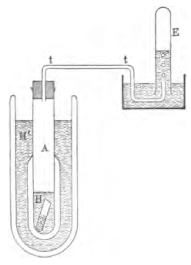

Ein frisch hergestelltes festes Radiumsalz entwickelt nur
relativ wenig Wärme; die Wärmeentwicklung wächst jedoch fortwährend
und strebt einer Grenze zu, die jedoch nach einem Monat
noch nicht völlig erreicht ist. Wenn man ein Radiumsalz auflöst,
und die Lösung in ein verschlossenes Röhrchen bringt, so ist
die von der Lösung entwickelte Wärmemenge zuerst schwach;
sie vermehrt sich sodann und wird nach Verlauf eines Monats
ziemlich konstant; die Wärmeentwicklung ist dann dieselbe, wie
die des festen Salzes.

Wenn sich das Radiumsalz, dessen Wärmeentwicklung man
im *Bunsen*schen Eiskalorimeter mißt, in einem Glasröhrchen
befindet, so durchdringen gewisse, sehr wenig absorbirbare
Strahlen das Röhrchen und das Kalorimeter, ohne darin absorbirt
zu werden. Um zu untersuchen, ob diese Strahlen eine merkliche
Energiemenge mit sich führen, kann man die Messung
wiederholen, nachdem man das Röhrchen mit einer 2&nbsp;mm dicken
Bleischicht umgeben hat; man findet, daß unter diesen Bedingungen
die Wärmeentwicklung des Salzes um etwa 4&nbsp;Proz. zugenommen
hat; die vom Radium in Form sehr durchdringender
Strahlen emittirte Energie ist also durchaus nicht zu vernachlässigen.

## r) Chemische Wirkungen der neuen radioaktiven Substanzen. Färbungen.

Die von stark aktiven Körpern emittirten Strahlen sind im
Stande, gewisse Umänderungen und chemische Reaktionen hervorzurufen.
Die Strahlen der Radium-haltigen Präparate wirken
färbend auf Glas und Porzellan[@cpcm1899cr2].
Die meist braune oder violette
Färbung des Glases ist sehr intensiv; sie entsteht in der Masse
des Glases selbst und bleibt nach Entfernung des Radiums bestehen.
Alle Gläser färben sich in mehr oder weniger langer
Zeit und die Anwesenheit von Blei ist hierzu nicht nötig. Man
kann diese Tatsache mit der neuerdings gemachten Beobachtung
in Verbindung bringen, daß die Glaswände von lange in Gebrauch
befindlichen Röntgenröhren sich färben.

Herr *Giesel* zeigte, daß die krystallisirten Haloidsalze der
Alkalien (Steinsalz, Sylvin) sich unter dem Einfluß des Radiums
ebenso färben, wie unter der Wirkung der Kathodenstrahlen.
Gleichartige Färbungen erhält man nach
*Giesel*[@gf1897ber], wenn man
die Salze in Natriumdampf erhitzt.

Ich untersuchte die Färbung einer Reihe von Gläsern von
bekannter Zusammensetzung, die mir hierfür von Herrn *Le
Chatelier* freundlichst überlassen wurden. Ich beobachtete
keine großen Unterschiede in der Färbung. Sie ist im allgemeinen
violett, gelb, braun oder grau. Sie scheint an die Anwesenheit
von Alkalimetallen geknüpft. Mit reinen krystallisirten Alkalisalzen
erhält man lebhaftere und mehr veränderliche Farben; das
ursprünglich weiße Salz wird blau, grün, gelbbraun usw.

Herr *Becquerel* zeigte, daß weißer Phosphor durch die
Wirkung des Radiums in die rote Modifikation verwandelt wird.

Papier wird durch die Radiumwirkung verändert und gefärbt.
Es wird zerbrechlich, zerfällt und gleicht schließlich einem
vielmaschigen Siebe.

Unter gewissen Umständen findet in der Nähe stark aktiver
Verbindungen Ozonentwicklung statt. Strahlen, die von einem
verschlossenen Röhrchen mit Radium ausgehen, entwickeln in der
durchstrahlten Luft kein Ozon. Dagegen tritt ein sehr starker
Ozongeruch auf, wenn man das Röhrchen öffnet. Im allgemeinen
entwickelt sich Ozon in der Luft, wenn diese in direkter Verbindung
mit dem Radium steht. Die Verbindung selbst durch
einen sehr engen Kanal ist ausreichend; es scheint, als ob die
Ozonentwicklung mit der Fortpflanzung der inducirten Radioaktivität
verknüpft sei, von der später die Rede sein wird.

Die Radium-haltigen Verbindungen scheinen sich im Laufe
der Zeit zu verändern, wahrscheinlich unter der Einwirkung ihrer
eigenen Strahlung. Oben war gezeigt worden, daß die Krystalle
von Radium-haltigem Baryum im Moment des Ausfallens farblos
sind und allmählich sich gelb bis orange, manchmal auch rosa
färben; diese Färbung verschwindet beim Auflösen. Radium-haltiges
Baryumchlorid entwickelt Oxydationsstufen des Chlors;
das Bromid entwickelt Brom. Diese langsamen Umänderungen
machen sich im allgemeinen erst einige Zeit nach der Herstellung
des festen Produktes bemerkbar, das gleichzeitig sein Aussehen und
seine Farbe ändert und gelb bis violett wird. Auch das emittirte
Licht wird mehr violett.

Die reinen Radiumsalze scheinen dieselben Umwandlungen
zu erfahren wie die Baryum-haltigen. Doch färben sich die aus
saurer Lösung niedergeschlagenen reinen Chloridkrystalle noch
nicht merklich in einer Zeit, die ausreicht, um den Baryum-haltigen
Chloridkrystallen eine intensive Färbung zu erteilen.

## s) Gasentwicklung in Gegenwart von Radiumsalzen.

Eine Lösung von Radiumbromid entwickelt fortwährend
Gase[@gf1903ber1].
Diese Gase bestehen hauptsächlich aus Wasserstoff und
Sauerstoff in einem Mengenverhältniß, das nahezu der Zusammensetzung
des Wassers entspricht; man kann deshalb annehmen,
daß in Gegenwart der Radiumsalze sich das Wasser zersetzt.
Die festen Radiumsalze (Chlorid und Bromid) geben ebenfalls
zu einer fortwährenden Gasentwicklung Anlaß. Diese Gase
werden in dem festen Salze okkludirt und entwickeln sich ziemlich
reichlich, wenn man das Salz auflöst. Man findet in dem
Gasgemenge Wasserstoff, Sauerstoff, Kohlensäure, Helium. Im
Spektrum der Gase bemerkt man noch einige unbekannte
Linien[@rwsf1903pz; @rwsf1903nat; @rwsf1903prsl].

Den Gasentwicklungen kann man auch zwei Unfälle zuschreiben,
die sich bei den Versuchen des Herrn *Curie* ereigneten.
Ein sehr dünnes zugeschmolzenes Glasröhrchen, das
beinahe vollständig mit festem trocknen Radiumbromid gefüllt
war, explodirte zwei Monate nach der Verschließung unter der
Einwirkung einer leichten Erhitzung. Die Explosion rührte wahrscheinlich
von dem Drucke der eingeschlossenen Gase her. Bei
einem andren Versuche kommunicirte eine Röhre mit ziemlich
altem Radiumchlorid mit einem größeren Reservoir, das sehr weit
evakuirt war. Als das Röhrchen rasch auf etwa 300° erhitzt
wurde, explodirte das Salz; das Röhrchen wurde zerbrochen und
das Salz weit umhergeschleudert. Im Augenblick der Explosion
konnte in der Röhre gar kein merklicher Druck herrschen. Der
Apparat war übrigens vorher einer versuchsweisen Erhitzung
unter gleichen Versuchsbedingungen, aber ohne Radium, unterworfen
gewesen, ohne daß ein derartiger Unfall eingetreten wäre.

Diese Versuche zeigen, daß es gefährlich ist, altes Radiumsalz
zu erhitzen, und daß es ferner gefährlich ist, das Radium
lange Zeit hindurch in einer geschlossenen Röhre aufzubewahren.

## t) Entstehung von Thermoluminescenz

Gewisse Körper wie z.&nbsp;B. Flußspat werden leuchtend, wenn
man sie erwärmt: sie sind thermoluminescirend; ihre Leuchtfähigkeit
erschöpft sich nach einiger Zeit; sie erlangen jedoch ihre
Fähigkeit, durch Erwärmung zu leuchten, wieder durch die Einwirkung
eines Funkens oder des Radiums. Das Radium
vermag also die thermoluminescirenden Eigenschaften dieser Körper
wieder herzustellen[@bh1900con].
Bei der Erhitzung erfährt der Flußspat
eine Umwandlung, die von einer Lichtemission begleitet ist.
Wenn der Flußspat sodann der Wirkung des Radiums ausgesetzt
wird, so findet eine Umwandlung im entgegengesetzten Sinne
statt, die ebenfalls von einer Lichtemission begleitet ist.

Ein durchaus analoges Phänomen findet statt, wenn man
das Glas der Radiumwirkung aussetzt. Auch dort entsteht eine
Unformung des Glases, während es unter der Wirkung der Radiumstrahlen
leuchtet: diese Umformung wird ganz sicher bewiesen
durch die dabei auftretende und sich stetig vermehrende
Färbung. Erhitzt man sodann das veränderte Glas, so findet die
umgekehrte Umwandlung statt, das Glas entfärbt sich und hierbei
findet eine Lichtentwicklung statt. Es ist wohl sehr wahrscheinlich,
daß man es hierbei mit einer chemischen Modifikation
zu tun hat und daß die Lichtentwicklung an diese Modifikation
geknüpft ist. Diese Erscheinung könnte allgemeiner Natur sein.
Es könnte sein, daß die Fluorescenz unter der Einwirkung des
Radiums und das Leuchten der Radium-haltigen Substanzen notwendig
mit einer chemischen oder physikalischen Umwandlung
der das Licht emittirenden Substanz verknüpft sind.

## u) Radiographieen

Die radiographische Wirkung der neuen radioaktiven Substanzen
ist sehr intensiv. Gleichwohl muß das anzuwendende Verfahren
beim Polonium ein ganz anderes sein als beim Radium.
Das Polunium wirkt nur auf sehr kleine Entfernungen und
wird durch feste Schirme sehr geschwächt; die Wirkung
läßt sich praktisch leicht durch einen dünnen Schirm unterdrücken.
(1&nbsp;mm Glas). Das Radium wirkt auf viel größere Entfernungen.
Die radiographische Wirkung der Radiumstrahlen
läßt sich in Luft noch auf Entfernungen von über 2&nbsp;m beobachten,
selbst wenn das strahlende Präparat in einem Glasröhrchen
eingeschlossen ist. Die unter diesen Bedingungen wirkenden
Strahlen gehören zur $\beta$- und $\gamma$-Gruppe.
Dank den Unterschieden
in der Durchlässigkeit verschiedener Körper für die Strahlen
kann man, wie bei den Röntgenstrahlen mit verschiedenen Objekten,
Radiographieen erhalten. Die Metalle sind im allgemeinen
undurchsichtig, nur Aluminium ist sehr durchlässig. Zwischen
Fleisch und Knochen besteht kein merklicher Unterschied in der
Durchlässigkeit. Man kann mit großer Entfernung und sehr
kleinen Strahlungsquellen arbeiten und erhält dann sehr scharfe
Radiographieen. Es ist für die Schönheit der Bilder sehr vorteilhaft,
die $\beta$-Strahlen durch ein Magnetfeld zur Seite zu werfen
und nur die $\gamma$-Strahlen zu benutzen. Die $\beta$-Strahlen werden
nämlich beim Durchstrahlen des abzubildenden Objektes einigermaßen
diffundiert und rufen einen gewissen Schleier hervor. Wenn
man sie unterdrückt, so muß man längere Zeit exponieren, erhält
aber dafür schönere Besultate. Zur Radiographie eines Portemonais
gebraucht man einen Tag mit einigen Centigrammen
Radiumsalz als Strahlungsquelle, die in einer Glasröhre in 1&nbsp;m
Abstand von der empfindlichen Platte sich befinden, während das
Objekt sich vor der Platte befindet. Befindet ich die Quelle in
20&nbsp;cm Abstand von der Platte, so erhält man dasselbe Resultat
in einer Stunde. In unmittelbarer Nachbarschaft der Strahlungsquelle
wird die Platte augenblicklich beeinflußt.

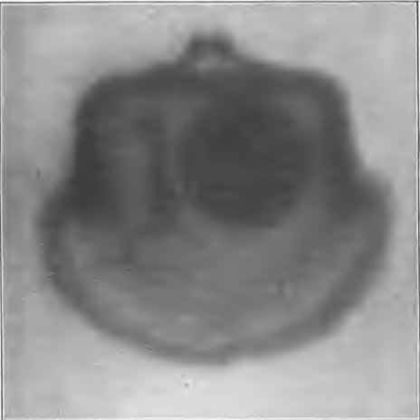

## v) Physiologische Wirkungen.

Die Radiumstrahlen üben eine Wirkung auf die Epidermis
aus. Diese Wirkung wurde von Herrn
*Walkhoff*[@wo1900pr] beobachtet
und von Herrn *Giesel*[@gf1900ber] bestätigt,
später auch von den Herren
*Becquerel* und *Curie*[@bh1901cr].

Wenn man auf die Haut eine Celluloid- oder eine sehr dünne
Gummikapsel legt, die sehr aktives Radiumsalz enthält, und
einige Zeit darauf liegen läßt, so entsteht eine Rötung der Haut,
entweder sofort oder nach Verlauf einer um so längeren Zeit,
je schwächer und je kürzer dauernd die Einwirkung war;
dieser rote Fleck erscheint an der Stelle, die der Wirkung ausgesetzt
war; die lokale Veränderung der Haut ähnelt in Aussehen
und Entwicklung einer Verbrennung. In manchen Fällen bildet
sich eine Blase. Wenn die Exposition sehr lange gedauert hat,
so bildet sich ein sehr schwer heilendes Geschwür. Bei einem
Versuch ließ Herr *Curie* ein relativ wenig aktives Präparat
10&nbsp;Stunden lang wirken. Die Rötung zeigte sich sofort und
später entstand eine Wunde, die vier Monate zur Heilung erforderte.
Die Epidermis war lokal zerstört und konnte sich nur
sehr langsam und schwierig unter Entstehung einer sehr deutlichen
Narbe neu bilden. Eine Radiumverbrennung nach halbstündiger
Expositionsdauer erschien nach zwei Wochen, bildete
eine Blase und heilte nach weiteren zwei Wochen. Eine andre
Verbrennung, durch eine Exposition von nur acht Minuten hervorgerufen,
verursachte einen roten Fleck, der nach zwei Monaten
erschien und nur unbedeutende Wirkung hatte.

Die Wirkung des Radiums auf die Haut kann durch Metalle
hindurch stattfinden; doch wird sie hierdurch geschwächt. Um
sich vor der Wirkung zu schützen, soll man es vermeiden, das
Radium lange bei sich herumzutragen, außer wenn man es in
eine Bleihülle einschließt.

Die Wirkung des Radiums auf die Haut wurde von Herrn
Dr. *Danlos* am Hospital Saint-Louis darauf hin untersucht, ob
es zur Behandlung gewisser Hautkrankheiten geeignet sei, eine
Methode, die der Behandlung mit Röntgenstrahlen oder mit ultraviolettem
Lichte analog ist. Das Radium giebt in dieser Hinsicht
ermutigende Resultate; die durch die Radiumwirkung
stellenweise zerstörte Epidermis stellt sich in gesundem Zustande
wieder her. Die Wirkung des Radiums ist tiefergehend als die
des Lichtes, und seine Anwendung ist leichter als die des Lichtes
und der Röntgenstrahlen. Die Untersuchung der Anwendungsbedingungen
ist natürlich etwas langwierig, weil man den Effekt
der Anwendung nicht unmittelbar beurteilen kann.

Herr *Giesel* bemerkte die Wirkung des Radiums auf
Pflanzenblätter. Die der Wirkung unterworfenen Blätter werden
gelb und zerfallen.

Herr *Giesel* entdeckte ferner die Wirkung der Strahlen
auf das Auge. Wenn man in der Dunkelheit ein strahlendes
Präparat in die Nähe des geschlossenen Augenlides oder der
Schläfe bringt, so hat man die Empfindung einer das Auge erfüllenden
Helligkeit. Die Erscheinung ist von den
Herren *Himstedt* und *Nagel*[@hfnwa1901ann]
näher untersucht worden. Diese Physiker
zeigten, daß alle Medien des Auges unter der Wirkung des Radiums
fluorescirend werden, wodurch sich die beobachtete Lichtempfindung
erklärt. Blinde, deren Netzhaut intakt ist, sind
gegen die Einwirkung des Radiums empfindlich, während solche
mit kranker Netzhaut keine von den Strahlen herrührende Lichtempfindung
verspüren.

Die Radiumstrahlen verhindern oder hemmen die Entwicklung
von Bakterienkulturen, doch ist diese Wirkung nicht sehr
stark[@aecw1901ann]. Neuerdings zeigte
Herr *Danysz*[@dmj1903cr], daß die Radiumstrahlen
energisch auf Rückenmark und Gehirn wirken. Nach
einer Einwirkung von einer Stunde entstehen Lähmungen bei den
Versuchstieren, die meistens nach einigen Tagen sterben.

## w) Wirkung der Temperatur auf die Strahlung.

Man weiß noch wenig darüber, in welcher Weise die Emission
der radioaktiven Substanzen sich mit der Temperatur ändert.
Doch ist bekannt, daß die Emission bei tiefen Temperaturen bestehen
bleibt. Herr *Curie*[@cp1900soc]
senkte ein Gefäß mit Radiumhaltigem
Baryumchlorid in flüssige Luft. Das Leuchten des strahlenden
Präparates bleibt hierbei bestehen. Im Moment, wo man
die Röhre aus dem Kältebade herauszieht, scheint sie sogar stärker
zu leuchten als vorher. Bei der Temperatur der flüssigen Luft
fährt das Radium fort, die Fluorescenz des Urankaliumsulfats zu
erregen. Herr Curie stellte durch elektrische Messungen, die in
einiger Entfernung von der Strahlungsquelle ausgeführt wurden,
fest, daß die Strahlung dieselbe Intensität besitzt, wenn das
Radium sich auf der Temperatur der Umgebung befindet, wie
wenn es sich in dem Gefäß mit flüssiger Luft befindet. Bei diesen
Versuchen befand sich das Radium auf dem Boden einer einseitig
geschlossenen Röhre. Die Strahlen traten durch das offene Ende
der Röhre aus, passirten einen gewissen Luftraum und wurden
in einem Kondensator aufgefangen. Man maß die Wirkung der
Strahlen auf die Luft des Kondensators, indem man die Röhre
entweder in freier Luft ließ oder sie bis zu einer gewissen Höhe
mit flüssiger Luft umgab. Das erhaltene Resultat war in beiden
Fällen dasselbe.

Wenn man das Radium auf eine hohe Temperatur erhitzt, so
bleibt die Radioaktivität bestehen. Frisch gesehmolzenes (bei
etwa 800°) Radium-Baryumchlorid ist radioaktiv und leuchtend.
Längere Erhitzung auf hohe Temperatur hat jedoch eine zeitweise
Abnahme der Radioaktivität des Präparates zur Folge.
Diese Abnahme ist sehr bedeutend, sie kann 75 Proz. der Gesamtstrahlung
betragen. Die relative Abnahme ist weniger bedeutend
für die absorbirbaren als für die durchdringenden Strahlen, die
durch die Erhitzung fast unterdrückt werden. Mit der Zeit nimmt
die Strahlung des Präparates wieder die frühere Stärke und 
Zusammensetzung an; dieser Zustand wird etwa nach Verlauf von
zwei Monaten nach der Erhitzung erreicht.

# Viertes Kapitel. Inducirte Radioaktivität.

## a) Mitteilung der Radioaktivität an ursprünglich inaktive Substanzen.

Im Laufe unserer Untersuchungen über die radioaktiven
Körper bemerkten wir, Herr *Curie* und ich[@cpcm1899cr1],
daß jede Substanz,
die sich einige Zeit in der Nachbarschaft eines Radium-haltigen
Salzes befindet, selbst radioaktiv wird. Bei unserer ersten hierauf
bezüglichen Publikation befaßten wir uns mit dem Nachweis,
daß die so von ursprünglich inaktiven Substanzen erworbene
Radioaktivität nicht etwa von einem Transport radioaktiven Staubes
herrührt, der sich an der Oberfläche dieser Substanzen niedergeschlagen
hätte. Diese jetzt ganz gesicherte Tatsache wird klar
bewiesen durch die im Folgenden beschriebenen Versuche, und
vor allen Dingen durch die Gesetze, nach denen die in ursprünglich
inaktiven Stoffen hervorgerufene Radioaktivität verschwindet,
wenn man sie der Einwirkung des Radiums entzieht.

Wir haben der so entdeckten neuen Erscheinung den Namen
**inducirte Radioaktivität** gegeben.

In derselben Arbeit haben wir die Hauptmerkmale der inducirten
Radioaktivität angegeben. Wir haben Platten von verschiedenen
Substanzen aktivirt, indem wir sie in die Nachbarschaft
fester Radium-haltiger Salze brachten und haben die
Radioaktivität dieser Platten mittels der elektrischen Methode
untersucht. Dabei beobachteten wir folgende Tatsachen:

1. Die Aktivität einer der Wirkung des Radiums ausgesetzten
Platte wächst mit der Expositionsdauer und nähert sich
asymptotisch einem gewissen Grenzwert.

2. Die Aktivität einer Platte, die vom Radium aktivirt und
dann dieser Einwirkung entzogen wird, verschwindet nach einigen
Tagen. Der Abfall der inducirten Aktivität gegen Null erfolgt
nach einem asymptotischen Gesetz.

3. Bei sonst gleichen Bedingungen ist die von einem bestimmten
Radium-haltigen Präparat auf verschiedenen Platten
inducirte Radioaktivität unabhängig von der Natur der Platten.
Glas, Papier, Metalle aktivirten sich in gleicher Stärke.

4. Die auf einer bestimmten Platte von verschiedenen Radium-haltigen
Präparaten inducirte Radioaktivität hat einen um so
höheren Grenzwert, je aktiver das Präparat ist.

Kurze Zeit darauf veröffentlichte
Herr *Rutherford*[@re1900pm1; @re1900pm2] eine
Arbeit, aus der folgt, daß die Thorverbindungen die Erscheinung
der inducirten Radioaktivität hervorrufen können. *Rutherford*
fand für diese Erscheinung dieselben Gesetze, wie die oben genannten,
und entdeckte ferner die wichtige Tatsache, daß Körper,
die negativ elektrisch geladen sind, sich stärker aktiviren als
andere. *Rutherford* beobachtete ferner, daß Luft, die über
Thorium-Oxyd gestrichen war, 10&nbsp;Minuten lang eine merkliche
Leitfähigkeit bewahrte. Die Luft teilt in diesem Zustande inducirte
Radioaktivität an inaktive Substanzen mit, vor allem an
solche, die negativ geladen sind. *Rutherford* interpretirte seine
Versuche durch die Annahme, daß die Thorverbindungen, und
vor allem das Oxyd, eine besondere radioaktive **Emanation**
aussenden, die von Luftströmen mit fortgerissen wird und positiv
geladen ist. Diese Emanation soll die Ursache der inducirten
Radioaktivität sein.
Herr *Dorn*[@de1900ed] hat die Versuche, die
*Rutherford*
mit Thoroxyd gemacht hatte, mit Radium-haltigen Baryumsalzen
wiederholt.

Herr *Debierne*[@dal1900cr; @dal1903cr1; @dal1900cr2]
zeigte, daß das Aktinium in äußerst
starkem Maße induzirte Aktivität in benachbarten Körpern hervorruft.
Ebenso wie bei dem Thorium findet eine starke Mitnahme
der Aktivität durch Luftströme statt.

Die inducirte Aktivität zeigt sehr veränderliches Aussehen
und wenn man die Aktivirung einer Substanz in der Nähe von
Radium in freier Luft bewirkt, so erhält man sehr unregelmäßige
Resultate. Die Herren
*Curie* und *Debierne*[@cpdal1901cr1] bemerkten, daß
die Erscheinung im Gegensatz hierzu sehr regelmäßig ist, wenn
man mit einem geschlossenen Gefäß arbeitet. Sie haben deshalb
die Aktivirung im geschlossenen Gefäß untersucht.

## b) Aktivirung in geschlossenem Gefäß.

Die inducirte Radioaktivität ist sowohl stärker, wie auch
regelmäßiger, wenn man in einem geschlossenen Gefäß arbeitet.
Die aktive Substanz befindet sich
in einem kleinen Glaßgefäß&nbsp;$a$
(Fig.&nbsp;12) mit einer Offnung bei&nbsp;$o$
in der Mitte einer geschlossenen
Umhüllung. Verschiedene Platten
$A$, $B$, $C$, $D$, $E$, die sich in
der Umhüllung befinden, werden
nach einer eintägigen Exposition
radioaktiv. Bei gleichen Dimensionen
ist die Radioaktivität dieselbe, unabhängig von der Natur
der Platten (Blei, Kupfer, Aluminium, Glas, Hartgummi, Wachs,
Pappdeckel, Paraffin). Die Aktivität einer Fläche einer dieser
Platten ist um so größer, je größer der freie Raum vor dieser
Fläche ist.

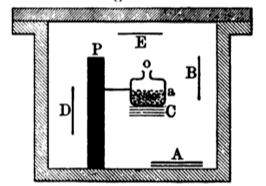

Wiederholt man den vorigen Versuch mit völlig geschlossenem
Gefäß&nbsp;$a$, so erhält man keine inducirte Aktivität.

Die Strahlung des Radiums kommt bei der Hervorrufung
der inducirten Radioaktivität nicht direkt in Betracht, so wird
z.&nbsp;B. bei dem vorigen Versuch die durch den dicken Bleischirm&nbsp;$PP$
geschützte Platte $D$ ebenso aktiv wie $B$ und&nbsp;$E$.

Die Radioaktivität überträgt sich in der Luft von Punkt zu
Punkt von der strahlenden Substanz bis zum zu aktivirenden
Körper. Sie kann sich selbst durch sehr enge Kapillarröhren
weithin fortpflanzen.

Die inducirte Aktivität ist gleichzeitig intensiver und regelmäßiger,
wenn man das feste Radium-haltige Salz durch eine
wässrige Lösung ersetzt.

Flüssigkeiten können inducirte Radioaktivität annehmen.
Man kann z.&nbsp;B. reines Wasser radioaktiv machen, wenn man es
in das Innere einer geschlossenen Hülle stellt, die außerdem eine
Lösung Radium-haltigen Salzes enthält.

Manche Körper werden leuchtend, wenn man sie in ein
Aktivirungsgefäß bringt (phosphorescirende und fluorescirende
Körper (Glas, Papier, Baumwolle, Wasser, Salzlösungen). 
Phosphorescirendes Zinksulfid leuchtet unter diesen Bedingungen 
besonders stark. Die Radioaktivität dieser leuchtenden Körper ist
jedoch dieselbe, wie die eines Metallstücks oder eines andren
Körpers, der sich unter gleichen Bedingungen aktivirt, ohne leuchtend
zu werden.

Welches auch immer die im geschlossenen Gefäß zu aktivirende
Substanz ist, sie nimmt eine mit der Zeit wachsende
Aktivität an, und erreicht schließlich einen **Grenzwert**, der
immer derselbe ist, wenn man mit derselben aktivirenden Substanz
und derselben Versuchsanordnung arbeitet.

**Der Grenzwert der inducirten Radioaktivität ist
unabhängig von der Natur des Gases, das sich in dem
Aktivirungsgefäß befindet** (Luft, Wasserstoff, Kohlensäure).

**Der Grenzwert der inducirten Aktivität in einem
bestimmten Gefäß hängt bloß von der darin in Lösung
befindlichen Radiummenge ab, und scheint ihr proportional
zu sein.**

## c) Rolle der Gase bei den Erscheinungen der inducirten Radioaktivität. Emanation.

Die Gase in einem Aktivirungsgefäß, das Radium in fester
Form oder in Lösung enthält, sind radioaktiv. Diese Aktivität
bleibt bestehen, wenn man das Gas durch eine Röhre absaugt
und in einem Probiergläschen auffängt. Die Wände des letzteren
werden dann selbst radioaktiv und leuchten im Dunklen.
Aktivität und Lichtemission des Gläschens verschwinden nachher
vollständig, aber sehr langsam, und man kann die Radioaktivität
noch nach einem Monat konstatiren.

Vom Beginn unsrer Untersuchungen an haben wir, Herr
*Curie* und ich[@cpcm1900con],
aus der Pechblende durch Erhitzung ein stark
radioaktives Gas extrahirt, die Aktivität ist jedoch ebenso wie bei
dem vorigen Versuch schließlich vollständig verschwunden. Im
Spektrum dieses Gases haben wir keine neue Linie bemerkt.^[Über die Spektra der aktiven Gase (`Emanationen'') sind neuerdings
  Untersuchungen von *Ramsay* und *Soddy* ausgeführt
  worden. Siehe S.&nbsp;101. (Anm.&nbsp;d.&nbsp;Übers.)]

Die inducirte Radioaktivität breitet sich also beim Radium,
Thorium und Aktinium von Punkt zu Punkt durch das Gas hindurch
aus, vom aktiven Körper bis zu den Wänden des Aktivirungsgefäßes,
und die aktivirende Eigenschaft wird mit dem
Gase selbst fortgeführt, wenn man dieses aus den Gefäßen heraussaugt.

Wenn man die Radioaktivität Radium-haltiger Stoffe mit
der elektrischen Methode mißt (mit dem in Fig.&nbsp;1 dargestellten
Apparat), so wird auch die Luft zwischen den Platten radioaktiv;
gleichwohl bemerkt man beim Hindurchschicken eines Luftstromes
zwischen den Platten keine merkliche Verminderung des
Stromes, woraus hervorgeht, daß die im Raume zwischen den
Platten ausgebreitete Radioaktivität wenig gegen die des festen
Radiums selbst in Betracht kommt.

Ganz anders verhält es sich beim Thor. Die Unregelmäßigkeiten,
die ich bei der Messung der Radioaktivität der Thorverbindungen
bemerkte, kamen daher, daß ich damals mit einem
offenen Luftkondensator arbeitete; der geringste Luftstrom bringt
hier aber eine beträchtliche Änderung in der Stromintensität
hervor, weil die in der Nachbarschaft des Thors verbreitete Aktivität
wesentlich gegen die der Substanz selbst in Betracht
kommt.

Noch ausgesprochener ist dieser Effekt beim Aktinium. Ein
stark aktives Aktiniumpräparat erscheint viel weniger aktiv, wenn
man einen Luftstrom über die Substanz schickt.

Die radioaktive Energie ist also im Gase in einer besonderen
Form enthalten. Herr *Rutherford* nimmt an, daß gewisse
radioaktive Körper fortwährend ein materielles radioaktives Gas
entwickeln, das er mit dem Namen **"Emanation"** bezeichnet.
Dieses Gas hätte die Eigenschaft, die Körper in dem Raume, in
dem es verbreitet ist, radioaktiv zu machen. Die eine Emanation
aussendenden Körper sind: Radium, Thorium, Aktinium.

## d) Entaktivirung fester aktivirter Körper in freier Luft.

Ein fester Körper, der in einem Aktivirungsgefäß durch
Radium während genügend langer Zeit aktivirt worden ist, und
dann aus dem Gefäß herausgenommen wird, entaktivirt sich an
freier Luft nach einem Exponentialgesetz, das für alle Körper
dasselbe und durch folgende Formel darstellbar ist[@cpdj1903cr1]:

![I = I0.[a.e^(-t/theta1) - (a-1).e^(-t/theta2)]](images/math02.png)&nbsp;

Hierbei ist $I_0$ die Anfangsintensität der Strahlung im Moment,
wo man die Platte aus dem Gefäß herausnimmt, $I$ die Intensität
zur Zeit&nbsp;$t$; $a$ ist ein Zahlenkoeffizient $a = 4,20$;
$\theta_1$ und $\theta_2$ sind
Zeitkonstanten und zwar: $\theta_1 =$ 2420&nbsp;Sekunden,
$\theta_2 =$
1860&nbsp;Sekunden. Nach Verlauf von zwei bis drei Stunden verwandelt
sich dieses Gesetz merklich in ein einfaches Exponentialgesetz, da
der Einfluß des zweiten Exponentialgliedes dann unmerklich geworden
ist. Das Entaktivirungsgesetz ist demnach derart, daß
die Strahlungsintensität in 28&nbsp;Minuten auf die Hälfte ihres Wertes
sinkt. Dieses Gesetz kann als charakteristisch für die Entaktivirung
fester Körper gelten, die durch Radium aktivirt sind.

Durch Aktinium aktivirte feste Körper entaktiviren sich
nach einem ähnlichen Gesetz wie das vorige, doch ist die Entaktivirung
etwas langsamer[@dal1903cr2].

Durch Thorium aktivirte feste Körper entaktiviren sich viel
langsamer; die Strahlungsintensität sinkt in 11&nbsp;Stunden auf die
Hälfte[@re1900pm2].

## e) Entaktivirung in geschlossenem Gefäß. Zerstörungsgeschwindigkeit der Emanation.

Ein vom Radium aktivirtes und dann der Einwirkung entzogenes
geschlossenes Gefäß entaktivirt sich nach einem viel
langsamer verlaufenden Gesetz, als der Entaktivirung in freier
Luft entspricht.[@cp1902cr2]
Man kann z.&nbsp;B. den Versuch so machen, daß
man eine Glasröhre im Innern aktivirt, indem man sie während
einer gewissen Zeit mit einer Lösung eines Radiumsalzes kommuniciren
läßt. Man schmilzt dann die Röhre an der Lampe zu
und mißt die Intensität der die Wände durchdringenden Strahlung
während der Dauer der Entaktivirung.

Die Entaktivirung erfolgt nach einem Exponentialgesetz, das
sehr genau durch die Formel

$I = I_0 \cdot e^{-t/\theta}$

dargestellt wird. Hierbei bedeutet:

--------- -------------------------------------------------------------
$I_0$     die Anfangsintensität der Strahlung;
$I$       die Intensität der Strahlung zur Zeit $I$;
$\theta$  eine Zeitkonstante, und zwar $\theta = 4,97 \cdot 10^3$ Sek.
--------- -------------------------------------------------------------

Die Intensität der Strahlung sinkt in vier Tagen auf die
Hälfte.

Dieses Entaktivirungsgesetz ist völlig unveränderlich und
gänzlich unabhängig von den Versuchsbedingungen (Größe des
Gefäßes, Natur seiner Wände, Gasfüllung, Aktivirungsdauer usw.).
Das Entaktivirungsgesetz bleibt dasselbe in einem Temperaturbereich
von −180° bis +450°. Dieses Entaktivirungsgesetz ist
also ganz charakteristisch und kann zur Definition einer völlig
unabhängigen **Zeiteinheit** dienen.

Bei diesen Versuchen ist es die in dem Gase angehäufte
radioaktive Energie, die die Aktivität der Wände unterhält. In
der Tat konstatirt man, wenn man das Gas durch Auspumpen
des Gefäßes entfernt, daß sich die Wände von diesem Augenblick
an nach dem schnelleren Gesetz entaktiviren, so daß die Intensität
der Strahlung in 28&nbsp;Minuten auf die Hälfte sinkt. Dasselbe
Resultat erhält man, wenn man die aktivirte Luft im Gefäß durch
gewöhnliche Luft ersetzt.

Das Entaktivirungsgesetz mit dem Abfall auf die Hälfte in
vier Tagen ist also charakteristisch für das Verschwinden der im
Gase angehäuften radioaktiven Energie. Wenn man sich der
*Rutherford*schen Ausdrucksweise bedient, kann man sagen, daß
die Emanation des Radiums mit der Zeit von selbst verschwindet
und nach vier Tagen nur noch die Hälfte beträgt.

Die Thoriumemanation ist andrer Natur und verschwindet
viel rascher. Das Aktivirungsvermögen sinkt in ungefähr 70&nbsp;Sekunden
auf die Hälfte.

Die Emanation des Aktiniums verschwindet noch schneller;
ihr Betrag sinkt in wenigen Sekunden auf die Hälfte.

## f) Natur der Emanationen.

Nach Herrn *Rutherford* ist die Emanation ein materielles
radioaktives Gas, das aus den radioaktiven Körpern entweicht.
In der Tat verhält sich die Radiumemanation in vielen Beziehungen
wie ein gewöhnliches Gas.

Wenn man zwei Glasbehälter miteinander verbindet, von
denen der eine Emanation enthält, der andre dagegen nicht, so
teilt sich die Emanation zwischen beiden Behältern wie ein
gewöhnliches Gas: Wenn beide Behälter auf gleicher Temperatur
sind, so teilt sich die Emanation zwischen ihnen im Verhältniß
der Volumina; wenn sie auf verschiedenen Temperaturen sind, so
teilt sie sich wie ein Gas, das dem
*Mariotte*-*Gay*-*Lussac*schen
Gesetze gehorcht. Bei diesen Versuchen wurde die Menge der
in einem Gefäß enthaltenen Emanation durch die Strahlung seiner
Wände bestimmt, unter Berücksichtigung der zeitlichen Abnahme
der Strahlungsintensität der Emanation[@cpdj1903cr2].

Die Emanation diffundirt längs enger Röhren nach den
Gesetzen für die Diffusion gewöhnlicher Gase; der Diffusionskoeffizient
ist nahe gleich dem der Kohlensäure[@cpdj1903cr2].

Bei der Temperatur der flüssigen Luft kondensirt sich die
Radiumemanation[@resf1903pm2].
Wenn man von zwei Emanation enthaltenden
kommunicirenden Gefäßen das eine in flüssige Luft taucht,
so kondensirt sich die ganze in beiden vorhandene Emanation in
dem kalten Gefäß.

Die Emanation des Radiums unterscheidet sich von einem
gewöhnlichen Gase dadurch, daß sie sich von selbst zerstört, wenn
man sie in einem geschlossenen Rohre aufbewahrt; wenigstens
beobachtet man unter diesen Umständen das Verschwinden der
radioaktiven Eigenschaften. Diese Eigenschaft der Radioaktivität
ist übrigens bis jetzt die einzige, durch die die Emanation sich
für uns bemerkbar macht, denn man hat bisher mit Sicherheit
weder ein charakteristisches Spektrum der Emanation noch einen
Gasdruck derselben nachweisen können.

Ganz neuerdings haben jedoch die Herren *Ramsay* und
*Soddy*[@rwsf1903pz]
in dem Spektrum der vom Radium entwickelten Gase
neue Linien gefunden, die ihrer Ansicht nach der Emanation angehören
könnten. Sie haben ferner konstatirt, daß die vom
Radium gewonnenen Gase Helium enthalten, und daß dieses Gas
in der Emanation des Radiums von selbst sich bildet. Wenn
diese äußerst wichtigen Resultate sich bestätigen sollten, so würde
man die Emanation als ein instabiles Gas zu betrachten haben,
und das Helium wäre vielleicht eines der Produkte der freiwilligen
Zersetzung des Gases.

Die Emanationen des Radiums und des Thoriums scheinen von
einer Reihe sehr energischer chemischer Agentien nicht beeinflußt
zu werden; die Herren *Rutherford* und
*Soddy*[@resf1902pm; @resf1903pm1] teilen sie
deshalb der Argongruppe zu.

## g) Änderung der Aktivität aktivirter Flüssigkeiten und Radium-haltiger Lösungen.

Eine beliebige Flüssigkeit wird radioaktiv, wenn man ein
mit ihr gefülltes Gefäß in einen Aktivirungsraum hineinstellt.
Wenn man die Flüssigkeit wieder herausnimmt und an freier
Luft stehen läßt, so entaktivirt sie sich schnell und überträgt
dabei ihre Radioaktivität an die umgebenden Gase und festen
Körper. Schließt man eine aktivirte Flüssigkeit in ein geschlossenes
Gefäß ein, so entaktivirt sie sich viel langsamer und die Aktivität
sinkt dann in vier Tagen auf die Hälfte, genau wie es für ein
Gas in geschlossenem Gefäß der Fall sein würde. Man kann
diese Tatsache erklären, indem man annimmt, daß die radioaktive
Energie in der Flüssigkeit in derselben Form angehäuft ist wie
im Gase (als Emanation).

Eine Lösung Radium-haltigen Salzes verhält sich zum Teil
ähnlich. Vor allem ist es bemerkenswert, daß eine Lösung von
Radiumsalz, die sich seit einiger Zeit in einem geschlossenen
Raume befindet, nicht stärker aktiv ist als reines Wasser, das
sich in einem Gefäß innerhalb desselben Raumes befindet, sobald
sich das Strahlungsgleichgewicht hergestellt hat. Wenn man
die Radiumlösung aus dem Raume entfernt und an freier Luft
in weit offenem Gefäß stehen läßt, so verbreitet sich die Aktivität
im Raume aus, und die Lösung wird beinahe inaktiv, obgleich sie
noch immer das Radium enthält. Wenn man dann diese entaktivirte
Lösung in eine geschlossene Flasche bringt, so gewinnt
sie allmählich, in etwa zwei Wochen, wieder einen Grenzwert der
Aktivität, der beträchtlich sein kann. Dagegen gewinnt eine
aktivirt gewesene und an der Luft entaktivirte Flüssigkeit, die
kein Radium enthält, ihre Aktivität in einem geschlossenen Gefäß
nicht wieder.

## h) Theorie der Radioaktivität.

Die Herren *Curie* und
*Debierne*[@cpdal1901cr2] stellten folgende sehr
allgemeine Theorie auf, die es gestattet, die Versuchsresultate
über die inducirte Radioaktivität in Zusammenhang zu bringen;
die Resultate selbst, die soeben besprochen sind, stellen reine
Tatsachen dar, die von jeder Hypothese unabhängig sind.

Man kann annehmen, daß jedes Radiumatom als eine konstante
und kontinuirliche Energiequelle wirkt, ohne daß man
sich hierbei vorläufig Rechenschaft zu geben braucht, woher die
Energie stammt. Die radioaktive Energie, die sich im Radium
anhäuft, hat das Bestreben, sich auf zwei verschiedene Weisen
zu zerstreuen:

1. Durch Strahlung (elektrisch geladene und ungeladene
Strahlen).

2. Durch Leitung, d.&nbsp;h. durch direkte Übertragung von
Punkt zu Punkt an die umgebenden Körper, wobei Gase und
Flüssigkeiten als Zwischenträger dienen können (Entwicklung
von Emanation und Umwandlung in inducirte Radioaktivität).

Der Verlust an radioaktiver Energie sowohl durch Strahlung
wie durch Leitung wächst mit der in dem radioaktiven Körper
angesammelten Energiemenge. Es muß sich notwendig ein Gleichgewicht
herstellen, wenn dieser soeben genannte zweifache Verlust
den vom Radium herrührenden kontinuirlichen Zufluß kompensirt.
Diese Anschauungsweise entspricht der bei den Wärmeerscheinungen
üblichen. Wenn im Innern eines Körpers aus
irgend einem Grunde eine kontinuirliche und konstante Wärmeentwicklung
stattfindet, so häuft sich die Wärme in dem Körper
an und die Temperatur steigt, bis der Wärmeverlust durch
Strahlung und Leitung mit dem fortwährenden Zufluß im Gleichgewicht
ist.

Im allgemeinen findet, abgesehen von einigen besonderen
Fällen, keine Übertragung der Radioaktivität durch feste Körper
hindurch statt. Wenn man eine Lösung in geschlossenem Gefäß
aufbewahrt, so bleibt bloß der Verlust durch Strahlung übrig und
die Radioaktivität nimmt einen erhöhten Wert an.

Wenn dagegen die Lösung sich in einem offenen Gefäß
befindet, so wird der Verlust an Aktivität durch Leitung von
Punkt zu Punkt beträchtlich, und wenn der Gleichgewichtszustand
erreicht ist, so ist die Strahlungsenergie der Lösung nur noch
sehr schwach.

Die Strahlungsenergie eines festen Radium-haltigen Salzes
vermindert sich an der Luft nicht merklich, weil eine Fortpflanzung
der Radioaktivität in festen Körpern nicht stattfindet,
und deshalb nur eine sehr dünne Oberflächenschicht an der Erzeugung
der inducirten Radioaktivität teilnimmt. In der Tat
konstatirt man, daß eine Lösung desselben radioaktiven Präparates
viel intensivere inducirte Radioaktivität hervorbringt. Bei
einem festen Salze sammelt sich die Energie der Radioaktivität
in dem Salze an und zerstreut sich hauptsächlich durch Strahlung.
Wenn dagegen das Salz seit einigen Tagen in Wasser aufgelöst
ist, so hat sich die radioaktive Energie zwischen dem
Wasser und dem Salze geteilt; wenn man sie dann durch Destillation
trennt, so nimmt das Wasser einen großen Teil der Aktivität
mit, und das feste Salz ist viel (10-&nbsp;bis 15 mal) weniger
aktiv als vor der Auflösung. Nachher gewinnt das feste Salz
allmählich seine ursprüngliche Aktivität wieder.

Man kann versuchen, die vorstehende Theorie noch weiter
zu präzisiren, indem man sich vorstellt, daß die Radioaktivität
des Radiums selbst auf dem Umwege über die in Form der
Emanation emittirte Energie entsteht.

Man kann annehmen, daß jedes Radiumatom eine kontinuirliche
und konstante Quelle von Emanation ist. Gleichzeitig mit
ihrer Erzeugung erfährt diese Energieform eine fortschreitende
Umwandlung in die radioaktive Energie der
*Becquerel*strahlung;
die Geschwindigkeit dieser Umformung ist proportional der
angehäuften Menge von Emanation.

Wenn eine Radium-haltige Lösung in ein Gefäß eingeschlossen
ist, so kann die Emanation sich innerhalb des Gefäßes und auf
den Wänden ausbreiten. An dieser Stelle wird sie also in Strahlung
verwandelt, während die Lösung nur wenig *Becquerel*strahlen
emittirt, – die Strahlung ist in gewissem Sinne **exteriorisirt**.
Beim festen Salz dagegen häuft sich die Emanation, da
sie nicht entweichen kann, an und wird auf derselben Stelle, wo
sie entstanden ist, in *Becquerel*strahlen verwandelt; diese
Strahlung erreicht dadurch einen höheren Betrag[@cp1903cr].

Wenn diese Theorie der Radioaktivität allgemein sein sollte,
so müßte man annehmen, daß alle radioaktiven Körper Emanation
aussenden. Dies ist für Radium, Thorium und Aktinium
konstatirt worden; der letztgenannte Körper besitzt diese Fähigkeit
in enormem Maße selbst in festem Zustande. Uran und
Polonium scheinen keine Emanation zu entwickeln, obgleich
sie *Becquerel*strahlen emittiren. Diese Körper erzeugen
auch keine inducirte Radioaktivität in geschlossenen Gefäßen,
wie die vorgenannten. Diese Tatsache ist mit der obigen Theorie
nicht in absolutem Widerspruch. Wenn nämlich das Uran
und das Polonium Emanationen emittirten, die sich sehr schnell
zerstörten, so würde es sehr schwer sein, die Fortführung dieser
Emanationen durch Luft und die Erzeugung inducirter Radioaktivität
auf benachbarten Körpern zu beobachten. Eine derartige
Hypothese hat durchaus nichts unwahrscheinliches an sich,
da die Zeiten, während denen die Emanationen des Radiums
und Thoriums auf die Hälfte sinken, sich zu einander wie 5000
zu&nbsp;1 verhalten. Es wird übrigens noch gezeigt werden, daß
unter gewissen Umständen das Uran inducirte Radioaktivität
erzeugen kann.

## i) Andre Form der inducirten Radioaktivität.

Nach dem Entaktivirungsgesetz aktivirter fester Körper in
freier Luft ist die Strahlungsenergie nach Verlauf eines Tages
beinahe unmerklich.

Gewisse Körper machen jedoch eine Ausnahme hiervon; dazu
gehören Celluloid, Paraffin, Kautschuk usw. Wenn diese Körper
längere Zeit aktivirt worden sind, so entaktiviren sie sich viel
langsamer als das Gesetz verlangt, und es bedarf manchmal einer
Zeit von 15 bis 20&nbsp;Tagen, bis die Aktivität unmerklich wird. Es
scheint, als ob diese Körper die Fähigkeit hätten, sich mit radioaktiver
Energie in Gestalt von Emanation zu imprägniren; sie
verlieren sie dann allmählich, indem sie inducirte Radioaktivität
in ihrer Umgebung erzeugen.

## k) Langsam entstehende inducirte Radioaktivität.

Man beobachtet noch eine ganz andre Form inducirter
Radioaktivität, die auf allen Körpern zu entstehen scheint, wenn
sie Monate lang in einem Aktivirungsgefäß gelegen haben. Wenn
diese Körper aus dem Gefäß herausgenommen werden, so sinkt
die Aktivität zuerst nach dem gewöhnlichen Gesetz (auf die
Hälfte in einer halben Stunde); wenn aber die Aktivität auf etwa
${}^{1}/_{20\,000}$
des Anfangswertes gesunken ist, so vermindert sie sich
nicht mehr, oder wenigstens nur noch äußerst langsam, manchmal
tritt sogar eine Vermehrung ein. Wir besitzen Platten aus
Kupfer, Glas, Aluminium, die eine derartige Restaktivität seit
über sechs Monaten bewahren.

Diese Erscheinungen der inducirten Aktivität scheinen ganz
andrer Natur als die gewöhnlichen zu sein und zeigen eine viel
langsamere Entwicklung.

Sowohl für die Entwicklung wie für das Verschwinden
dieser Form der inducirten Radioaktivität ist eine beträchtliche
Zeit nötig.

## l) Inducirte Radioaktivität auf mit Radium zusammen gelösten Substanzen.

Wenn man ein radioaktives Mineral, das Radium enthält,
behufs Extraktion dieses Körpers behandelt, so erhält man, solange
das Verfahren noch nicht weit vorgeschritten ist, chemische
Trennungen, bei denen die Radioaktivität sich vollständig in
einem der Reaktionsprodukte befindet, während das andre Produkt
vollständig inaktiv ist. Man trennt so auf der einen Seite
die strahlenden Produkte, die mehrere 100mal aktiver sein
können als das Uran, auf der andren Seite Kupfer, Arsenik, Antimon
usw., die absolut inaktiv eind. Gewisse andre Körper dagegen
(Eisen, Blei) ließen sich niemals in völlig inaktivem Zustande
trennen. Wenn die Konzentration der strahlenden Körper
zunimmt, wird das Verhalten ein andres; keine Trennung liefert
dann völlig inaktive Produkte mehr; alle von einer Trennung herrührenden
Portionen sind immer in verschiedenem Grade aktiv.

Nach der Entdeckung der inducirten Radioaktivität versuchte
Herr *Giesel*[@gf1900verh]
zuerst gewöhnliches inaktives Wismut zu
aktiviren, indem er es mit sehr aktivem Radium zusammen in
Lösung hielt. Er erhielt so radioaktiven Wismut und schloß
daraus, daß das aus der Pechblende gewonnene Polonium wahrscheinlich
Wismut sei, das durch die Nachbarschaft des in der
Pechblende enthaltenen Radiums aktivirt sei.

Ich habe ebenfalls aktivirtes Wismut hergestellt, indem ich
Wismut mit sehr aktivem Radiumsalz in Lösung hielt.

Die Schwierigkeiten dieses Versuches bestehen in der außerordentlichen
Sorgfalt, die man anwenden muß, um das Radium
aus der Lösung zu entfernen. Wenn man bedenkt, welche unmeßbar
kleine Menge von Radium genügt, um in einem Gramm
Materie eine sehr merkliche Radioaktivität hervorzubringen,
so glaubt man, das aktivirte Produkt niemals genug gewaschen
und gereinigt zu haben. Jede Reinigung aber zieht eine Verminderung
der Aktivität des aktivirten Produktes nach sich, sei
es, daß man wirklich Spuren von Radium entfernt, sei es, daß
die unter diesen Bedingungen inducirte Radioaktivität den chemischen
Umwandlungen nicht widersteht.

Die Resultate, die ich erhalte, scheinen jedoch mit Sicherheit
zu ergeben, daß eine Aktivirung stattfindet und nach der Abtrennung
des Radiums bestehen bleibt. So finde ich nach sorgfältiger
Reinigung des aktivirten Wismutnitrates, daß bei einer
fraktionirten Fällung der Nitratlösung mit Wasser es sich fraktionirt
wie Polonium, indem seine aktiveren Bestandteile zuerst
ausfallen.

Wenn die Reinigung ungenügend ist, so findet das Gegenteil
statt, was darauf hinweist, daß sich in dem aktivirten Wismut
noch Spuren von Radium befinden. Ich erhielt so aktivirtes
Wismut, bei dem der Sinn der Fraktionirung eine große Reinheit
anzeigte, und das 2000mal aktiver war als Uran. Dieses Wismut
verminderte seine Aktivität mit der Zeit. Ein andrer Teil
desselben Präparate dagegen, der mit denselben Vorsichtsmaßregeln
hergestellt war und sich im gleichen Sinne fraktionirte,
bewahrte seine Aktivität ohne merkliche Verminderung seit einer
Zeit, die gegenwärtig ungefähr drei Jahre beträgt.

Diese Aktivität ist 150mal grösser als die Urans. Ich
aktivirte in gleicher Weise Blei und Silber, indem ich sie mit Radium
in Lösung hielt. Meistens sinkt die so erhaltene inducirte
Radioaktivität kaum mit der Zeit, dagegen widersteht sie im allgemeinen
nicht aufeinander folgenden chemischen Umwandlungen
des aktivirten Körpers.
Herr *Debierne*[@dal1900cr1] hat Baryum aktivirt,
indem er es mit Aktinium zusammen in Lösung hielt. Dieses
Baryum bleibt nach verschiedenen chemischen Umwandlungen
aktiv, seine Aktivität ist also eine ziemlich stabile
des Atoms. Das aktivirte Baryumchlorid fraktionirt sich wie
Radium-haltiges Baryumchlorid; die aktivsten Teile sind in Wasser
und in verdünnter Salzsäure am wenigsten löslich. Das getrocknete
Chlorid ist selbstleuchtend; seine *Becquerel*strahlung ist
analog der des Radium-haltigen Baryums. Herr *Debierne* erhielt
aktivirtes Baryumchlorid, das 1000mal aktiver war als Uran.
Gleichwohl hatte dieses Baryum nicht alle Eigenschaften des
Radiums angenommen, denn es zeigte im Spektroskop keine der
stärksten Radiumlinien. Ausserdem verminderte sich seine Aktivität
mit der Zeit und nach drei Wochen war es dreimal schwächer
als im Anfang.

Über die Aktivirung der Körper in Lösung mit radioaktiven
Substanzen müssen noch ausgedehnte Untersuchungen gemacht
werden. Es scheint, als ob man je nach den Versuchsbedingungen
mehr oder weniger stabile Formen von dem Atom anhaftender
inducirter Radioaktivität erhalten könne. Die unter diesen Bedingungen
erhaltene inducirte Radioaktivität ist sogar vielleicht
dieselbe, wie die sich langsam entwickelnde Form, die man durch
lange dauernde Aktivirung aus der Ferne im Aktivirungsgefäß
erhält. Man muß sich auch fragen, bis zu welchem Grade die
dem Atom anhaltende inducirte Radioaktivität die chemische
Natur des Atomes afficirt, und ob sie die chemischen Eigenschaften
desselben vorübergehend oder dauernd modificiren
kann.

Die chemische Untersuchung der aus der Ferne aktivirten Körper ist
dadurch erschwert, daß die Aktivirung auf eine sehr dünne
Oberflächenschicht beschränkt ist, und daß deshalb die von der
Umwandlung etwa betroffene Substanzmenge äußerst gering ist.

Inducirte Radioaktivität kann auch erhalten werden, wenn man gewisse
Substanzen mit Uran zusammen gelöst erhält. Der Versuch gelingt mit
Baryum. Wenn man, wie es *Debierne* machte, der Uran und Baryum
enthaltenden Lösung Schwefelsäure zusetzt, so reißt das
niedergeschlagene Baryumsulfat die Aktivität mit sich; gleichzeitig
verliert das Uran seine Aktivität zum Teil. Herr *Becquerel* fand, daß
man bei mehrmaliger Wiederholung dieses Verfahrens fast inaktives Uran
erhält. Man könnte danach glauben, daß man durch dieses Verfallen einen
vom Uran verschiedenen Körper abgetrennt hat, dessen Anwesenheit die
Aktivität des Urans hervorbrachte. Dem ist Jedoch nicht so, denn nach
einigen Monaten gewinnt das Uran seine anfängliche Aktivität wieder;
das niedergeschlagene Baryumsulfat dagegen verliert die seinige.

Ein ähnliches Phänomen findet beim Thorium statt. Herr *Rutherford* schlägt eine Lösung von Thoriumsalz durch Ammoniak nieder; er trennt
die Lösung ab und dampft zur Trockenheit ein. Er erhält so einen sehr
aktiven Rückstand, während das niedergeschlagene Thorium sich weniger
aktiv zeigt als vorher. Dieser aktive Rückstand, dem *Rutherford* den Namen **Thorium-X** giebt, verliert seine Aktivität mit der Zeit,
während das Thor seine ursprüngliche Aktivität wiedergewinnt.[@resf1902zpc]

Es scheint, daß bezüglich der inducirten Radioaktivität in Lösungen die
verschiedenen Körper sich nicht alle gleich verhalten, und daß einige
unter ihnen viel empfänglicher für die Aktivirung sind als andre.

## m) Zerstreuung radioaktiven Staubes und inducirte Aktivität des Laboratoriums.

Bei den Untersuchungen stark radioaktiver Substanzen muß man besondere Vorsichtsmaßregeln anwenden, wenn man dauernd
feine Messungen ausführen will. Die verschiedenen im chemischen
Laboratorium gebrauchten Gegenstände, ebenso wie die zu den
physikalischen Versuchen dienenden, werden bald alle radioaktiv und
wirken auf die photographische Platte durch schwarzes Papier hindurch.
Der Staub, die Zimmerluft, die Kleider sind radioaktiv. In dem
Laboratorium, in dem wir arbeiten, ist das Übel dermaßen akut geworden,
daß wir keinen Apparat mehr in gut isolirendem Zustande halten können.

Es ist also gut, wenn man besondere Vorsichtsmaßregeln anwendet, um so
viel als möglich die Zerstreuung radioaktiven Staubes und das Auftreten
inducirter Radioaktivität zu vermeiden.

Die chemischen Gerätschaften dürfen niemals in den physikalischen
Arbeitsraum gebracht werden, und man muß soviel als möglich vermeiden,
aktive Substanzen in diesem Raume liegen zu lassen. Vor Beginn dieser
Untersuchungen hatten wir die Gewohnheit, bei elektrostatischen
Versuchen die verschiedenen Apparate durch Drähte zu verbinden, die
durch an Erde gelegte Metallröhren gegen jede äußere elektrische
Störung geschirmt waren. Bei Untersuchungen über radioaktive Körper ist
diese Anordnung durchaus fehlerhaft; die Luft wird leitend, die
Isolation zwischen Draht und Schutzrohr wird schlecht, und die
unvermeidliche elektromotorische Kontaktkraft zwischen Draht und Röhre
sucht einen Strom durch die Luft hindurch hervorzubringen und das
Elektrometer abzulenken. Wir verlegen jetzt die Drähte unter völligem
Ausschluß der Luft, indem wir sie z.&nbsp;B. in die Mitte von mit
Paraffin oder einem andren Isolirmittel gefüllten Röhren legen. Es wäre
auch vorteilhaft, bei diesen Versuchen vollständig geschlossene
Elektrometer zu verwenden.

## n) Aktivirung ohne Mitwirkung radioaktiver Substanzen

Verschiedene Versuche wurden gemacht, um eine Aktivirung ohne
Zuhilfenahme radioaktiver Substanzen hervorzurufen.

Herr *Villard*[@vp1900soc]
unterwarf ein Stück Wismut als Antikathode einer
Entladungsröhre der Einwirkung von Kathodenstrahlen; das Wismut wurde
dadurch radioaktiv, jedoch in äußerst schwachem
Grade, denn es bedurfte einer Exposition von acht Tagen, um eine photographische Wirkung zu erzielen.

Herr *Mc.Lennan*[@mjc1902pm] exponirt verschiedene Salze der Wirkung
von Kathodenstrahlen und erhitzt sie sodann leicht. Diese Salze
erwerben dadurch die Fähigkeit, positiv geladene Körper zu entladen.

Untersuchungen dieser Art bieten ein großes Interesse. Wenn es möglich
wäre, durch Anwendung bekannter physikalischer Agentien ursprünglich
inaktiven Körpern eine merkliche Radioaktivität zu erteilen, so könnten
wir hoffen, dadurch die Ursache der spontanen Radioaktivität gewisser
Körper aufzufinden.

## o) Änderung der Aktivität radioaktiver Körper; Wirkung der Auflösung.

Das Polonium vermindert, wie bereits gesagt, seine Aktivität mit der
Zeit. Diese Abnahme ist langsam und scheint nicht für alle Proben
gleich schnell vor sich zu gehen. Eine Probe von Wismut-Poloniumnitrat
verlor die Hälfte ihrer Aktivität in 11 Monaten und 95 Proz. in 33
Monaten. Andre Proben verhielten sich ähnlich. Eine Probe von
metallischem Wismut-Polonium wurde aus einem Subnitrat hergestellt, das
nach seiner Herstellung 100&nbsp;000 mal aktiver war als Uran. Dieses
Metall ist jetzt nur noch ein mäßig aktiver Körper (2000 mal aktiver
als Uran). Seine Aktivität wird von Zeit zu Zeit gemessen. Während
sechs Monaten hat es 67 Proz. seiner Aktivität verloren.

Der Aktivitätsverlust scheint durch chemische Reaktionen nicht
beschleunigt zu werden. Bei schnellen chemischen Operationen konstatirt
man im allgemeinen keinen beträchtlichen Verlust an Aktivität.

Im Gegensatz zu dem Verhalten des Poloniums scheinen die
Radium-haltigen Salze eine permanente Radioaktivität zu besitzen, die
im Verlauf einiger Jahre keine nennenswerte Einbuße erleidet.

Wenn man ein festes Radiumsalz frisch hergestellt hat, so besitzt es
anfangs noch keine konstante Radioaktivität. Seine Aktivität wächst vom
Augenblick der Herstellung an und erreicht einen merklich
unveränderlichen Grenzwert nach etwa
einem Monat. Das Gegenteil findet für die Lösung statt. Wenn man sie
frisch hergestellt hat, so ist sie zuerst sehr aktiv, aber an freier
Luft stehen gelassen entaktivirt sie sich schnell und nimmt schließlich
einen Grenzwert an, der bedeutend schwächer sein kann als der
Anfangswert. Diese Änderungen der Aktivität wurden zuerst von
*Giesel*[@gf1899ann2] beobachtet. Sie lassen sich vom Standpunkt der
Emanationstheorie leicht erklären. Die Aktivitätsverminderung der
Lösung entspricht dem Verlust an Emanation, die sich im Raume
zerstreut; diese Verminderung wird stark verlangsamt, wenn man die
Lösung im geschlossenen Gefäß aufbewahrt. Eine an freier Luft
entaktivirte Lösung nimmt eine viel größere Aktivität wieder an, wenn
man sie in ein zugeschmolzenes Gefäß einschließt. Die Zeit, die das
Wachstum der Aktivität eines nach vorheriger Auflösung in festen
Zustand übergeführten Salzes gebraucht, ist nötig zur Aufspeicherung
der im festen Salz neu entstehenden Emanation.

Ich teile einige Versuche hierüber mit:

Eine Lösung von Radium-Baryumchlorid stand zwei Tage lang an der Luft
und wurde dabei 300 mal weniger aktiv.
Eine Lösung befindet sich im geschlossenen Gefäß; man öffnet das Gefäß
und gießt die Lösung in eine Schale; eine Messung der Radioaktivität
ergiebt:

--------------------------------- ------
Aktivität sofort nach Ausgießen       67
Aktivität nach zwei Stunden           20
Aktivität nach zwei Tagen           0,25
--------------------------------- ------

Eine Lösung von Radium-Baryumchlorid, die an freier Luft gestanden hat,
wird in ein Glasröhrchen eingeschlossen. Eine Messung der Strahlung der
Röhre ergab:

------------------------ ---
Aktivität unmittelbar     27
Aktivität nach 2 Tagen    61
Aktivität nach 3 Tagen    70
Aktivität nach 4 Tagen    81
Aktivität nach 7 Tagen   100
Aktivität nach 11 Tagen  100
------------------------ ---

Die Anfangsaktivität eines festen Salzes nach seiner Herstellung ist
um so schwächer, je länger es in Lösung befindlich war. Um so größer
ist die an das Lösungsmittel übertragene
Aktivität. Die folgenden Zahlen stellen die Anfangsaktivitäten eines
Chlorides dar, dessen Endaktivität gleich 800 ist, und das während
einer gegebenen Zeit in Lösung gehalten wurde; man trocknete dann das
Salz und maß seine Aktivität unmittelbar darauf:

---------------------------------------------------------------- ---
Endaktivität                                                     800
Anfangsaktivität nach Auflösung und sofortiger Trocknung         440
Anfangsaktivität nach 5tägiger Lösung und sofortiger Trocknung   120
Anfangsaktivität nach 18tägiger Lösung und sofortiger Trocknung  130
Anfangsaktivität nach 32tägiger Lösung und sofortiger Trocknung  114
---------------------------------------------------------------- ---

Bei diesem Versuch befand sich die Lösung in einem bloß mit einem
Uhrglas bedeckten Gefäß.

Aus demselben Salz stellte ich zwei Lösungen her, die ich in fest
verschlossenem Gefäß 13 Monate lang aufbewahrte; die eine dieser
Lösungen war 8 mal konzentrirter als die andre.

Anfangsaktivität des Salzes unmittelbar nach der Trocknung:

------------------------------ ----
aus der konzentrirten Lösung   200
aus der verdünnten Lösung      100
------------------------------ ----

Die Entaktivirung des Salzes ist also um so größer, je größer die Menge
des Lösungsmittels, da die an die Flüssigkeit übertragene radioaktive
Energie ein größeres Flüssigkeitsvolumen zu sättigen und einen größeren
Raum zu erfüllen hat. Die beiden Proben desselben Salzes, die eine so
verschiedene Anfangsaktivität hatten, vermehrten übrigens ihre
Aktivität mit sehr verschiedener Anfangsgeschwindigkeit; nach einem
Tage hatten sie dieselbe Aktivität, und das weitere Anwachsen hatte für
beide bis zum Grenzwert genau gleichen Verlauf.

Wenn die Lösung sehr verdünnt ist, so erfolgt die Entaktivirung sehr
schnell, wie die folgenden Versuche zeigen: Drei gleiche Portionen
desselben Salzes werden in gleichen Wassermengen aufgelöst. Die erste
Lösung $a$ wird eine Stunde lang an freier Luft gelassen, dann
getrocknet. Die zweite Lösung $b$ wird eine Stunde lang mit einem
Luftstrome durchspült, dann getrocknet. Die dritte Lösung $c$ wird 13
Tage lang an freier Luft gelassen, dann getrocknet. Die
Anfangsaktivitäten der drei Salze sind:

-----------------  ------
Für den Teil $a$   145,2
Für den Teil $b$   141,6
Für den Teil $c$   102,6
-----------------  ------

Die Endaktivität des Salzes beträgt ungefähr 470. Man sieht also, daß
der größte Teil des Effektes schon nach einer Stunde erreicht ist. Die
relative Salzmenge in der Lösung betrug ungefähr 0,5 zu 100.

Die radioaktive Energie breitet sich in Emanationsform schwer vom
festen Radium in die Luft aus; denselben Widerstand erfährt sie auch
beim Übergang vom festen Radium in eine Flüssigkeit. Wenn man
Radiumsulfat während eines ganzen Tages mit Wasser schüttelt, so ist
seine Aktivität nach dieser Operation merklich dieselbe, wie die einer
Portion desselben Sulfats, das sich an freier Luft befunden hat.

Erzeugt man ein Vakuum über Radium-haltigem Salz, so entfernt man
dadurch alle disponible Emanation. Gleichwohl wurde die Aktivität eines
Radium-haltigen Chlorides, das wir sechs Tage lang im Vakuum erhielten,
hierdurch nicht merklich geschwächt. Dieser Versuch zeigt, daß die
Radioaktivität des Salzes hauptsächlich von im Innern der Körner
aufgespeicherter radioaktiver Energie besteht, die durch Erzeugung
eines Vakuums nicht entfernt werden kann.

Der Aktivitätsverlust, den das Radium bei der Auflösung erfährt, ist
relativ größer für die durchdringenden als für die absorbirbaren
Strahlen, wie aus folgenden Beispielen hervorgeht:

Ein Radium-haltiges Chlorid, das seine Endaktivität 470 erreicht hat,
wird aufgelöst und bleibt eine Stunde lang in Lösung; dann wird es
getrocknet und die Anfangsaktivität mit der elektrischen Methode
gemessen. Man findet, daß die totale Anfangsstrahlung 0,3 der totalen
Endstrahlung beträgt. Macht man die Intensitätsmessung nach Bedeckung
der Substanz mit einem Aluminiumschirm von 0,01 mm Dicke, so findet
man, daß die den Schirm durchdringende Anfangsstrahlung 0,17 der
den­selben Schirm durchdringenden Endstrahlung beträgt.

Wenn das Salz 13 Tage lang in Lösung war, so findet man für die totale
Anfangsstrahlung 0,22 der totalen Endstrahlung, und für die eine
0,01&nbsp;mm dicke Aluminiumschicht durchdringende Anfangsstrahlung 0,13
der Endstrahlung.

In beiden Fällen ist das Verhältniß der Anfangsintensität nach der
Auflösung zur Endintensität für die Gesamtstrahlung 1,7 mal größer als
für die 0,01&nbsp;mm Aluminium durchdringende Strahlung.

Hierzu ist jedoch zu vermerken, daß man es nicht vermeiden kann, daß
während der Zeitdauer der Trocknung das Präparat sich in einem schlecht
definirtem Zustande sich befindet, in dem es weder fest noch völlig
flüssig ist. Ebenso wenig läßt sich eine Erhitzung des Präparates
behufs schnellerer Entfernung des Wassers vermeiden.

Aus diesen beiden Gründen ist es kaum möglich, dem wahren
Anfangszustand des aus dem gelösten in den festen Zustand
übergehenden Präparates zu bestimmen. Bei den eben beschriebenen
Versuchen waren gleiche Mengen strahlender Substanz in gleichen
Wassermengen aufgelöst; die Lösungen wurden dann unter möglichst
gleichen Bedingungen zur Trockne eingedampft und ohne die Erhitzung
über 120° bis 130° zu treiben.

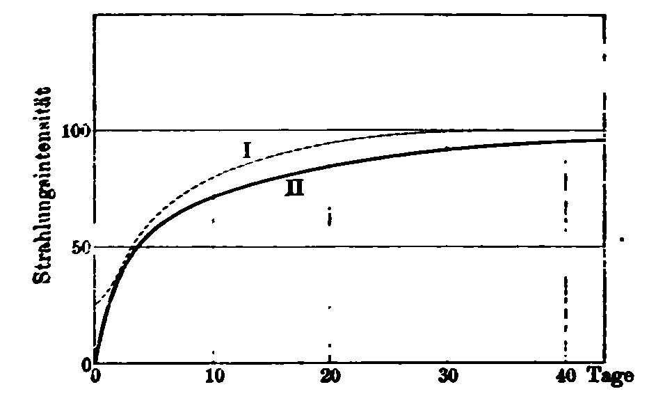

Ich untersuchte das Gesetz, nach dem die Aktivität eines festen
Radium-haltigen Salzes zunimmt, vom Augenblick der völligen Trocknung
an bis zu der Zeit, wo es seinen Grenzwert erreicht hat. Die folgenden
Tabellen enthalten die Intensität $I$ der Strahlung als Funktion der
Zeit; dabei wird die Endstrahlung gleich 100 gesetzt und die Zeit vom
Augenblick der völligen Trocknung an gerechnet. Die Tabelle&nbsp;I
(Fig.&nbsp;13, Kurve&nbsp;I) bezieht sich auf die Gesamtstrahlung. Die
Tabelle&nbsp;II (Fig.&nbsp;13, Kurve&nbsp;II) bezieht sich nur auf die
durchdringenden Strahlen (die 3&nbsp;cm Luft und 0,01&nbsp;mm Aluminium
durchsetzt haben).

Tabelle I

Zeit     $I$
------- ----
0 Tage   21
1 Tag    25
3 Tage   44
5 Tage   60
10 Tage  78
19 Tage  93
33 Tage 100
67 Tage 100

Tabelle II

Zeit     $I$
------- ----
0 Tage  1,3
1 Tag    19
3 Tage   43
6 Tage   60
15 Tage  70
23 Tage  88
46 Tage  94

Ich machte mehrere andre Messungsreihen derselben Art, die jedoch nicht
in völliger Übereinstimmung sind, wenn auch der allgemeine Verlauf der
Erscheinung derselbe ist. Es ist schwierig, sehr regelmäßige Resultate
zu erhalten. Man kann jedoch sagen, daß die Neubildung der Aktivität
etwa einen Monat gebraucht und daß die durchdringenden Strahlen von der
Auflösung am meisten betroffen werden.

Die Anfangsintensität der Strahlung, die 3&nbsp:cm Luft und 0,01&nbsp;mm
Aluminium durchdringt, beträgt nur 1&nbsp;Proz. der Endstrahlung,
während die Anfangsintensität der Gesamtstrahlung 21 Proz. des
Endwertes beträgt.

Ein frisch getrocknetes Radium-haltiges Salz besitzt dieselbe
Fähigkeit, inducirte Radioaktivität hervorzurufen (läßt also die­selbe
Emanationsmenge nach außen entweichen), wie eine Probe desselben
Salzes, das nach Herstellung im festen Zustande lange genug gelegen
hat, um die Endaktivität zu erreichen. Die Strahlungsaktivität beider
Präparate kann dabei sehr verschieden sein; das erste ist z.&nbsp;B.
fünfmal weniger aktiv als das zweite.

## p) Änderung der Aktivität der radioaktiven Körper; Wirkung der Erhitzung.

Wenn man eine Radium-haltige Verbindung erhitzt, so entwickelt sich
Emanation und der Körper verliert an Aktivität. Der Verlust ist um so
größer, je stärker und gleichzeitig länger dauernd die Erhitzung war.
Wenn man z.&nbsp;B. ein Radium-haltiges Salz eine Stunde lang auf 130°
erhitzt, so entzieht man ihm dadurch 10 Proz. seiner Gesamtstrahlung;
dagegen bringt eine
10 Minuten lange Erhitzung auf 400° keinen merklichen Effekt hervor.
Eine Erhitzung auf Rotglut während einiger Stunden zerstört 77 Froz.
der Totalstrahlung.

Der Aktivitätsverlust durch Erhitzung ist größer für die
durchdringenden als für die absorbirbaren Strahlen. So zerstört eine
Erhitzung von einigen Stunden Dauer etwa 77 Proz. der Gesamtstrahlung;
dieselbe Erhitzung zerstört aber fast vollständig (zu 99 Proz.) die
Strahlung, die 3&nbsp;cm Luft und 0,1&nbsp;mm Aluminium zu durchdringen
vermag. Wenn man das Radium-Baryumchlorid einige Stunden lang
geschmolzen erhält (bei 800°), so zerstört man 98 Proz. der durch
0,3&nbsp;mm Aluminium hindurchgehenden Strahlung. Man kann sagen, daß
die durchdringenden Strahlen nach einer starken und lang dauernden
Erhitzung praktisch nicht mehr existiren.

Dieser Aktivitätsverlust eines Radium-haltigen Salzes durch Erhitzen
ist nicht von Dauer; die Aktivität des Salzes erneuert sich von selbst
bei gewöhnlicher Temperatur und strebt einem Grenzwert zu. Ich
beobachtete die merkwürdige Tatsache, daß diese Grenze höher ist als
die Endaktivität vor der Erhitzung, wenigstens verhält es sich so mit
dem Chlorid. Ich teile einige Beispiele mit: Ein Präparat von 
Radium-Baryumchlorid, das nach seiner Herstellung in festem Zustande
längst seine Endaktivität erreicht hatte, besitzt eine Totalstrahlung,
die durch die Zahl 470 ausgedrückt ist, und eine Strahlung, die
0,01&nbsp;mm dickes Aluminium durchdringt, gleich 157. Dieses Präparat
wird einige Stunden lang auf Rotglut erhitzt. Zwei Monate nach der
Erhitzung erreicht es eine Endaktivität, die für die Gesamtstrahlung
690 und für die durch 0,01&nbsp;mm Aluminium hindurchgehende 227
beträgt. Die Totalstrahlung und die durch 0,01 mm Aluminium
hindurchgehende haben sich also im Verhältniß 690:470 bezw. 227:156
vermehrt. Beide Brüche sind merklich einander gleich und zwar
gleich&nbsp;1,45.

Ein Präparat von Radium-Baryumchlorid, das nach Herstellung in festem
Zustande eine Endaktivität gleich 62 erreicht hat, wird einige Stunden
lang im geschmolzenen Zustande erhalten; dann wird das geschmolzene
Präparat pulverisirt. Dieses Präparat erreicht eine Endaktivität gleich
140, d.&nbsp;h. über zweimal mehr, als es ohne die starke Erhitzung
erreicht haben würde.

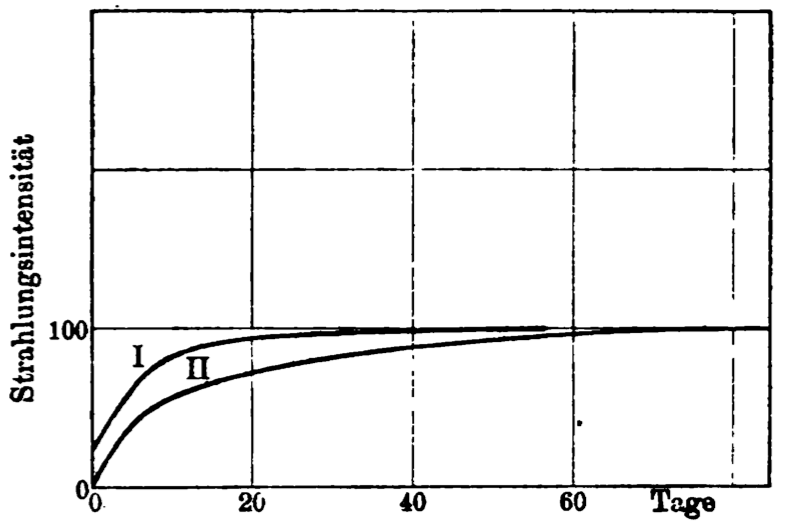

Ich untersuchte das Gesetz, nach dem die Aktivitätszunahme
der Radium Verbindungen nach der Erhitzung vor sich geht. Ich gebe als
Beispiel die Resultate zweier Messungsreihen. Die Zahlen der
Tabellen&nbsp;I und&nbsp;II bedeuten die Intensität $I$ der Strahlung
als Funktion der Zeit; die Endintensität der Strahlung ist gleich 100
gesetzt, und die Zeit vom Aufhören der Erhitzung an gerechnet. Tabelle I (Fig.&nbsp;14, Kurve&nbsp;I) bezieht sich auf die Gesamtstrahlung
eines Radium-Baryumchlorids. Tabelle II (Fig.&nbsp;14, Kurve&nbsp;II)
bezieht sich auf die durchdringende Strahlung eines
Radium-Baryumsulfates, bei dem man die Intensität der durch 3&nbsp;cm
Luft und 0,01&nbsp;mm Aluminium hindurchgegangenen Strahlung maß.
Beide Präparate waren 7 Stunden lang auf Kirschrotglut erhitzt.

Tabelle I

Zeit     $I$
------- ----
0 Tage  16,2
0,6 "   25,4
1 Tag   27,4
2 Tage   38
3 Tage  46,3
4 Tage   54
6 Tage  67,5
10 Tage  84
24 Tage  95
57 Tage 100

Tabelle II

Zeit     $I$
------- ----
0 Tage  0,8
0,7 "    13
1 Tag    18
1,9 "   26,4
6 Tage  46,2
10 Tage 55,5
14 Tage  64
18 Tage 71,8
27 Tage  81
36 Tage  91
50 Tage 95,5
57 Tage  99
84 Tage 100

Ich habe noch verschiedene andre Bestimmungen gemacht, aber ebenso wie
für die Wiederentstehung der Aktivität nach der Auflösung stimmen die
Resultate der verschiedenen Reihen nicht gut überein.

Die Wirkung der Erhitzung bleibt nicht bestehen, wenn man das erhitzt
gewesene Salz auflöst. Von zwei Proben derselben Radium-haltigen
Substanz von der Aktivität 1800 wurde die eine stark erhitzt und ihre
Aktivität dadurch auf 670 reducirt. In diesem Moment wurden beide
Proben aufgelöst und 20 Stunden in Lösung gelassen; ihre nachherige
Anfangsaktivität in festem
Zustande betrug für das nicht erhitzte 460 und für das erhitzte 420; es
bestand somit kein großer Unterschied in der Aktivität beider Präparate.

Wenn dagegen die beiden Präparate nicht genügend lange in Lösung
bleiben, wenn man sie z.&nbsp;B. unmittelbar nach der Auflösung wieder
trocknet, so ist das nicht erhitzte Präparat viel aktiver als das
erhitzte; eine gewisse Zeit ist also nötig, damit die Auflösung die
Wirkung der Erhitzung zum Verschwinden bringt.
Ein Präparat von der Aktivität 3200 wurde erhitzt und
hatte nach der Erhitzung nur noch die Aktivität 1030. Dieses Präparat
wurde gleichzeitig mit einer nicht erhitzten Probe derselben Substanz
aufgelöst und sofort wieder getrocknet. Die Anfangsaktivität betrug
1450 für das nicht erhitzte und 760 für das erhitzte.

Bei den festen Radium-haltigen Salzen wird die Fähigkeit, die inducirte
Radioaktivität zu erregen, durch die Erhitzung stark beeinflußt.
Während der Erhitzung entwickeln die Radium-haltigen Verbindungen mehr
Emanation als bei gewöhnlicher Temperatur; wenn man sie dann aber
wieder auf Zimmertemperatur abkühlt, so ist nicht nur ihre Aktivität
viel geringer als vorher, sondern auch ihr Aktivirungsvermögen hat sich
beträchtlich verringert. Während der auf die Erhitzung folgenden Zeit
nimmt die Radioaktivität des Körpers zu und kann sogar den
ursprünglichen Wert überschreiten. Auch das Aktivirungsvermögen stellt
sich zum Teil wieder her; nach längerer Erhitzung auf Rotglut jedoch
ist
das Aktivirungsvermögen fast völlig beseitigt und vermag sich nicht
wieder von selbst im Laufe der Zeit herzustellen. Man kann aber einem
Radium-haltigen Salz sein ursprüngliches Aktivirungsvermögen wieder
geben, wenn man es in Wasser auflöst und im Heizbad bei einer
Temperatur von 120° trocknet. Es scheint also, als ob die Calcinirung
die Wirkung habe, das Salz in einen besonderen physikalischen Zustand
zu versetzen, in dem es die Emanation viel schwerer abgiebt als
dasselbe nicht auf hohe Temperatur erhitzte feste Präparat; daraus
folgt ganz natürlich, daß das Salz eine höhere Endaktivität erreicht,
als es vor der Erhitzung besaß^[Siehe auch weiter unten S. 120. Anm. d. 
Übers.]. Um das Salz in den früheren Zustand zurückzuversetzen, genügt
es, es aufzulösen und wieder zu trocknen, ohne dabei über 150° zu
erhitzen.

Ich teile einige Beispiele mit:

Ich bezeichne mit $a$ den Endwert der inducirten Aktivität, die in
einem geschlossenen Gefäß auf einer Kupferplatte erzeugt wird, und zwar
von einem Baryum-Radiumkarbonat von der Aktivität 1600. Für das nicht
erhitzte Präparat werde $a$ = 100 gesetzt. Man findet:

-------------------------- ----------
1 Tag nach der Erhitzung   $a$ = 3,3
4 Tag nach der Erhitzung   $a$ = 7,1
10 Tage nach der Erhitzung $a$ = 15
20 Tage nach der Erhitzung $a$ = 15
27 Tage nach der Erhitzung $a$ = 15
-------------------------- ----------

Die Radioaktivität des Präparates hatte sich durch die Erhitzung um
90 Proz. vermindert, hatte aber nach einem Monat ihren alten Wert
schon wieder gewonnen.

Der folgende gleichartige Versuch wurde mit einem Radium-Baryumchlorid
von der Aktivität 3000 gemacht. Das Aktivirungsvermögen wurde ebenso
wie bei dem vorhergehenden Versuch bestimmt.

Aktivirungsvermögen des nicht erhitzten Präparates a = 100.

Aktivirungsvermögen des Präparates nach einer dreistündigen Erhitzung
auf Rotglut:

-------------------------- ----------
2 Tag nach der Erhitzung   $a$ = 2,3
5 Tag nach der Erhitzung   $a$ = 7,0
11 Tage nach der Erhitzung $a$ = 8,2
18 Tage nach der Erhitzung $a$ = 8,2
-------------------------- ----------

Aktivirungsvermögen des nicht erhitzten Präparates nach Auflösung und Wiedertrocknung bei 150° $a$ = 92.

Aktivirungsvermögen des erhitzten Präparates nach Auflösung und
Wiedertrocknung bei 150° $a$ = 105.

## q) Theoretische Deutung der Aktivitätsänderungen der Radiumsalze nach Auflösung oder Erhitzung.

Die soeben beschriebenen Tatsachen können zum Teil wenigstens erklärt
werden, wenn man sich der Theorie bedient, nach der das Radium Energie
in Form von Emanation producirt, die sich dann ihrerseits in
Strahlungsenergie verwandelt. Wenn man ein Radiumsalz auflöst, so
verbreitet sich die von ihm erzeugte Emanation außerhalb der Lösung aus
und erzeugt Radioaktivität außerhalb der Quelle, von der sie stammt;
wenn man die Lösung verdampft, so ist das erhaltene feste Salz wenig
aktiv, denn es enthält nur wenig Emanation. Allmählich häuft sich die
Emanation in dem Salze an, dessen Aktivität bis zu einem Grenzwert
wächst, der dann erreicht ist, wenn die Erzeugung von Emanation durch
das Radium den Verlust durch Abgabe nach außen und durch Umwandlung in
Becquerelstrahlen kompensirt.

Wenn man ein Radiumsalz erhitzt, so wird seine Abgabe von Emanation
nach außen sehr verstärkt und die Erscheinungen der inducirten
Radioaktivität sind intensiver, als wenn das Salz sich auf
Zimmertemperatur befindet. Wenn aber das Salz auf die gewöhnliche
Temperatur zurückgebracht wird, so ist es erschöpft wie in dem Fall der
Auflösung, es enthält nur wenig Emanation mehr und seine Aktivität ist
gering. Allmählich sammelt sich die Emanation von neuem im festen Salze
an, und die Strahlung nimmt zu.

Man kann annehmen, daß die Emanationserzeugung des Radiums zeitlich
konstant ist, und daß ein Teil nach außen entweicht, während der übrige
Teil im Radium selbst in Becquerelstrahlung transformirt wird. Wenn das
Radium zur Rotglut erhitzt war, so verliert es einen großen Teil seines
Aktivirungsvermögens; anders ausgedrückt: es wird die Abgabe von
Emanation nach außen hin vermindert. Infolgedessen muß der im Radium
selbst ausgenutzte Bruchteil der Emanation stärker sein, und das
Präparat eine höhere Aktivität erreichen.

Man kann versuchen, das theoretische Gesetz der Aktivitätszunahme eines
gelöst oder erhitzt gewesenen Salzes aufzustellen. Wir nehmen an, daß
die Intensität der Strahlung des Radiums in jedem Augenblick der im
Radium vorhandenen Emanationsmenge $q$ proportional ist. Man weiß, daß
die Emanation sich von selbst zerstört nach einem derartigen Gesetze,
das man in jedem Augenblick hat:

1) $q=q_0 \cdot e^{-t/\delta}$,

wo $q_0$ die zur Zeit $t$ = 0 vorhandene Emanationsmenge, und die
Zeitkonstante $\delta = 4,97 \cdot 10^5$ Sek.

Sei andrerseits $\Delta$ die von dem Radium in jedem Augenblick
gelieferte Emanationsmenge, eine Größe, die ich als konstant annehmen
will. Wir wollen untersuchen, was passiren würde, wenn keine Emanation
nach außen entwiche. Die erzeugte Emanation würde dann völlig
verbraucht, um im Radium Strahlung zu erzeugen. Man hat aber nach
Gleichung 1):

$dq/dt=-q_0/\delta \cdot e^{-t/\delta}$,

somit würde im Gleichgewichtszustande das Radium eine gewisse Menge
von Emanation $Q$ enthalten, die gegeben wäre durch:

2) $\Delta = Q/\delta$ oder $Q=\Delta\cdot\delta$;

und die Strahlung des Radiums wäre dann proportional mit $Q$.

Nehmen wir an, man brächte das Radium in Bedingungen, unter denen es
Emanation nach außen verliert; das erreicht man, indem man es auflöst
oder erhitzt. Das Gleichgewicht wird gestört sein und die Aktivität
wird sich vermindern. Sobald man aber die Ursache für den
Emanationsverlust beseitigt (den Körper in den festen Zustand
zurückführt oder die Erhitzung unterbricht), so häuft sich die
Emanation von neuem im Radium an und wir haben eine Periode, während
der die Erzeugungsgeschwindigkeit $\Delta$ größer ist als die
Zerstörungsgeschwindigkeit $q/\Delta$. Man hat dann:

$dq/dt = \Delta - q/\delta = (Q-q)/\delta$ ,

oder

$d/dt (Q-q) = -(Q-q)/\delta$

und

3) $Q-q = (Q-q_0)\cdot e^{-t/\delta}$,

wobei $q_0$ die zur Zeit $t$ im Radium vorhandene Emanation.

Nach Formel 3) wächst der Überschuß $(Q — q)$ an Emanation, den das
Radium im Gleichgewichtszustande über den zu einem gegebenen Zeitpunkt
vorhandenen Betrag enthält, nach einem Exponentialgesetz, das identisch
ist mit dem für das spontane Verschwinden der Emanation geltenden. Da
aber die Strahlung des Radiums proportional der Emanationsmenge ist, so
muß der Überschuß der Endintensität über die momentane Intensität der
Strahlung nach demselben Gesetz abnehmen; der Überschuß muß also in
etwa vier Tagen auf die Hälfte sinken.

Die vorliegende Theorie ist unvollständig, da der Emanationsverlust
durch Abgabe nach außen vernachlässigt ist. Es ist jedoch schwer zu
sagen, wie man die Abhängigkeit dieses Vorgangs von der Zeit anzusetzen
hat. Vergleicht man die Resultate der Versuche mit denen der
unvollständigen Theorie, so findet man keine befriedigende
Übereinstimmung; man gewinnt jedoch die Überzeugung, daß die fragliche
Theorie wenigstens einen Teil der Wahrheit enthält. Das Gesetz, nach
dem der Überschuß der Endaktivität über die gerade vorhandene
in 4 Tagen auf die Hälfte abnehmen soll, stellt die Reaktivirung nach
vorausgegangener Erhitzung für etwa 10 Tage mit ziemlicher Annäherung
dar. Im Falle der Reaktivirung nach vorheriger Auflösung scheint
dasselbe Gesetz annähernd zu passen für einen gewissen Zeitraum,
der 2 bis 3 Tage nach der Trocknung des Präparates beginnt und 10 bis
15 Tage dauert. Die Erscheinungen sind übrigens komplicirt; das
beschriebene Gesetz sagt nichts darüber, warum die durchdringenden
Strahlen in stärkerem Verhaltniß geschwächt werden als die
absorbirbaren.

	
# Fünftes Kapitel. Natur und Ursache der Erscheinungen der Radioaktivität

Von Beginn der Untersuchungen über die radioaktiven Körper an, als die
Eigenschaften dieser Körper noch kaum bekannt waren, stellte die
Selbsttätigkeit ihrer Strahlung ein Problem von größtem
Interesse für die Physiker dar. Heutzutage haben wir in der Kenntniß
der radioaktiven Körper große Fortschritte gemacht und können einen
radioaktiven Körper von großer Intensität, das Radium, isoliren. Die
Ausnutzung der merkwürdigen Eigenschaften des Radiums erlaubte eine
tiefgehende Untersuchung der von den radioaktiven Körpern ausgehenden
Strahlung; die verschiedenen bisher untersuchten Strahlengruppen bieten
Analogien mit den in Entladungsröhren vorkommenden Strahlen,
Kathoden-, Röntgen- und Kanalstrahlen. Dieselben Strahlengruppen
findet man auch in den von Röntgenstrahlen erzeugten Sekundärstrahlen
wieder[@sg1900phd; @cpsg1900cr], sowie in der Strahlung der inducirt
aktiven Körper.

Wenn aber auch die Natur der Strahlung gegenwärtig besser bekannt ist,
so bleibt doch die Ursache der selbsttätigen Strahlung geheimnißvoll,
und die Erscheinung ist für uns noch immer ein Rätsel und ein
Gegenstand tiefsten Erstaunens.

Die selbsttätig radioaktiven Körper und vor allem das Radium stellen
Energiequellen dar. Ihre Energieproduktion wird uns bemerkbar durch die
Becquerelstrahlung, durch die chemischen und optischen Effekte und die
fortwährende Wärmeentwicklung.

Man hat sich oft gefragt, ob die Energie in den radioaktiven Körpern
selbst erzeugt wird, oder ob diese Körper sie von äußeren Quellen
entlehnen. Keine von den zahlreichen Hypothesen, die aus diesen beiden
Gesichtspunkten entsprungen sind, hat bis jetzt eine experimentelle
Bestätigung erfahren.

Man kann annehmen, daß die radioaktive Energie früher einmal angehäuft
worden ist und sich allmählich erschöpft wie eine Phosphorescenz von
langer Dauer. Man kann sich vorstellen, daß die Entwicklung
radioaktiver Energie mit einer Umwandlung des strahlenden Atoms selbst,
das sich in einem Entwicklungszustande befindet, verbunden ist; die
Tatsache, daß das Radium kontinuirlich Wärme entwickelt, spricht zu
Gunsten dieser Anschauung. Man kann annehmen, daß die Umwandlung von
einem Gewichtsverlust begleitet ist und von einer Emission materieller
Teilchen, aus denen die Strahlung besteht. Die Energiequelle kann
ferner in der Gravitationsenergie gesucht werden.
Endlich kann man sich vorstellen, daß der Raum fortwährend von einer
noch unbekannten Strahlung durchsetzt werde, die bei ihrem Durchgang
durch radioaktive Körper aufgehalten und in die radioaktive Energie
umgewandelt wird.

Man kann für und wider jede dieser Anschauungsweisen viele Gründe
vorbringen, und meistens haben die Versuche, die Konsequenzen dieser
Hypothesen experimentell zu verificiren, negative Resultate gegeben.
Die radioaktive Energie des Radiums und des Urans scheint sich bis
jetzt nicht zu erschöpfen und überhaupt keine merkliche Veränderung mit
der Zeit zu erfahren. *Demarçay* hat eine Probe reinen Radiumchlorids
in einem Intervall von fünf Monaten spektroskopisch untersucht; er
beobachtete am Ende der fünf Monate keine Veränderung des Spektrums.
Die Hauptlinie des Baryums, die im Spektrum sichtbar war und die
spurenweise Anwesenheit von Baryum anzeigte, hatte sich in dem
betrachteten Zeitraum nicht verstärkt; das Radium hatte sich also nicht
in merklicher Weise in Baryum verwandelt.

Die von Herrn *Heydweiller*[@ha1902pz] angekündigten Gewichtsänderungen
der Radiumverbindungen können noch nicht als gesicherte Tatsache
betrachtet werden.

Die Herren *Elster* und *Geitel*[@ejgh1898ann] fanden, daß die
Radioaktivität des Urans sich auf dem Grunde eines 850 m tiefen
Schachtes nicht ändert; eine Erdschicht von dieser Dicke brächte also
keine Änderung in der hypothetischen Primärstrahlung, die die
Radioaktivität des Urans verursachen sollte, hervor.

Wir haben die Radioaktivität des Urans zur Mittags- und zur
Mitternachtszeit untersucht, von dem Gedanken ausgehend, daß die
hypothetische Primärstrahlung ihre Quelle in der Sonne habe und beim
Durchgang durch die Erde teilweise absorbirt werde. Der Versuch ergab
keinen Unterschied beider Messungen.

Die neuesten Untersuchungen sprechen zu Gunsten der Hypothese einer
Umwandlung des Radiumatoms; diese Hypothese ist bereits im Beginn der
Untersuchungen über die Radioaktivität ausgesprochen worden[@cs1899rg];
sie wurde von Herrn Rutherford frei übernommen, der annahm, daß die
Emanation des Radiums ein
materielles Gas sei, das eines der Spaltungsprodukte des Radiums
darstelle[@resf1903pm2].

Die neuen Versuche der Herren Ramsay und Soddy laufen auf den Beweis
hinaus, daß die Emanation ein instabiles Gas ist, das sich von selbst
unter Bildung von Helium zerstört. Andrerseits ließe sich die
fortwährende Wärmeentwicklung des Radiums nicht durch eine gewöhnliche
chemische Reaktion erklären, während sie sehr wohl ihren Ursprung in
einer Umwandlung des Atoms haben könnte.

Bedenken wir endlich noch, daß die neuen radioaktiven Substanzen sich
immer in den Uranmineralien vorfinden, und daß wir vergeblich in dem
käuflichen Baryum nach Radium gesucht haben (s. S. 38), daß also
das Vorkommen des Radiums an das des Urans gebunden zu sein scheint.
Die Uranmineralien enthalten ferner Argon und Helium und dieses
Zusammentreffen ist wohl kaum einem Zufall zuzuschreiben. Das
gleichzeitige Vorkommen dieser verschiedenen Körper in denselben
Mineralien führt zu der Annahme, daß die Gegenwart der einen für die
Bildung der andren notwendig ist.

* * * *

#	Literarische Ergänzungen
(bis Oktober 1903).^[Die beigeschriebenen römischen Zahlen und
Buchstaben beziehen sich auf die entsprechenden Kapitel und Abschnitte
des Buches. Wo keine Zahl angegeben, ist der Inhalt allgemeinerer Natur
oder eine Ermittelung nicht möglich gewesen. Die hier, sowie im Text
des Buches benutzten Abkürzungen für die Namen der Zeitschriften
entsprechen den in den "Fortschritten der Physik" gebräuchlichen.]
	
## A. Originalarbeiten.

Adam, E. P. "Water Radioactivity." *Phil. Mag.* (6) 6, 568 (1903). -- IV

Akroyd, W. "A new case of phosphoreseence induced by radiumbromide." *Nature* 68, 269 (1903).

Allan, S. J. "Radioactivity of freshly fallen snow." *Phys. Rev.* 16,
237(1903). -- IV

Armstrong, H. E. "The assumed Radioactivity of ordinary materials."
*Nature* 67, 414 (1903). -- Id u. IIb

v. Aubel, E. "Action des corps radioactifs sur la conductibilité électrique da sélènium." *Compt. rend.* 136, 929 (1903). -- IVm

Barker, G. F. "Radioactivity of thorium minerals." *Sill. Journ.* 16,
161(1903) -- I u. IV

Baur, E. "Die Bedeutung der Becquerelstrahlen für die Chemie."
*Naturw. Rdsch.* 16, 338 u. 355 (1901). -- IIb

Becker, A. "Über die Leitfähigkeit fester Isolatoren unter dem
Einfluß von Radiumstrahlen." *Ann. d. Phys.* (4) 12, 124 (1903). -- IIIn

Becquerel, H. "Strahlung des Poloniums und Radiums." *Compt. rend.*
136, 431 (1903). Ref.: *Naturw. Rdsch.* 18, 225 (1903). -- IIIc u. d

— "Sur le rayonnement du polonium et sur le rayonnement secondaire
qu'il produit." *Compt. rend.* 136, 977 (1903). -- III

— "Conductibilité et ionisation résiduelle de la paraffine solide sous
l'influence du rayonnement du radium." *Compt. rend.* 136, 1173 (1903). -- IIIn

— "Sur une propriété des rayons &alpha; du radium." *Compt. rend.* 136,
1517 (1908). -- IIIi

— "Sur la phosphorescence oscillante que présentent
certaines substances sous l'action du radium." *Compt. rend.* 137, 629 (1903). -- IIIm 

Bleckrode, L. "Über einige Versuche mit flüssiger Luft; Radioaktivität
des Poloniums." *Ann. d. Phys.* (4) 12, 218 (1903). -- IIIw

Bumstead, H. A. und *Wheeler*, L. P. "Note on a radioactive gas in surface water." *Sill. Journ.* (4) 16, 328 (1903). -- IV

Cooke, H. L. "Penetrating radiation from the earth's surface." *Science (N. S.)* 17, 183 (1903). *Phil. Mag.* (6) 6, 403 (1903). -- IV, Id

Cook Gates, F. "Effect of heat on exited Radioactivity." *Phys. Rev.*
16, 300 (1903). -- IVp

des Coudres, Th. "Zur elektrostatischen Ablenkbarkeit der Rutherfordstrahlen." *Phys. Zeitschr.* 4, 483 (1903). -- IIIi

Crookes, W. "Certain properties of the emanation of Radium". *Chem.
News* 87, 241 (1903). -- IV

— "The mystery of radium." *Chem. news* 87, 158 (1903). -- V

— "The emanations of radium." *Nature* 67, 522 (1903). *Electrician*
50, 986 (1903). *Proc. Roy. Soc.* 71, 405 (1903). -- IV

— "Modern views of matter; the realization of a dream." *Congreß f.
angew. Chem.*, Berlin 1903. *Science (N. S.)* 17, 993 (1903).

—  und Dewar, J. "Note on the effect of extreme cold on the emanations
of radium." *Nature* 68, 213 (1903). *Proc. roy. soc.*, London 1903. -- IVf

Curie, P. "Production de la phosphorescence d'un grand nombre de
corps par l'émanation du radium." *Soc. franc. de phys.*, No. 200,
3 (1903). -- IV

Curie, S. "Über den radioaktiven Stoff Polonium." *Phys. Zeitschr.* 4,
234 (1903). -- IIb

— "Über das Atomgewicht des Radiums." *Phys. Zeitschr.* 4, 456 (1903). -- IIg

Curie, P. u. S. "Sur les corps radioactifs." *Compt. rend.* 134, 85 (1902). -- V

Darwin, G. H. "Radioactivity and the age of the sun." *Nature* 68, 496 (1903). -- V

Debierne, A. "Sur la production de la radioactivité induite par
l'actinium." *Compt. rend.* 136, 446, 671 (1903). -- IV u. IIb

Dorn, E. "Versuch über die zeitliche Gewichtsänderung von Radium." *Phys. Zeitschr.* 4, 530 (1903). -- V

Durack, J. J. E. "Specifische Ionisation durch Radiumelektronen."
*Phil. Mag.* (6) 5, 550 (1903). -- Ib

Ebert, H. "Über die Möglichkeit, radioaktive Emanationen in flüssiger
Luft anzureichern." *Münchener Sitz.-Ber.* 33, 133 (1903). -- IVf

—  u. Ewers, P. "Über die dem Erdboden entstammende radioaktive
Emanation." *Phys. Zeitschr.* 4, 162 (1902). -- IV

Elster, J. u. Geitel, H. "Über eine fernere Analogie in dem
elektrischen Verhalten der natürlichen und der durch Becquerelstrahlen
leitend gemachten Luft." *Phys. Zeitschr.* 2, 590 (1901). -- IV

— "Über die durch atmosphärische Luft inducirte Radioaktivität."
*Phys. Zeitschr.* 3, 76 (1901). -- IIb

— "Über die radioaktive Emanation in der atmosphärischen Luft."
*Phys. Zeitschr.* 4, 522 (1903). -- IV

Everett, J.D. "Analogue to the action of radium." *Nature* 67, 535 (1903).

Exner, S. "Einige Beobachtungen über die vom Radium in tierischen
Geweben erzeugte Phosphorescenz." *Chem. Centralbl.* 2, 276 (1903). *Centralbl. f. Physiol.* 17, 178 (1903). -- IIIp

Forch, C. "Bewirken radioaktive Substanzen eine Absorption von
Gravitationsenergie?" *Phys. Zeitschr.* 4, 318 (1903). -- V

Geigel, R. "Über die Absorption von Gravitationsenergie durch
radioaktive Substanzen." *Ann. d. Phys.* (4) 10, 429 (1903). -- V

Giesel, F. "Über radioaktive Stoffe." *Chem. Ber.* 34, 3772 (1901). -- IIb

— "Über radioaktives Blei." *Chem. Ber.* 35, 102 (1902). -- IIb

— "Über radioaktive Stoffe." *Chem. Ber.* 35, 3608 (1602). -- IIb

— "Über den Emanationskörper aus Pechblende und über Radium."
*Chem. Ber.* 36, 342 (1903). -- IIb u. IV

Glew, F. H. "Radium fluorescence." *Nature* 68, 200 (1903). -- IIIp

Graetz, L. "Über eigentümliche Strahlungserscheinungen." *Ann. d.
Phys.* (4) 9, 1100 (1903). -- IVn

Grusinzew. "Experimentaluntersuchung über die Einwirkung der
Radiumstrahlen auf das Entladungspotential." *Journ. d. russ.
phys.-chem. Ges.* 34, 337 (1902). -- IIIo

Hardy, W. B. "Radioactivity and the cosmical time scale." *Nature*
68, 548 (1903). -- V

—  and Miss Willcock, E, G. "Über die oxydirende Wirkung der
Strahlung des Radiumbromids, erwiesen durch die Zerlegung
von Jodoform." *Proc. Roy. Soc.* 72, 200 (1903). Ref.: *Naturw.
Rdsch.* 18, 539 (1903). -- IIIr

de Hemptinne, A. "Einfluß radioaktiver Substanzen auf das Leuchten
der Gase." *Compt. rend.* 133, 934 (1901). -- IIIo

Himstedt, F. "Über die Ionisirung der Luft durch Wasser." *Ann. d.
Phys.* (4) 12, 107 (1903). -- IVn

Hofmann, K., Korn, A. u. Strauß, E. "Über die Einwirkung von
Kathodenstrahlen auf radioaktive Substanzen." *Chem. Ber.* 34,
407 (1901). -- IIb u. IVn

Hofmann, K. u. Strauß, E. "Über das radioaktive Blei." *Chem. Ber.*
34, 8, 907, 3033, 3970 (1901). -- IIb

Hofmann, K. u. Wölfl, V. "Radioactive lead as a primarily active
substance." *Chem. News* 87, 241 (1903). -- IIb

Hofmann, K. u. Zerban, F. "Über das radioaktive Thor." *Chem.
Ber.* 35, 531 (1902). -- IIb

Indrickson, F. N. "Experiments with radiumbromide." Ref.: *Journ.
chem. soc.* 84, abstr. II, 346 (1903).

Kaufmann, W. "Bemerkungen zu der Arbeit des Herrn Geigel: „Über die Absorption von Gravitationsenergie usw." *Ann. d. Phys.* (4) 10, 894 (1903). -- V

Korn, A. u. Strauß, E. "Über die Strahlung des radioaktiven Bleis." *Ann. d. Phys.* (4) 11, 397 (1903). -- IIb

Kučera, G. "Eine Bemerkung zur Arbeit des Herrn Geigel: „Über
die Absorption usw." *Phys. Zeitschr.* 4, 319 (1903). -- V

Lagrange, Ch. "The source of radiumenergy." *Nature* 68, 269
(1903). -- V

Lebedinsky. "Wirkung der Strahlen von Radiumbromid auf die
Funkenentladung." *Journ. Elektritschestwo*, 318 u. 352 (1902). -- IIIo

Mc Lennan, J. C. "Induced Radioactivity excited in air at the foot
of waterfalls." *Phil Mag.* (6) 5, 419 (1903). *Phys. Zeitschr.* 4,
295 (1903) -- IV

Mc Lennan, J. C. u. Burton, E. F. "Radioactivity of ordinary
materials." *Phil. Mag.* (6) 5, 699 (1903). -- Id, IIb, IV

— "Über die Radioactivität der Metalle im allgemeinen." *Phys.
Zeitschr.* 4, 553 (1903). *Phil. Mag.* (6) 6, 343 (1903). -- Id, IIb, IV

Lodge, O. "Radium-Emission." *Nature* 67, 511 (1903).

Marckwald, W. "Über das radioaktive Wismut (Polonium)." *Verhdl. d. 74. 
Ges. d. Naturf. u. Ärzte*, Karlsbad 1902. -- IIb

— "Über den radioaktiven Bestandteil des Wismuts aus der Joachimsthaler
Pechblende." *Phys. Zeitschr.* 4, 51 (1902). *Chem. Ber.* 35, 4239 (1902). -- IIb

— "Über radioaktive Stoffe." *Ber. d. deutsch. pharm. Ges.* 13, 11 (1903). *Chem. Centralbl.* 1, 612 (1903). -- IIb

Martin, G. "Cosmical radioactivity." *Chem. News* 88, 197 (1903). -- V

Merritt, E. "Recent developments in the study of radioactive Substances." *Science (N. S.)* 18, 41 (1903).

Patterson, J. "On the Ionisation in air at different temperatures and
pressures." *Phil. Mag.* (6) 6, 231 (1903). -- Id u. IIb

Pegram, G. B. "Radioactifs minérals." *Science (N. S.)* 13, 274 (1901). -- IIb

— "Radiumemanation." Electrician 51, 210 u. 254 (1903). -- IV

Ramsay, W. "A new development of the radium mystery." *Chem.
News* 88, 40 (1903). IVf u. V

— u. Soddy, P. "Gases occluded by radiumbromide." *Nature* 68, 246
(1903). -- IVf u. V

Re, Ph. "Hypothese sur la nature des corps radioactifs." *Compt. rend.*
136, 1393 (1903). -- V

Richardson, O. W. "On the positive ionisation produced by hot platinum
in air at low pressures." *Phil. Mag.* (6) 6, 80 (1903). -- IV

Runge, C. u. Precht, J. "Über das Funkenspektrum des Radiums."
*Ann. d. Phys.* (4) 12, 407 (1903). -- IIc u. IIg

— "Die Stellung des Radiums im periodischen System nach seinem
Spektrum." *Phys. Zeitschr.* 4, 285 (1903). -- IIc u. IIg

— "Über das Bunsenflammenspektrum des Radiums." *Ann. d. Phys.*
(4) 10, 655 (1903). -- IIc

Rutherford, E. "Einfluß der Temperatur auf die Emanationen radioaktiver
Substanzen." *Phys. Zeitschr.* 2, 429 (1901). -- IV f

— "Emanationen von radioaktiven Substanzen." *Nature* 64, 157
(1901). -- IVo

— "Durchdringende Strahlen der radioaktiven Stoffe." *Nature* 66,
318 (1902). -- IIIc

— "Versuche über erregte Radioaktivität." *Phys. Zeitschr.* 3, 254
(1902). -- IVd

— "Excited radioactivity and the method of its transmission." *Phil.
Mag.* (6) 5, 95 (1903). -- IV

— "Some remarks on radioactivity." *Phil. Mag.* (6) 5, 481 (1903).

— "Radioactivity of ordinary materials." *Nature* 67, 511 (1903). -- Id u. IIb

— "Radioactive Processes." *Chem. News* 87, 297 (1903). -- IV u. V

Rutherford, E. "Übertragung erregter Radioaktivität." *Phys. Zeitschr.*
3, 210 (1902). -- IVc

— u. Miss Brooks. "The new gas from radium." *Proc. and Transact.
roy. soc. Canada* (2) 7, 21 (1901). -- IVc u. V

— u. Cooke. "A penetrating radiation from the earths surface." *Phys.
Rev.* 16, 183 (1903). -- Id u. IIb

— u. Allan, S. J. "Erregte Aktivität und Ionisirung der Atmosphäre."
*Phys. Zeitschr.* 3, 225 (1902). *Phil. Mag.* (6) 4, 704 (1902). Ref.: *Naturw. Rdsch.* 18, 147 (1903). -- IV

— u. Mc Grier. "Magnetische Ablenkbarkeit der Strahlen radioaktiver
Substanzen." *Phys. Zeitschr.* 3, 385 (1902). -- IIId

— u. Soddy, F. "Die Radioaktivität von Thorverbindungen. I. Untersuchung über radioactive Emanation." *Journ. chem. soc.* 81, 821 (1902). -- IV

— "II. Die Ursache und Natur der Radioaktivität." *Journ. chem. soc.* 81, 837 (1902). -- IV u. V.

— "Mitteilungen über die Kondensationspunkte der Thorium- und
Radiumemanationen." *Proc. chem. soc.* 18, 219 (1902). *Chem. Centralbl.* 1, 68 (1903). -- IVf

— "The Radioactivity of Uranium." *Phil. Mag.* (6) 5, 441 (1903). --
 Ic, IV u. V

— "A comparative study of the Radioactivity of Uranium and
Thorium." *Phil. Mag.* (6) 5, 445 (1903).

— "On condensation of the radioactive emanations." *Phil. Mag.* (6)
5, 561 (1903). -- IVf

— "On radioactif Change." *Phil. Mag.* (6) 5, 576 (1903). -- V

Sagnac, G. "Les propriétés nouvelles du radium." *Journ. d. phys.* (4)  2, 545 (1903).

Schuster, A. "Cosmical Radioactivity." *Chem. News* 88, 166 (1903). -- V

v. Schweidler, E. "Über die angebliche Radioactivität und Luminescenz
von Reten. Phys." *Zeitschr.* 4, 521 (1903). -- Id u. IIb

Sella, A. "Untersuchungen über die inducirte Radioaktivität." Rend.
Lincei* (5) 11 (1. Sem.), 57 u. 242 (1902), *Nuov. Cim.* (5) 3, 138
(1902); ibid. (5) 4, 131 (1902). -- IV

Sella, A. u. Pochettino, A. "Über die elektrische Leitfähigkeit der aus einem Wasserstrahlgebläse herausströmenden Luft." Rend. Linc. (1902) I. Sem., 527. -- IV

Soddy, F. "Die Radioaktivität des Urans." *Proc. chem. soc.* 18, 121 
(1902). *Journ. chem. soc.* 81, 860 (1902). -- Io

— "Einige neuere Fortschritte bezüglich der Radioaktivität." *Contemp.
Rev.* 708 (1903). *Chem. Centralbl.* 2, 91 (1903).

— Stark, J. "Bemerkung zur Ablenkung der positiven Strahlen im
magnetischen Felde." *Phys. Zeitschr.* 4, 583 (1903). -- III

Strutt, R. J. "Die Leitfähigkeit von Gasen unter dem Einfluß von
Becquerelstrahlen." *Proc. Roy. Soc.* 68, 126 (1901). -- IIb

— "Energy emitted by radioactive bodies." *Nature* 68, 6 (1903). -- IIIb u. IIIq

— "Radioactivity of ordinary materials." *Phil. Mag.* (6) 5, 680 (1903).
*Nature* 67, 369 u. 439 (1903). -- Id u. IIb

— "The preparation and properties of an intensely radioactive Gas from
metallic mercury." *Phil. Mag.* (6) 6, 113 (1903). -- IV

— and Joly, J. "Radium and the sun's heat." *Nature* 68, 572 (1903).

Tafel, J. "Über die Wirkungen von Kanalstrahlen auf Zinkoxyd."
*Ann. d. Phys.* (4) 11, 613 (1903). -- IIIp u. IIIr

Thomson, J. J. "Über die Zunahme der elektrischen Leitfähigkeit der
Luft, die bei deren Durchgang durch Wasser erzeugt wird." *Cambr. Proc.* 11, 505 (1902); ibid. 12, Mai (1903). *Phil. Mag.* (6) 4, 352 (1902). *Nature* 67, 609 (1903). -- Id, IVn, V

— "Radium." *Nature* 67, 601 (1908).

— "Radioactivity of ordinary materials." *Nature* 67, 391 (1903). -- Id u. IIb

Townsend, J. S. "Specific ionisation by corpuscles of radium." *Phil.
Mag.* (6) 5, 698 (1903). -- Ib

Wilde, H. "On the resolution of elementary substances in their 
ultimates and on the spontaneous molecular activity of radium."
Ref.: *Chem. News* 88, 190 (1903). -- V

Wilson, C. T. B. "Further experiments of radioactivity from rain."
Cambr. Proc 12, 17 (1903). -- IV

— "On radioactivity from snow." *Cambr. Proc.* 12, 85 (1903). -- IV

Wilson, W. E. "Radioactivity and solar energy." *Nature* 68, 222
(1903). -- V

## B. Zusammenfassende Darstellungen.

Becquerel, H. "Die Radioaktivität der Materie." *Rev. génér. des sciences* 13, 603 (1902). *Nature* 63, 396 (1901).

— "Recherches sur une propriété de la matière (activité radiante 
spontané ou radioactivité de la matière)." 355 S. bei Firmin-Didot et
Cie., Paris 1903.

Curie, P. "Radium." *Roy. Instit.* 1903. *Electrician* 51, 403 (1903).

Elster, J. "Über die Fortschritte auf dem Gebiet der Becquerelstrahlen."
Eders Jahrbuch der Photographie, 193 (1901).

# Einzelnachweise und Fußnoten

